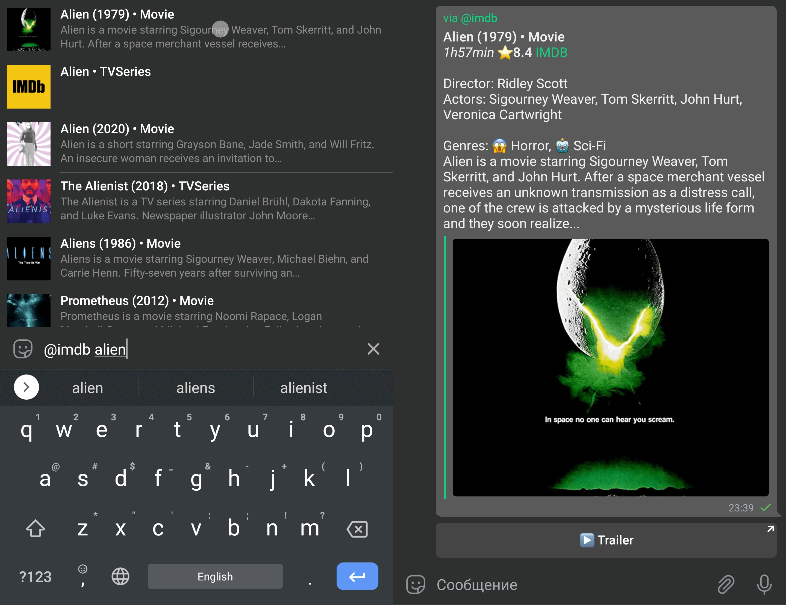
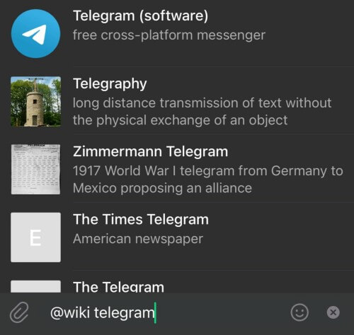
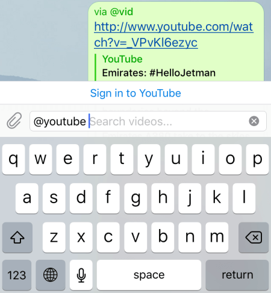
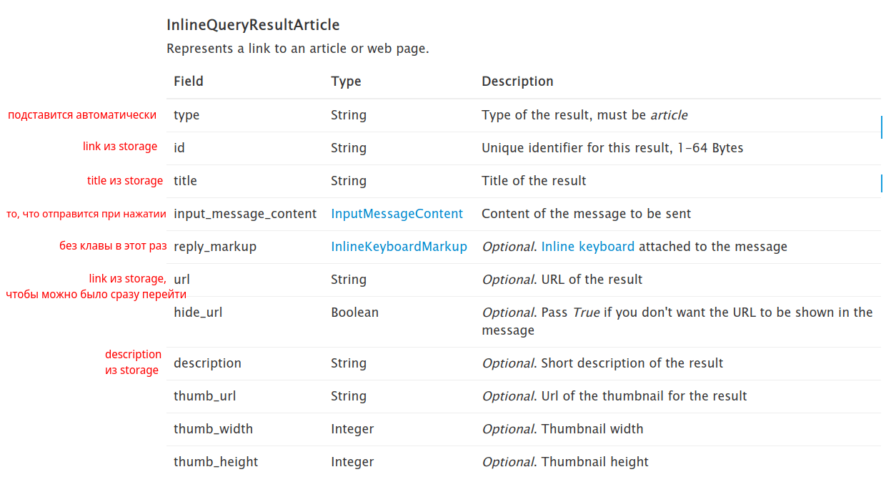
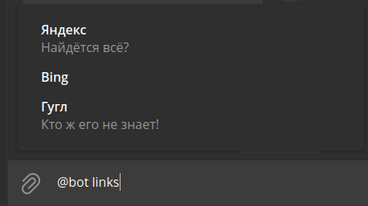
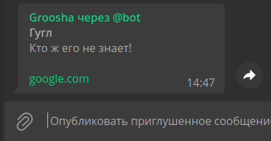
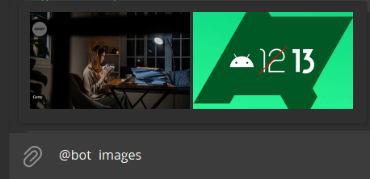
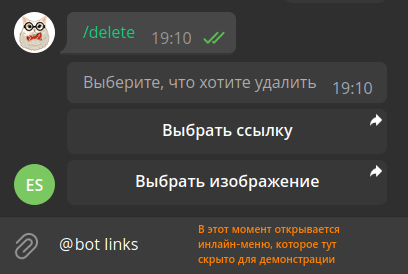
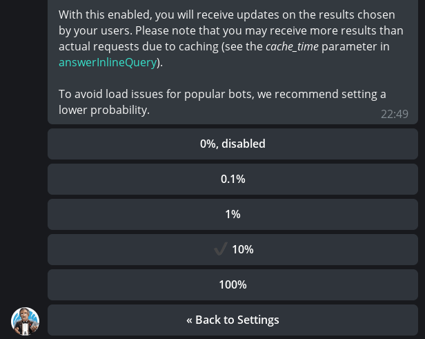

# Inline Mode

!!! info ""
    aiogram version used: 3.7.0

## Theory {: id="theory" }

### Why use inline mode? {: id="why-inline-mode" }

In previous chapters, the bot and user communicated with each other independently, but Telegram has a special mode
that allows a user to send information on their behalf, but with the help of a bot. This is called **inline mode**
(Inline mode), and here's what it looks like in practice:



But how can such a feature be applied in practice? I propose to look at the names of some
semi-official Telegram bots that have inline mode:

* [@gif](https://t.me/gif) 
* [@wiki](https://t.me/wiki)
* [@imdb](https://t.me/imdb)
* [@youtube](https://t.me/youtube)
* [@foursquare](https://t.me/foursquare)
* [@music](https://t.me/music)
* [@gamee](https://t.me/gamee)
* [@like](https://t.me/like)

The list could go on for a long time, but the idea, I hope, is clear: inline mode is perfect for searching for content to insert
into the current chat. Some of the capabilities of such bots (like, poll, gif) Telegram integrated into official
applications, but others are still actively used today.

!!! warning "Important"
    Remember that if a message sent from inline mode has a keyboard with a callback button attached,
    pressing it will cause the bot to receive a `CallbackQuery` object **without** a `Message` object inside. Instead,
    there will be a not very informative `inline_message_id`.

### Format of incoming requests {: id="incoming-update-format" }

When a user types a bot's username in the chat and then enters text, an update of type
[InlineQuery](https://core.telegram.org/bots/api#inlinequery) is created. If you carefully examine the fields of this object,
you can notice some oddities.

First, there is no chat ID from which the bot was called, instead there is an optional
field `chat_type`, showing (if non-empty) the **type** of chat (private, group, supergroup, channel). The reason is simple:
since you don't need to add the bot anywhere to use it in inline mode, adding a Chat object
would allow unnoticed tracking and collecting chats on Telegram.

Second, there is a field `offset`, and it's not a number, but a string. The fact is that by default a bot can send no more than
50 results to the user in response to an inline query. To show more, you need to pass the `next_offset` parameter in the response,
which will be duplicated in the `offset` field of the next `InlineQuery`. This way the bot will understand that it needs to load new data
starting from `offset`. And it's a string because in addition to numbers you can use various identifiers, like UUID.

### Format of outgoing responses {: id="outgoing-answer-format" }

To respond to user requests there is exactly one method:
[answerInlineQuery](https://core.telegram.org/bots/api#answerinlinequery).
But there are a whole 20 [types to send](https://core.telegram.org/bots/api#inlinequeryresult). More precisely,
in fact there are 11, since the remaining ones are just the same types, but with different input data, for example, `file_id`
instead of a link to a media file. It's best not to mix different types with each other, especially Article with the rest.
Let's consider some of them separately.



Perhaps the most commonly used type is [InlineQueryResultArticle](https://core.telegram.org/bots/api#inlinequeryresultarticle)
(shown in the image above). In all major clients, it looks like a stack of rectangular blocks, which always have
a title, sometimes have a description, and a preview image is displayed on the left, or just a placeholder.
If the developer set the `url` attribute, some clients display the specified link under the description line, and
the preview becomes clickable and leads directly to the link in the browser. When you click on the line, what is set in
the `input_message_content` argument is sent (it's mandatory), which can have 5 different types:

* text
* geolocation
* venue
* contact
* invoice


The remaining types relate to so-called "media files", which we will consider using images as an example. When responding with a set
of images, the data is arranged either as vertical tiles, as in the screenshot above, or as a scrollable horizontal
bar (for example, in the iOS version).

If you open the section about [InlineQueryResult](https://core.telegram.org/bots/api#inlinequeryresult) again, you will
see that Photo (like some other types) is presented in two variants:
`InlineQueryResultPhoto` and `InlineQueryResultCachedPhoto`. The difference is that the first variant accepts a link
to an image from the Internet, while the second accepts `file_id` from a media already uploaded to Telegram.

!!! warning "Important"
    In inline mode, you cannot upload images directly from a file. Either an Internet link or `file_id`.
    There is no third option.

By default, clicking on a media file from the results list causes that media to be sent to the invoked chat.
However, if you set the `input_message_content` argument (in the case of media, it's already optional), then when clicked,
what is set in this argument will be sent. For example, clicking on a movie poster will send its text description
with a link to watch in an online cinema. Or clicking on a photo of an employee will send their phone number as a
contact 👀. By the way, even though media has `title` and `description` arguments, clients don't display them,
and the Bot API itself [ignores](https://t.me/tdlibchat/16432) them.

The answerInlineQuery method has several arguments that deserve attention. First, there is `cache_time`.
It determines the period for which the query result can be cached by Telegram servers so it doesn't send it to the bot.
If your data is static or changes rarely, feel free to increase this value. Second, there is the `is_personal` flag,
which affects whether the result will be cached only for one user or for everyone. If your bot
shows personalized values depending on user ID, set it to True.

!!! info ""
    The author of these lines once forgot to set the `is_personal` flag in his [@my_id_bot](https://t.me/my_id_bot),
    set the cache to 86400 seconds (1 day) and heard a lot of complaints from users who were sending his ID instead of their
    own. Learn from others' mistakes, not your own.

Third, the string argument `next_offset`, which allows you to implement result loading as you scroll, since
you can return no more than 50 values in a single InlineQuery response. We'll consider using `next_offset` in a separate
example.

Fourth, `switch_pm_text` and `switch_pm_parameter`. In addition to the query results, the bot can show a small
button with text from the `switch_pm_text` argument above them, clicking on which is similar to a deep link, i.e., the user will go to
private chat with the bot, instead of the input field there will be a "START" button, and when clicked the bot will receive a message with text
`/start TEXT`, where instead of TEXT is the value of the `switch_pm_parameter` argument.



This is very convenient to use if there are no results for a specific query or you want to give the user an opportunity
to quickly add something. There's one more feature, but we'll consider it later during bot development.
Speaking of which...

## Practice {: id="practice" }

For the bot to know what to show when called in inline mode, it needs some data: either pre-saved,
or obtained from the user themselves. As an example, let's write a bot that will accept links
and images from the user, and then display all this good stuff in inline mode on request.

!!! info ""
    Don't forget to enable inline mode for the bot via [@BotFather](https://t.me/botfather):
    Bot Settings -> Inline Mode -> Turn on

### Storage system {: id="storage" }

To avoid diving too deeply into details, especially since this chapter is already quite long, let's agree that our test
bot will use a regular in-memory dictionary as a database imitation. This will allow us not to worry
about resetting the state during debugging, and also simplify pre-filling the storage if you suddenly want to
run the bot immediately with ready-made links or images. For each of the two types of data, there will be three functions:
add data, get data, delete data. So here's the entire code for the file:

```python title="storage.py"
from typing import Optional

# In real life, there should be a normal DBMS here.
# But for an example, a simple dictionary is enough for us.
# Note that it resets when the bot is restarted.
data = dict()


def add_link(
        telegram_id: int,
        link: str,
        title: str,
        description: Optional[str]
):
    """
    Saves a link to the dictionary

    :param telegram_id: User ID in Telegram
    :param link: link text
    :param title: link title
    :param description: (optional) link description
    """
    data.setdefault(telegram_id, dict())
    data[telegram_id].setdefault("links", dict())
    data[telegram_id]["links"][link] = {
        "title": title,
        "description": description
    }

def add_photo(
        telegram_id: int,
        photo_file_id: str,
        photo_unique_id: str
):
    """
    Saves an image to the dictionary

    :param telegram_id: User ID in Telegram
    :param photo_file_id: file_id of the image
    :param photo_unique_id: file_unique_id of the image
    """
    data.setdefault(telegram_id, dict())
    data[telegram_id].setdefault("images", [])
    if photo_file_id not in data[telegram_id]["images"]:
        data[telegram_id]["images"].append((photo_file_id, photo_unique_id))

def get_links_by_id(telegram_id: int) -> dict:
    """
    Gets user's saved links

    :param telegram_id: User ID in Telegram
    :return: if there is data for the user, then a dictionary with links
    """
    if telegram_id in data and "links" in data[telegram_id]:
        return data[telegram_id]["links"]
    return dict()

def get_images_by_id(telegram_id: int) -> list[str]:
    """
    Gets user's saved images

    :param telegram_id: User ID in Telegram
    :return:
    """
    if telegram_id in data and "images" in data[telegram_id]:
        return [item[0] for item in data[telegram_id]["images"]]
    return []

def delete_link(telegram_id: int, link: str):
    """
    Deletes a link

    :param telegram_id: User ID in Telegram
    :param link: link
    """
    if telegram_id in data:
        if "links" in data[telegram_id]:
            if link in data[telegram_id]["links"]:
                del data[telegram_id]["links"][link]

def delete_image(telegram_id: int, photo_file_unique_id: str):
    """
    Deletes an image

    :param telegram_id: User ID in Telegram
    :param photo_file_unique_id: file_unique_id of the image to delete
    """
    if telegram_id in data and "images" in data[telegram_id]:
        for index, (_, unique_id) in enumerate(data[telegram_id]["images"]):
            if unique_id == photo_file_unique_id:
                data[telegram_id]["images"].pop(index)
```

### Common bot commands {: id="common-commands" }

The bot will have several common commands: `/start`, `/help`, `/save`, `/delete`, and `/cancel`. The first two are informational,
`/save` starts the process of saving data, `/delete` starts the process of deleting data, and `/cancel`, accordingly,
interrupts one of the running processes. Let's start with the `/save` command.

### Saving data {: id="data-saving" }

This time we will describe states in a separate file to make it more convenient to import. For this, let's create a file
`states.py` and implement the `SaveCommon` class, which will have one state "waiting for input":

```python title="states.py"
from aiogram.fsm.state import StatesGroup, State

class SaveCommon(StatesGroup):
    waiting_for_save_start = State()
```

Now let's handle saving messages of various types

#### Text {: id="save-text" }

Let's start with text messages. The idea is simple: the user sends a message. If it contains at least one link, it
is extracted, and then the user is asked to enter the link title (mandatory) and description. The last step can be skipped
with the `/skip` command. If there are several links, only the first one is taken.

In addition to the "waiting for input" state described above, there are two more specific to text: "waiting for title input" and
"waiting for description input". In `states.py`, let's add these states:

```python title="states.py"
# here is the previous code

class TextSave(StatesGroup):
    waiting_for_title = State()
    waiting_for_description = State()
```

Let's start with two handlers for text in the `SaveCommon` -> `waiting_for_save_start` state. We need to catch messages with links.
In the chapter [about filters and middlewares](filters-and-middlewares.md#filters-as-classes), we already made a similar filter, but for
usernames. Now it's time to copy it from there and adapt it for links:

```python title="filters/text_has_link.py"
from typing import Union, Dict, Any

from aiogram.filters import BaseFilter
from aiogram.types import Message


class HasLinkFilter(BaseFilter):
    async def __call__(self, message: Message) -> Union[bool, Dict[str, Any]]:
        # If entities don't exist at all, None will be returned,
        # in this case we consider it an empty list
        entities = message.entities or []

        # If there is at least one link, return it
        for entity in entities:
            if entity.type == "url":
                return {"link": entity.extract_from(message.text)}

        # If we found nothing, return None
        return False
```

To shorten the import, let's edit the `filters/__init__.py` file:

```python title="filters/__init__.py"
from .text_has_link import HasLinkFilter

# Do this so we can then simply import
# from filters import HasLinkFilter
__all__ = [
    "HasLinkFilter"
]
```

Why do we need two handlers for text? The first will catch messages where there is a link, and the second - where there isn't.
Let's write:

```python title="handlers/save_text.py"
# <imports>

@router.message(SaveCommon.waiting_for_save_start, F.text, HasLinkFilter())
async def save_text_has_link(message: Message, link: str, state: FSMContext):
    await state.update_data(link=link)
    await state.set_state(TextSave.waiting_for_title)
    await message.answer(
        text=f"Okay, I found a link {link} in the message. "
             f"Now send me the title (no more than 30 characters)"
    )

@router.message(SaveCommon.waiting_for_save_start, F.text)
async def save_text_no_link(message: Message):
    await message.answer(
        text="Hmm.. I didn't find a link in your message. "
             "Try again or press /cancel to cancel."
    )
```

Next we expect the user to enter the title of the entry. Here too we can split the logic into two handlers: for successful
and unsuccessful circumstances:

```python title="handlers/save_text.py" hl_lines="3"
# imports and previous steps

@router.message(TextSave.waiting_for_title, F.text.func(len) <= 30)
async def title_entered_ok(message: Message, state: FSMContext):
    await state.update_data(title=message.text, description=None)
    await state.set_state(TextSave.waiting_for_description)
    await message.answer(
        text="Got it, I see the title. Now enter a description "
             "(also no more than 30 characters) "
             "or press /skip to skip this step"
    )

@router.message(TextSave.waiting_for_title, F.text)
async def too_long_title(message: Message):
    await message.answer("Title is too long. Try again")
    return
```

Pay attention to the code `F.text.func(len) <= 30`. Magic filter allows you to pass a function to input, which
will be executed on what is specified before `.func`. I.e. `F.text.func(len)` -> `len(F.text)` and only if the `.text` attribute
is not None (in other words, there's also a check for content type). But actually specifically for `len()`
there is support directly in
[magic-filter](https://github.com/aiogram/magic-filter/blob/3c5e38fd5cd359fd961e26bab17e65201b02c1c6/magic_filter/magic.py#L227-L228):
`F.text.len() <= 30`

Next is a handler for description. Here again we can split into two handlers... wait, the `too_long_title()` function,
essentially, could also be suitable for the description step, since we have the same text limits! Let's rename it and
add a filter for another state:

```python title="handlers/save_text.py"
@router.message(TextSave.waiting_for_title, F.text)
@router.message(TextSave.waiting_for_description, F.text)
async def text_too_long(message: Message):  # formerly too_long_title()
    await message.answer("Title is too long. Try again")
    return
```

Now let's handle the last handler, which we enter either when entering a short description or with the `/skip` command.
And since we need to catch two inputs, we attach two decorators, take an optional `CommandObject` in the arguments, and inside
check: if there's no command, it means the description was entered:

```python title="handlers/save_text.py"
# This function should be BEFORE text_too_long() !
@router.message(TextSave.waiting_for_description, F.text.func(len) <= 30)
@router.message(TextSave.waiting_for_description, Command("skip"))
async def last_step(
        message: Message,
        state: FSMContext,
        command: Optional[CommandObject] = None
):
    if not command:
        await state.update_data(description=message.text)
    # Save data to our pseudo database
    data = await state.get_data()
    add_link(message.from_user.id, data["link"], data["title"], data["description"])

    await message.answer("Link saved!")
    await state.clear()
```

So, we've created a set of handlers for saving links to our in-memory database. Here's the entire code for the file:

```python title="handlers/save_text.py"
from typing import Optional

from aiogram import Router, F
from aiogram.filters.command import Command, CommandObject
from aiogram.fsm.context import FSMContext
from aiogram.types import Message, InlineKeyboardMarkup, InlineKeyboardButton

from filters import HasLinkFilter
from states import SaveCommon, TextSave
from storage import add_link

router = Router()

@router.message(SaveCommon.waiting_for_save_start, F.text, HasLinkFilter())
async def save_text_has_link(message: Message, link: str, state: FSMContext):
    await state.update_data(link=link)
    await state.set_state(TextSave.waiting_for_title)
    await message.answer(
        text=f"Okay, I found a link {link} in the message. "
             f"Now send me a description (no more than 30 characters)"
    )

@router.message(SaveCommon.waiting_for_save_start, F.text)
async def save_text_no_link(message: Message):
    await message.answer(
        text="Hmm.. I didn't find a link in your message. "
             "Try again or press /cancel to cancel."
    )

@router.message(TextSave.waiting_for_title, F.text.func(len) <= 30)
async def title_entered_ok(message: Message, state: FSMContext):
    await state.update_data(title=message.text, description=None)
    await state.set_state(TextSave.waiting_for_description)
    await message.answer(
        text="Got it, I see the title. Now enter a description "
             "(also no more than 30 characters) "
             "or press /skip to skip this step"
    )

@router.message(TextSave.waiting_for_description, F.text.func(len) <= 30)
@router.message(TextSave.waiting_for_description, Command("skip"))
async def last_step(
        message: Message,
        state: FSMContext,
        command: Optional[CommandObject] = None
):
    if not command:
        await state.update_data(description=message.text)
    # Save data to our pseudo database
    data = await state.get_data()
    add_link(message.from_user.id, data["link"], data["title"], data["description"])
    await state.clear()
    kb = [[InlineKeyboardButton(
        text="Try it",
        switch_inline_query="links"
    )]]
    await message.answer(
        text="Link saved!",
        reply_markup=InlineKeyboardMarkup(inline_keyboard=kb)
    )

@router.message(TextSave.waiting_for_title, F.text)
@router.message(TextSave.waiting_for_description, F.text)
async def text_too_long(message: Message):
    await message.answer("Title is too long. Try again")
    return
```

#### Images {: id="save-images" }

Images are much simpler; they are added in one step. But there's a catch: in addition to `file_id` for subsequent display,
we need to save `file_unique_id`, since it will come in handy when we allow the user to delete saved images:

```python title="handlers/save_images.py"
from aiogram import Router, F
from aiogram.fsm.context import FSMContext
from aiogram.types import Message, PhotoSize
from states import SaveCommon
from storage import add_photo

router = Router()

@router.message(SaveCommon.waiting_for_save_start, F.photo[-1].as_("photo"))
async def save_image(message: Message, photo: PhotoSize, state: FSMContext):
    add_photo(message.from_user.id, photo.file_id, photo.file_unique_id)
    await message.answer("Image saved!")
    await state.clear()
```

### Displaying data {: id="show-data" }

Okay, we've learned how to save data, now we need to display it somehow. For this the bot must catch updates with type
`inline_query`, and the handler will receive an object of type [InlineQuery](https://core.telegram.org/bots/api#inlinequery).
Let's agree that we won't show anything on an empty query (for now), on the request `@bot links` we'll show a list of links, and
on the request `@bot images` - images. Instead of `@bot`, of course, there will be the bot's username.

#### Text {: id="show-text" }

To respond with text messages we need to collect a list of objects with the type
[InlineQueryResultArticle](https://core.telegram.org/bots/api#inlinequeryresultarticle). We already have all the necessary
(and even additional) data:



For the `input_message_content` argument, let's write a simple nested function that will return text taking into account the presence or
absence of a description:

```python
def get_message_text(
        link: str,
        title: str,
        description: Optional[str]
) -> str:
    text_parts = [f'{html.bold(html.quote(title))}']
    if description:
        text_parts.append(html.quote(description))
    text_parts.append("")  # add an empty line
    text_parts.append(link)
    return "\n".join(text_parts)
```

Now let's describe the handler itself:

```python title="handlers/inline_mode.py"
@router.inline_query(F.query == "links")
async def show_user_links(inline_query: InlineQuery):

    # This function simply collects the text that will be
    # sent when clicking on a variant in inline mode
    def get_message_text():
        # this nested function is described above ↑

    results = []
    for link, link_data in get_links_by_id(inline_query.from_user.id).items():
        # Add each record to the final array
        results.append(InlineQueryResultArticle(
            id=link,  # links are unique for us, so no problems
            title=link_data["title"],
            description=link_data["description"],
            input_message_content=InputTextMessageContent(
                message_text=get_message_text(
                    link=link,
                    title=link_data["title"],
                    description=link_data["description"]
                ),
                parse_mode="HTML"
            )
        ))
    # Don't forget to set is_personal=True!
    await inline_query.answer(results, is_personal=True)
```

As a result we get (the second record skipped the description step):



When clicked, we get a nice message like this:



#### Images {: id="show-images" }

Images are a bit simpler, but there's a catch: we can't use the image's `file_id` as the ID of a specific variant,
because it's longer than 64 bytes (Bot API limit). So we will use the ordinal number of the element in the array,
converted to a string. Otherwise, the code is very similar to the previous one:

```python title="handlers/inline_mode.py"
@router.inline_query(F.query == "images")
async def show_user_images(inline_query: InlineQuery):
    results = []
    for index, file_id in enumerate(get_images_by_id(inline_query.from_user.id)):
        # Add each record to the final array
        results.append(InlineQueryResultCachedPhoto(
            id=str(index),  # index of the element in list
            photo_file_id=file_id
        ))
    # Don't forget to set is_personal=True!
    await inline_query.answer(results, is_personal=True)
```

And here's the result:



### Deleting data {: id="delete-data" }

Saved items need to be cleaned up from time to time. We also want to give the user the ability to delete accumulated links
and/or images. For this we'll create a handler for the `/delete` command. But we don't want to force the user to enter the bot's username
and write `links` or `images`. For this we'll place two buttons under the command response. One will open
inline mode to view links, the other - to view images.

Let's add a new class to `states.py`:

```python title="states.py"
class DeleteCommon(StatesGroup):
    waiting_for_delete_start = State()
```

Now let's create a handler for the `/delete` command:

```python title="handlers/common.py" hl_lines="7 13"
# new import
from aiogram.filters.state import StateFilter

@router.message(Command("delete"), StateFilter(None))
async def cmd_delete(message: Message, state: FSMContext):
    kb = []
    kb.append([
        InlineKeyboardButton(
            text="Select a link",
            switch_inline_query_current_chat="links"
        )
    ])
    kb.append([
        InlineKeyboardButton(
            text="Select an image",
            switch_inline_query_current_chat="images"
        )
    ])
    await state.set_state(DeleteCommon.waiting_for_delete_start)
    await message.answer(
        text="Choose what you want to delete:",
        reply_markup=InlineKeyboardMarkup(inline_keyboard=kb)
    )
```

When you click on such a button, the correct value is substituted in inline mode, which will immediately open a list of links or
images (for demonstration, I removed the popup menu for now to show the buttons):



If we used `switch_inline_query` instead of `switch_inline_query_current_chat`, Telegram would offer
to select a chat where the user can write, and then substitute the specified text there.

It remains to write a router that will catch delete requests and edit the storage contents:

```python title="handlers/delete_data.py"
# imports
router = Router()

@router.message(
    DeleteCommon.waiting_for_delete_start,
    F.text,
    ViaBotFilter(),
    HasLinkFilter()
)
async def link_deletion_handler(message: Message, link: str, state: FSMContext):
    delete_link(message.from_user.id, link)
    await state.clear()
    await message.answer(
        text="Link deleted! "
             "Inline mode results will update within a few minutes.")

@router.message(
    DeleteCommon.waiting_for_delete_start,
    F.photo[-1].file_unique_id.as_("file_unique_id"),
    ViaBotFilter()
)
async def image_deletion_handler(
        message: Message,
        state: FSMContext,
        file_unique_id: str
):
    delete_image(message.from_user.id, file_unique_id)
    await state.clear()
    await message.answer(
        text="Image deleted! "
             "Inline mode results will update within a few minutes.")
```

Note: we delete images by `file_unique_id`, because each time an image is sent, `file_id` will be different
(in short: the full `file_id` contains time stamps and other non-constant data).


### Switch back and forth {: id="switch-parameter" }

When we previously discussed [the format of outgoing responses](#outgoing-answer-format), we saw arguments
with the `switch_pm` prefix. Let's use them so the user can immediately start adding data from any
chat, not just from the private chat with the bot.

Let's add the above-mentioned parameters to the inline query handler. To do this, let's rewrite the `answer_inline_query()` method call
in the `handlers/inline_mode.py` file:

```python
await inline_query.answer(
        results, is_personal=True,
        switch_pm_text="Add more »»",
        switch_pm_parameter="add"
    )
```

In the `handlers/common.py` file, let's add one more entry point to the `/save` command handler using the `CommandStart`
filter with a deep link `add`:

```python title="handlers/common.py" hl_lines="4"
# new import:
from aiogram.filters.command import CommandStart

@router.message(CommandStart(magic=F.args == "add"))
@router.message(Command("save"), StateFilter(None))
async def cmd_save(message: Message, state: FSMContext):
    ...

# Note that the handler for just /start should come AFTER this one
@router.message(Command(commands=["start"]))
async def cmd_start(message: Message, state: FSMContext):
    ...
```

And also at the final step of adding text and images, let's add a `switch_inline_query` button with an offer
to try posting something to another chat:

```python
# file handlers/save_text.py
@router.message(TextSave.waiting_for_description, F.text.func(len) <= 30)
@router.message(TextSave.waiting_for_description, Command("skip"))
async def last_step(...):
    # rest of the function code here
    kb = [[InlineKeyboardButton(
        text="Try it",
        switch_inline_query="links"
    )]]
    await message.answer(
        text="Link saved!",
        reply_markup=InlineKeyboardMarkup(inline_keyboard=kb)
    )

# file handlers/save_images.py
@router.message(SaveCommon.waiting_for_save_start, F.photo[-1].as_("photo"))
async def save_image(...):
    # rest of the function code here
    kb = [[InlineKeyboardButton(
        text="Try it",
        switch_inline_query="images"
    )]]
    await message.answer(
        text="Image saved!",
        reply_markup=InlineKeyboardMarkup(inline_keyboard=kb)
    )
```

And here lies another cool feature of inline mode: if you call the bot not in its private chat, switch to the
"Add more »»" button, and get to the final step, then when the bot sends a message with a `switch_inline_query` button,
the Telegram client will automatically return the user to the original chat and immediately open inline mode with the needed text!


## Additional materials {: id="extras" }

### Result pagination {: id="lazy-loading" }

According to Bot API documentation, you can send no more than 50 elements in one call to [answerInlineQuery](https://core.telegram.org/bots/api#answerinlinequery).
But what if you need more? For this case the `next_offset` parameter comes in handy. The bot specifies it, and this same value will come in
the next inline query when the user scrolls through all current items. For example, let's write a simple number generator
that returns batches of 50 elements, but with a maximum value of 195:

```python title="handlers/inline_pagination_demo.py"
def get_fake_results(start_num: int, size: int = 50) -> list[int]:
    """
    Generates a list of consecutive numbers

    :param start_num: starting number for the generator
    :param size: batch size (default 50)
    :return: list of consecutive numbers
    """
    overall_items = 195
    # If there are no more results, send an empty list
    if start_num >= overall_items:
        return []
    # Sending an incomplete batch (the last one)
    elif start_num + size >= overall_items:
        return list(range(start_num, overall_items+1))
    else:
        return list(range(start_num, start_num+size))
```

Now let's write an inline handler so that when approaching the end of the current list, Telegram requests
more data. To do this, first check the `offset` field and set it to one if it's empty. Then generate
a fake list of results. If the output is exactly 50 objects, then in the response we set `next_offset` equal to the current
value + 50. If there are fewer objects, we don't specify anything so Telegram doesn't try to load new rows:

```python title="handlers/inline_pagination_demo.py" hl_lines="21"
@router.inline_query(F.query == "long")
async def pagination_demo(
        inline_query: InlineQuery,
):
    # Calculate offset as a number
    offset = int(inline_query.offset) if inline_query.offset else 1
    results = [InlineQueryResultArticle(
        id=str(item_num),
        title=f"Item #{item_num}",
        input_message_content=InputTextMessageContent(
            message_text=f"Item #{item_num}"
        )
    ) for item_num in get_fake_results(offset)]
    if len(results) < 50:
        await inline_query.answer(
            results, is_personal=True
        )
    else:
        await inline_query.answer(
            results, is_personal=True, 
            next_offset=str(offset+50)
        )
```

As the user scrolls through the inline results, the bot will receive requests and return new results, until it reaches
the 195th element, then the requests will stop.

### Collecting statistics {: id="inline-feedback" }

Few people know, but Telegram allows you to collect simple statistics on bot usage in inline mode. To start,
you need to enable the corresponding setting with @BotFather: `/mybots` - (select bot) - Bot Settings - Inline Feedback:



The numbers on the buttons indicate the _probability_ of receiving a [ChosenInlineResult](https://core.telegram.org/bots/api#choseninlineresult) event
when the user selects an object in inline mode. So, for example, if set to **10%**, then each time an object is selected there is a
ten percent chance of receiving a ChosenInlineResult event in the bot. Telegram doesn't recommend setting the value to 100% due to
doubling the load on the bot. Thus, for serious analytics this feature is not suitable, but in capable hands and over a long period
of time it can give a general idea of the most useful inline results. Example of a handler for such events:

```python title="handlers/inline_chosen_result_demo.py"
from aiogram import Router
from aiogram.types import ChosenInlineResult

router = Router()

@router.chosen_inline_result()
async def pagination_demo(
        chosen_result: ChosenInlineResult,
):
    # Write directly to console. But you might want to save it somewhere
    print(
        f"After '{chosen_result.query}' query, "
        f"user chose option with ID '{chosen_result.result_id}'"
    )
```

Despite the fact that Telegram doesn't recommend setting large values for Inline Feedback, this feature has at least one practical application:
some music bots try to load the full version of a composition on request without saving the song beforehand. If you do this when the bot is
called in inline mode, you might not fit within 10-15 seconds, after which Bot API will return an error about a "stale" update.

And here's how developers work around this: while the bot is searching for a track, the preview offers a short sample
(5-10 seconds). When the user clicks on a line, an audio message is sent with an inline button attached
(otherwise it's impossible to edit the message), the bot catches the send event, extracts the `inline_message_id` of the message from the `ChosenInlineResult` update,
loads the full version of the audio, and using this `inline_message_id` edits the sample to become the full track. Telegram teaches you to use workarounds, yes.
