# Кнопки

!!! info ""
    Використовувана версія aiogram: 3.7.0

У цій главі ми познайомимося з такою чудовою функцією Telegram-ботів як кнопки. Перш за все, щоб уникнути 
плутанини, визначимося з назвами. То, що причеплюється до дна екрана вашого пристрою, будемо називати **звичайними** 
кнопками, а то, що причеплюється безпосередньо до повідомлень, назвемо **інлайн**-кнопками. Ще раз картинкою:  

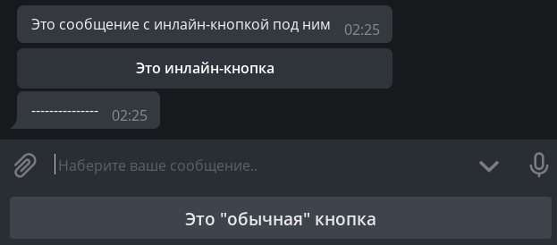

## Звичайні кнопки {: id="reply-buttons" }
### Кнопки як шаблони {: id="reply-as-text" }

Цей вид кнопок з'явився разом з Bot API у далекому 2015 році і представляє собою не що інше, як шаблони повідомлень 
(за винятком кількох особливих випадків, але про них пізніше). Принцип простий: що написано на кнопці, те й буде відправлено 
в поточний чат. Відповідно, щоб обробити натиск такої кнопки, бот повинен розпізнавати вхідні текстові повідомлення. 

Напишемо хендлер, який при натиску на команду `/start` буде відправляти повідомлення з двома кнопками:

```python
@dp.message(Command("start"))
async def cmd_start(message: types.Message):
    kb = [
        [types.KeyboardButton(text="С пюрешкой")],
        [types.KeyboardButton(text="Без пюрешки")]
    ]
    keyboard = types.ReplyKeyboardMarkup(keyboard=kb)
    await message.answer("Как подавать котлеты?", reply_markup=keyboard)
```

!!! info ""
    Незважаючи на те, що Telegram Bot API [дозволяє](https://core.telegram.org/bots/api#keyboardbutton) вказувати 
    просто рядки замість об'єктів `KeyboardButton`, при спробі використати рядок aiogram 3.x викине помилку 
    валідації і це не баг, а [фіча](https://t.me/aiogram_pcr/1/920453).  
    Живіть тепер з цим 🤷‍♂️

Що ж, запустимо бота і здивуємося від величезних кнопок:

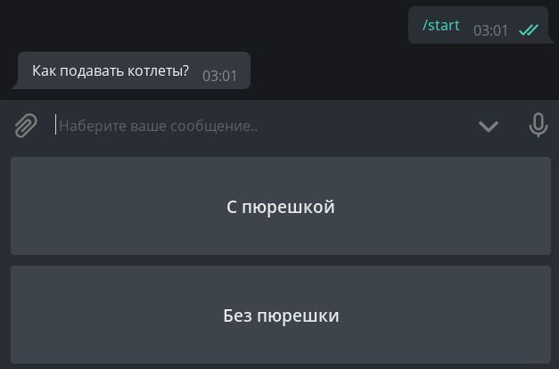

Якось некрасиво. По-перше, хочеться зробити кнопки менше, а по-друге, розташувати їх горизонтально.  
Чому взагалі вони такі великі? Справа в тому, що за замовчуванням «кнопкова» клавіатура повинна займати на смартфонах стільки 
ж місця, скільки й звичайна буквена. Для зменшення кнопок до об'єкту клавіатури надо вказати додатковий 
параметр `resize_keyboard=True`.  
Але як замінити вертикальні кнопки на горизонтальні? З точки зору Bot API, клавіатура — це 
[масив масивів](https://core.telegram.org/bots/api#replykeyboardmarkup) кнопок, а якщо говорити простіше, масив рядків. 
Перепишемо наш код, щоб було красиво, а для більшої важливості додамо параметр `input_field_placeholder`, який замінить текст у порожній строці введення, 
коли активна звичайна клавіатура:

```python
@dp.message(Command("start"))
async def cmd_start(message: types.Message):
    kb = [
        [
            types.KeyboardButton(text="С пюрешкой"),
            types.KeyboardButton(text="Без пюрешки")
        ],
    ]
    keyboard = types.ReplyKeyboardMarkup(
        keyboard=kb,
        resize_keyboard=True,
        input_field_placeholder="Выберите способ подачи"
    )
    await message.answer("Как подавать котлеты?", reply_markup=keyboard)
```

Дивимося — дійсно красиво:

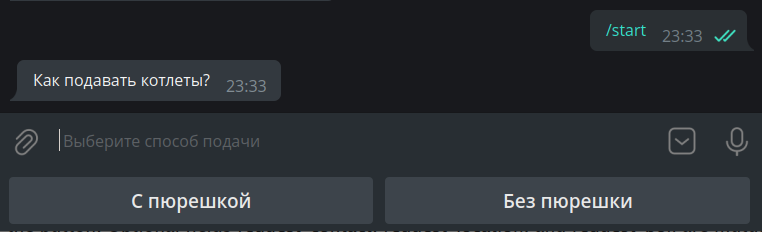

Залишилося навчити бота реагувати на натиск таких кнопок. Як уже було сказано вище, необхідно робити перевірку 
на повне збігання тексту. Зробимо це за допомогою _магічного фільтра_ F, детальніше про який 
поговоримо в [іншій главі](filters-and-middlewares.md#magic-filters):

```python
# новый импорт!
from aiogram import F

@dp.message(F.text.lower() == "с пюрешкой")
async def with_puree(message: types.Message):
    await message.reply("Отличный выбор!")

@dp.message(F.text.lower() == "без пюрешки")
async def without_puree(message: types.Message):
    await message.reply("Так невкусно!")
```

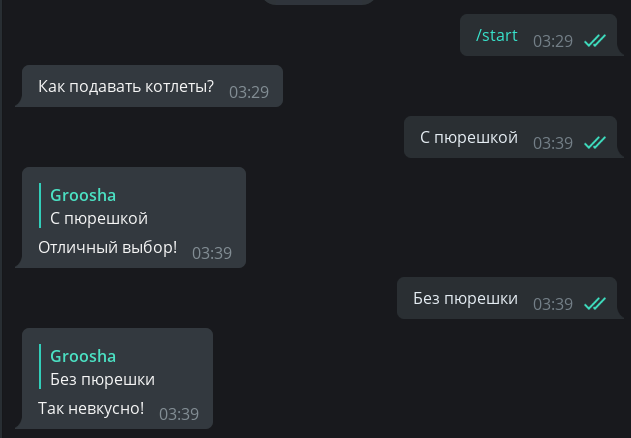

Щоб видалити кнопки, необхідно відправити нове повідомлення зі спеціальною «видаляючою» клавіатурою типу 
`ReplyKeyboardRemove`. Наприклад: `await message.reply("Отличный выбор!", reply_markup=types.ReplyKeyboardRemove())`

### Keyboard Builder {: id="reply-builder" }

Для більш динамічної генерації кнопок можна скористатися збирачем клавіатур. Нам знадобляться 
наступні методи:

- `add(<KeyboardButton>)` — додає кнопку в пам'ять збирача;
- `adjust(int1, int2, int3...)` — робить рядки по `int1, int2, int3...` кнопок;
- `as_markup()` — повертає готовий об'єкт клавіатури;
- `button(<params>)` — додає кнопку з заданими параметрами, тип кнопки (Reply або Inline) визначається автоматично.

Створимо пронумеровану клавіатуру розміром 4×4:

```python
# новый импорт!
from aiogram.utils.keyboard import ReplyKeyboardBuilder

@dp.message(Command("reply_builder"))
async def reply_builder(message: types.Message):
    builder = ReplyKeyboardBuilder()
    for i in range(1, 17):
        builder.add(types.KeyboardButton(text=str(i)))
    builder.adjust(4)
    await message.answer(
        "Выберите число:",
        reply_markup=builder.as_markup(resize_keyboard=True),
    )
```

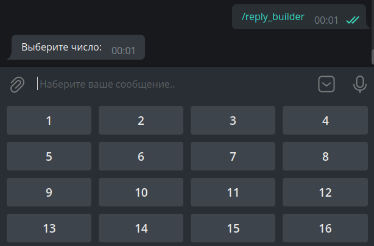


!!! info ""
    У [об'єкту звичайної клавіатури](https://core.telegram.org/bots/api#replykeyboardmarkup) є ще дві корисні опції: 
    `one_time_keyboard` для автоматичного скриття кнопок після натиску і `selective` для показу клавіатури 
    лише деяким учасникам групи. Їх використання залишається для самостійного вивчення.

### Спеціальні звичайні кнопки {: id="reply-special" }

На момент написання цієї глави в Telegram існує шість спеціальних видів звичайних кнопок, які не є 
звичайними шаблонами повідомлень. Вони призначені для:

- відправки поточної геолокації; 
- відправки свого контакту з номером телефону; 
- створення опитування/вікторини; 
- вибору і відправки боту даних користувача з потрібними критеріями;
- вибору і відправки боту даних (супер)групи або каналу з потрібними критеріями;
- запуску веб-програми (WebApp).

Поговоримо про них детальніше.

**Відправка поточної геолокації**. Тут все просто: де користувач знаходиться, ті координати й відправляє. 
Це буде статичне гео, а не Live Location, який оновлюється автоматично. Розумно, що хитрі користувачі 
можуть підмінити своє місцезнаходження, іноді навіть на рівні всієї системи (Android).  

**Відправка свого контакту з номером телефону**. При натиску на кнопку (з попередньою підтвердженням) 
користувач відправляє свій контакт з номером телефону боту. Ті самі хитрі користувачі можуть ігнорувати кнопку 
і відправити будь-який контакт, але в цьому випадку на них можна знайти управу: достатньо перевірити в хендлері або 
в фільтрі рівність `message.contact.user_id == message.from_user.id`.

**Створення опитування/вікторини**. За натиску на кнопку користувачеві пропонується створити опитування або вікторину, які 
потім відправляться в поточний чат. Необхідно передати 
об'єкт [KeyboardButtonPollType](https://core.telegram.org/bots/api#keyboardbuttonpolltype), 
необов'язковий аргумент `type` служить для уточнення типу опитування (опитування або вікторина).

**Вибір і відправка боту даних користувача з потрібними критеріями**. Показує вікно вибору користувача зі списку чатів 
того, хто натиснув на кнопку. Необхідно передати об'єкт 
[KeyboardButtonRequestUser](https://core.telegram.org/bots/api#keyboardbuttonrequestuser), в якому надо вказати 
згенерований будь-яким способом айді запиту і критерії, наприклад, "бот", "є підписка Telegram Premium" і т.д. 
Після вибору користувача бот отримає сервісне повідомлення з типом [UserShared](https://core.telegram.org/bots/api#usershared).

**Вибір і відправка боту чату з потрібними критеріями**. Показує вікно вибору користувача зі списку чатів 
того, хто натиснув на кнопку. Необхідно передати об'єкт 
[KeyboardButtonRequestChat](https://core.telegram.org/bots/api#keyboardbuttonrequestchat), в якому надо вказати 
згенерований будь-яким способом айді запиту і критерії, наприклад, "група або канал", "користувач — творець чату" і т.д.
Після вибору користувача бот отримає сервісне повідомлення з типом [ChatShared](https://core.telegram.org/bots/api#chatshared).

**Запуск веб-програми (WebApp)**. При натиску на кнопку відкриває [WebApp](https://core.telegram.org/bots/webapps). 
Необхідно передати об'єкт [WebAppInfo](https://core.telegram.org/bots/api#webappinfo). 
У цій книзі веб-програми наразі розглядатися не будуть.

Втім, простіше один раз побачити код:
```python
@dp.message(Command("special_buttons"))
async def cmd_special_buttons(message: types.Message):
    builder = ReplyKeyboardBuilder()
    # метод row позволяет явным образом сформировать ряд
    # из одной или нескольких кнопок. Например, первый ряд
    # будет состоять из двух кнопок...
    builder.row(
        types.KeyboardButton(text="Запросить геолокацию", request_location=True),
        types.KeyboardButton(text="Запросить контакт", request_contact=True)
    )
    # ... второй из одной ...
    builder.row(types.KeyboardButton(
        text="Создать викторину",
        request_poll=types.KeyboardButtonPollType(type="quiz"))
    )
    # ... а третий снова из двух
    builder.row(
        types.KeyboardButton(
            text="Выбрать премиум пользователя",
            request_user=types.KeyboardButtonRequestUser(
                request_id=1,
                user_is_premium=True
            )
        ),
        types.KeyboardButton(
            text="Выбрать супергруппу с форумами",
            request_chat=types.KeyboardButtonRequestChat(
                request_id=2,
                chat_is_channel=False,
                chat_is_forum=True
            )
        )
    )
    # WebApp-ов пока нет, сорри :(

    await message.answer(
        "Выберите действие:",
        reply_markup=builder.as_markup(resize_keyboard=True),
    )
```

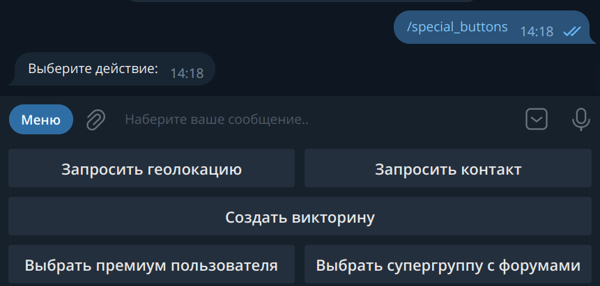

Напоследок, два шаблони хендлерів на прийом натисків від нижніх двох кнопок:

```python
# новый импорт
from aiogram import F

@dp.message(F.user_shared)
async def on_user_shared(message: types.Message):
    print(
        f"Request {message.user_shared.request_id}. "
        f"User ID: {message.user_shared.user_id}"
    )


@dp.message(F.chat_shared)
async def on_user_shared(message: types.Message):
    print(
        f"Request {message.chat_shared.request_id}. "
        f"User ID: {message.chat_shared.chat_id}"
    )
```


## Інлайн-кнопки {: id="inline-buttons" }
### URL-кнопки {: id="url-buttons" }

На відміну від звичайних кнопок, інлайнові причеплюються не до дна екрана, а до повідомлення, з яким були відправлені. 
У цій главі ми розглянемо два типи таких кнопок: URL і Callback. Ще один — Switch — буде розглянут 
в главі про [інлайн-режим](inline-mode.md).

!!! info ""
    Login- і Pay-кнопки в книзі розглядатися не будуть взагалі. Якщо у когось є бажання допомогти хоча б 
    з робочим кодом для авторизації або оплати, будь ласка, створіть Pull Request на 
    [GitHub](https://github.com/MasterGroosha/aiogram-3-guide). Спасибо!

Найпростіші інлайн-кнопки відносяться до типу URL, тобто «посилання». Підтримуються лише протоколи HTTP(S) і tg://

```python
# новый импорт
from aiogram.utils.keyboard import InlineKeyboardBuilder

@dp.message(Command("inline_url"))
async def cmd_inline_url(message: types.Message, bot: Bot):
    builder = InlineKeyboardBuilder()
    builder.row(types.InlineKeyboardButton(
        text="GitHub", url="https://github.com")
    )
    builder.row(types.InlineKeyboardButton(
        text="Оф. канал Telegram",
        url="tg://resolve?domain=telegram")
    )

    # Чтобы иметь возможность показать ID-кнопку,
    # У юзера должен быть False флаг has_private_forwards
    user_id = 1234567890
    chat_info = await bot.get_chat(user_id)
    if not chat_info.has_private_forwards:
        builder.row(types.InlineKeyboardButton(
            text="Какой-то пользователь",
            url=f"tg://user?id={user_id}")
        )

    await message.answer(
        'Выберите ссылку',
        reply_markup=builder.as_markup(),
    )
```

Окремо зупинимося на середньому блоці коду. Справа в тому, що в березні 2019 року розробники Telegram 
[додали можливість](https://telegram.org/blog/unsend-privacy-emoji#anonymous-forwarding) вимикати перехід 
до профілю користувача у пересланому повідомленні. При спробі створити URL-кнопку з ID користувача, у якого вимкнено 
перехід по форварду, бот отримає помилку `Bad Request: BUTTON_USER_PRIVACY_RESTRICTED`. Відповідно, перш ніж 
показувати таку кнопку, необхідно з'ясувати стан згаданого налаштування. Для цього можна викликати метод 
[getChat](https://core.telegram.org/bots/api#getchat) і в відповіді перевірити стан поля `has_private_forwards`. 
Якщо воно дорівнює `True`, значить, спроба додати URL-ID кнопку приведе до помилки. 

### Колбеки {: id="callback-buttons" }

З URL-кнопками більше обговорювати, по суті, нічого немає, тому перейдемо до гвоздика сьогоднішньої програми — Callback-кнопкам. 
Це дуже потужна штука, яку ви можете зустріти практично скрізь. Кнопки-реакції у постах (лайки), меню у @BotFather 
і т.д. Суть у чому: у колбек-кнопок є спеціальне значення (data), за яким ваше додаток опізнає, що натиснуто й що надо зробити. 
І вибір правильного data **дуже важливий**! Варто також відзначити, що, на відміну від звичайних кнопок, натиск на колбек-кнопку 
дозволяє зробити практично що угодно, від замовлення піци до запуску обчислень на кластері суперкомп'ютерів.

Напишемо хендлер, який за командою `/random` буде відправляти повідомлення з колбек-кнопкою:
```python
@dp.message(Command("random"))
async def cmd_random(message: types.Message):
    builder = InlineKeyboardBuilder()
    builder.add(types.InlineKeyboardButton(
        text="Нажми меня",
        callback_data="random_value")
    )
    await message.answer(
        "Нажмите на кнопку, чтобы бот отправил число от 1 до 10",
        reply_markup=builder.as_markup()
    )
```

Але як же обробити натиск? Якщо раніше ми використовували хендлер на `message` для обробки вхідних повідомлень, то тепер 
будемо використовувати хендлер на `callback_query` для обробки колбеків. Орієнтуватися будемо на «значення» кнопки, тобто на 
її data:

```python
@dp.callback_query(F.data == "random_value")
async def send_random_value(callback: types.CallbackQuery):
    await callback.message.answer(str(randint(1, 10)))
```

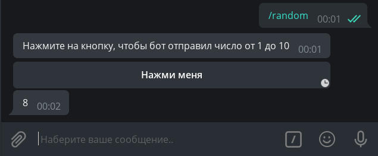

Ой, а що це за годинник? Виявляється, сервер Telegram чекає від нас підтвердження про доставку колбека, інакше протягом 30 
секунд буде показувати спеціальну іконку. Щоб сховати годинник, потрібно викликати метод `answer()` у колбека (або використати 
метод API `answer_callback_query()`). У загальному випадку, в метод `answer()` можна нічого не передавати, але можна викликати 
спеціальне вікно (вспливаюче зверху або поверх екрана):

```python
@dp.callback_query(F.data == "random_value")
async def send_random_value(callback: types.CallbackQuery):
    await callback.message.answer(str(randint(1, 10)))
    await callback.answer(
        text="Спасибо, что воспользовались ботом!",
        show_alert=True
    )
    # или просто await callback.answer()
```

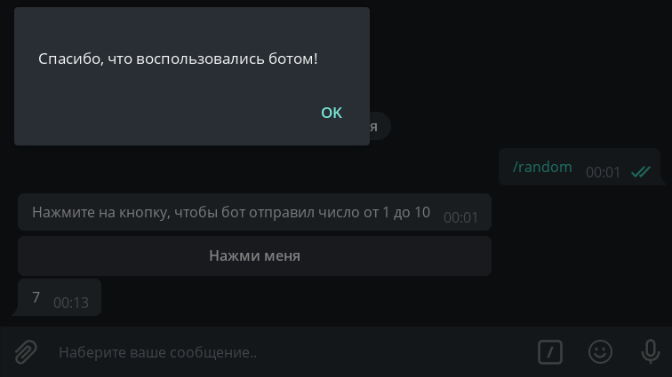

У читача може виникнути питання: в який момент обробки відповідати на колбек методом `answer()`? У загальному випадку, головне — просто не забути повідомити Telegram про отримання колбек-запиту, але я рекомендую ставити 
    виклик `answer()` в самому кінці, і ось чому: якщо раптом у процесі обробки колбека статись якась помилка і 
    бот нараховується на необроблене виключення, користувач побачить неприбираючі півхвилини годинник і зрозуміє, що щось 
    не так. В іншому випадку годинник зникне, а користувач залишиться в невіданні, виконався його запит успішно чи ні.

!!! info "Звертайте увагу"
    У функції `send_random_value` ми викликали метод `answer()` не у `message`, а у `callback.message`. Це пов'язано з тим, 
    що колбек-хендлери працюють не з повідомленнями (тип [Message](https://core.telegram.org/bots/api#message)), 
    а з колбеками (тип [CallbackQuery](https://core.telegram.org/bots/api#callbackquery)), у якого інші поля, і 
    саме повідомлення — лише його частина. Врахуйте також, що `message` — це повідомлення, до якого була причеплена 
    кнопка (тобто відправник такого повідомлення — сам бот). Якщо хочете знати, хто натиснув на кнопку, дивіться 
    поле `from` (у вашому коді це буде `callback.from_user`, т.к. слово `from` зарезервовано в Python)

!!! warning "Про об'єкт `message` у колбеці"
    Якщо повідомлення відправлено з [інлайн-режиму](inline-mode.md), то поле `message` у колбека буде порожнім. 
    У вас не буде можливості отримати вміст такого повідомлення, якщо тільки заздалегідь де-небудь його не зберегти.

Перейдемо до прикладу потримордніше. Нехай користувачеві пропонується повідомлення з числом 0, а внизу три кнопки: +1, -1 і Підтвердити. 
Першими двома він може редагувати число, а остання видаляє всю клавіатуру, фіксуючи зміни. Зберігати значення будемо 
в пам'яті в словнику (про скінченні автомати поговоримо як-небудь _в інший раз_).

```python
# Здесь хранятся пользовательские данные.
# Т.к. это словарь в памяти, то при перезапуске он очистится
user_data = {}

def get_keyboard():
    buttons = [
        [
            types.InlineKeyboardButton(text="-1", callback_data="num_decr"),
            types.InlineKeyboardButton(text="+1", callback_data="num_incr")
        ],
        [types.InlineKeyboardButton(text="Подтвердить", callback_data="num_finish")]
    ]
    keyboard = types.InlineKeyboardMarkup(inline_keyboard=buttons)
    return keyboard


async def update_num_text(message: types.Message, new_value: int):
    await message.edit_text(
        f"Укажите число: {new_value}",
        reply_markup=get_keyboard()
    )

        
@dp.message(Command("numbers"))
async def cmd_numbers(message: types.Message):
    user_data[message.from_user.id] = 0
    await message.answer("Укажите число: 0", reply_markup=get_keyboard())

    
@dp.callback_query(F.data.startswith("num_"))
async def callbacks_num(callback: types.CallbackQuery):
    user_value = user_data.get(callback.from_user.id, 0)
    action = callback.data.split("_")[1]

    if action == "incr":
        user_data[callback.from_user.id] = user_value+1
        await update_num_text(callback.message, user_value+1)
    elif action == "decr":
        user_data[callback.from_user.id] = user_value-1
        await update_num_text(callback.message, user_value-1)
    elif action == "finish":
        await callback.message.edit_text(f"Итого: {user_value}")

    await callback.answer()
```

І, здавалось би, всё працює: 

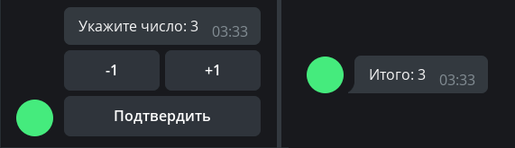

Але тепер уявімо, що хітрий користувач зробив наступне: викликав команду `/numbers` (значення 0), збільшив значення 
до 1, знову викликав `/numbers` (значення скинулося до 0) і редагував і натиснув кнопку "+1" на першому повідомленні. 
Що станеться? Бот по-чесному відправить запит на редагування тексту зі значенням 1, але т.к. на тому повідомленні 
вже стоїть цифра 1, то Bot API поверне помилку, що старий і новий тексти збігаються, а бот словить виключення: 
`Bad Request: message is not modified: specified new message content and reply markup are exactly the same 
as a current content and reply markup of the message`

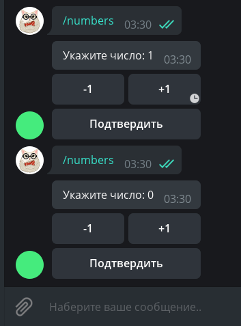

З цією помилкою ви, швидше за все, поначалу часто стикатися, намагаючись редагувати повідомлення. 
Взагалі, подібна помилка часто говорить про проблеми з логікою генерації/оновлення даних у повідомленні, але іноді, 
як у прикладі вище, може бути очікуваною поведінкою. 

У цьому випадку ігноруємо помилку цілком, т.к. нам важливий 
лише кінцевий результат, який точно буде правильним. Помилка **MessageNotModified** належить до категорії Bad Request, 
тому у нас є вибір: ігнорувати весь подібний клас помилок, або впіймати весь клас BadRequest 
і спробувати за текстом помилки опізнати конкретну причину. 
Щоб не дуже ускладнювати приклад, обійдемося першим способом і трохи оновимо функцію `update_num_text()`:

```python
# Новые импорты!
from contextlib import suppress
from aiogram.exceptions import TelegramBadRequest

async def update_num_text(message: types.Message, new_value: int):
    with suppress(TelegramBadRequest):
        await message.edit_text(
            f"Укажите число: {new_value}",
            reply_markup=get_keyboard()
        )
```

Якщо тепер ви спробуєте повторити приклад вище, то зазначене виключення в цьому блоці коду бот просто-напросто проігнорує.

### Фабрика колбеків {: id="callback-factory" }

Коли ви оперуєте якимись простими колбеками з загальним префіксом, типу `order_1`, `order_2`... вам може здатися, 
що досить легко викликати `split()` і ділити рядок по якомусь розділювачу. А тепер уявіть, що вам треба 
зберігати не одне значення, а три: `order_1_1994_2731519`. Що тут артикул, ціна, кількість? А може бути, це взагалі 
рік випуску? Та й розбиття рядка починає виглядати жахливо: `.split("_")[2]`. А чому не 1 або 3? 

У якийсь момент виникає потреба структурувати вміст таких callback data, і в aiogram є рішення! 
Ви створюєте об'єкти типу `CallbackData`, вказуєте префікс, описуєте структуру, а далі фреймворк самостійно збирає 
рядок з даними колбека і, що важливіше, коректно розбирає вхідне значення. Знову розбиратимемося на конкретному прикладі; 
створимо клас `NumbersCallbackFactory` з префіксом `fabnum` і двома полями `action` і `value`. Поле `action` визначає, 
що робити, змінювати значення (change) або зафіксувати (finish), а поле `value` показує, на скільки змінювати 
значення. За замовчуванням воно буде None, т.к. для дії "finish" дельта зміни не потрібна. Код:

```python
# новые импорты!
from typing import Optional
from aiogram.filters.callback_data import CallbackData

class NumbersCallbackFactory(CallbackData, prefix="fabnum"):
    action: str
    value: Optional[int] = None
```

Наш клас обов'язково повинен успадковуватися від `CallbackData` і приймати значення префіксу. Префікс — це 
загальна підстрока на початку, за якою фреймворк буде визначати, яка структура лежить у колбеці. 

Тепер напишемо функцію генерації клавіатури. Тут нам знадобиться метод `button()`, який автоматично 
буде створювати кнопку з потрібним типом, а від нас потрібно лише передати аргументи. 
Як аргумент `callback_data` замість рядка будемо вказувати 
екземпляр нашого класу `NumbersCallbackFactory`:

```python
def get_keyboard_fab():
    builder = InlineKeyboardBuilder()
    builder.button(
        text="-2", callback_data=NumbersCallbackFactory(action="change", value=-2)
    )
    builder.button(
        text="-1", callback_data=NumbersCallbackFactory(action="change", value=-1)
    )
    builder.button(
        text="+1", callback_data=NumbersCallbackFactory(action="change", value=1)
    )
    builder.button(
        text="+2", callback_data=NumbersCallbackFactory(action="change", value=2)
    )
    builder.button(
        text="Подтвердить", callback_data=NumbersCallbackFactory(action="finish")
    )
    # Выравниваем кнопки по 4 в ряд, чтобы получилось 4 + 1
    builder.adjust(4)
    return builder.as_markup()
```

Методи відправки повідомлення і його редагування залишаємо тими ж (у назвах і командах додамо суфікс `_fab`):

```python
async def update_num_text_fab(message: types.Message, new_value: int):
    with suppress(TelegramBadRequest):
        await message.edit_text(
            f"Укажите число: {new_value}",
            reply_markup=get_keyboard_fab()
        )

@dp.message(Command("numbers_fab"))
async def cmd_numbers_fab(message: types.Message):
    user_data[message.from_user.id] = 0
    await message.answer("Укажите число: 0", reply_markup=get_keyboard_fab())
```

Нарешті, переходимо до головного — обробці колбеків. Для цього в декоратор надо передати клас, колбеки з яким 
ми ловимо, з викликаним методом `filter()`. Також з'являється додатковий аргумент з назвою `callback_data` 
(ім'я повинно бути саме таким!), і мавши той же тип, що й фільтруємий клас:

```python
@dp.callback_query(NumbersCallbackFactory.filter())
async def callbacks_num_change_fab(
        callback: types.CallbackQuery, 
        callback_data: NumbersCallbackFactory
):
    # Текущее значение
    user_value = user_data.get(callback.from_user.id, 0)
    # Если число нужно изменить
    if callback_data.action == "change":
        user_data[callback.from_user.id] = user_value + callback_data.value
        await update_num_text_fab(callback.message, user_value + callback_data.value)
    # Если число нужно зафиксировать
    else:
        await callback.message.edit_text(f"Итого: {user_value}")
    await callback.answer()
```

Ще трохи конкретизуємо наші хендлери і зробимо окремий обробник 
для числових кнопок і для кнопки «Підтвердити». Фільтрувати будемо за значенням `action` і в цьому нам допоможуть 
«магічні фільтри» aiogram 3.x. Серйозно, вони так і називаються: Magic Filter. Детальніше це чарівництво розглянемо 
в іншій главі, а зараз просто скористаємося «магією» і прийнемо це на віру:

```python
# новый импорт!
from magic_filter import F

# Нажатие на одну из кнопок: -2, -1, +1, +2
@dp.callback_query(NumbersCallbackFactory.filter(F.action == "change"))
async def callbacks_num_change_fab(
        callback: types.CallbackQuery, 
        callback_data: NumbersCallbackFactory
):
    # Текущее значение
    user_value = user_data.get(callback.from_user.id, 0)

    user_data[callback.from_user.id] = user_value + callback_data.value
    await update_num_text_fab(callback.message, user_value + callback_data.value)
    await callback.answer()


# Нажатие на кнопку "подтвердить"
@dp.callback_query(NumbersCallbackFactory.filter(F.action == "finish"))
async def callbacks_num_finish_fab(callback: types.CallbackQuery):
    # Текущее значение
    user_value = user_data.get(callback.from_user.id, 0)

    await callback.message.edit_text(f"Итого: {user_value}")
    await callback.answer()
```

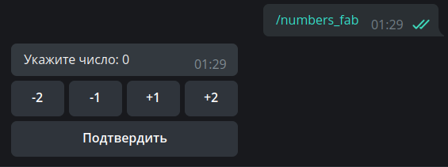

На перший погляд те, що ми зробили, може здатися складним, але насправді фабрика колбеків дозволяє 
створювати продвинуті колбек-кнопки і зручно дробити код на логічні сутності. Побачити застосування фабрики 
на практиці ви можете в [боті для гри в «Сапер»](https://github.com/MasterGroosha/telegram-bombsweeper-bot), 
написаному вашим улюбленим автором :)

### Автовідповідь на колбеки {: id="callback-autoreply" }

Якщо у вас дуже багато колбек-хендлерів, на які треба або просто відповідати, або відповідати однотипно, можна 
трохи упростити собі життя, скориставшись спеціальною мідлварю. Загалом про таке ми поговоримо 
[окремо](filters-and-middlewares.md#middlewares), а зараз просто познайомимося.

Итак, найпростіший варіант — це додати вот таку рядок після створення диспетчера:

```python
# не забываем про новый импорт
from aiogram.utils.callback_answer import CallbackAnswerMiddleware

dp = Dispatcher()
dp.callback_query.middleware(CallbackAnswerMiddleware())
```

У цьому випадку після виконання хендлера aiogram буде автоматично відповідати на колбек. 
Можна переопредилити 
[стандартні налаштування](https://github.com/aiogram/aiogram/blob/5adaf7a567e976da64e418eee5df31682ad2496c/aiogram/utils/callback_answer.py#L133-L137) 
і вказати свої, наприклад: 

```python
dp.callback_query.middleware(
    CallbackAnswerMiddleware(
        pre=True, text="Готово!", show_alert=True
    )
)
```

На жаль, ситуації, коли на всі колбек-хендлери одна й та сама відповідь, досить рідкі. До щастя, переопредилити 
поведінку мідлвари в конкретному обробнику досить просто: достатньо пробросити аргумент `callback_answer` 
і виставити йому нові значення:

```python
# новый импорт!
from aiogram.utils.callback_answer import CallbackAnswer

@dp.callback_query()
async def my_handler(callback: CallbackQuery, callback_answer: CallbackAnswer):
    ... # тут какой-то код
    if <everything is ok>:
        callback_answer.text = "Отлично!"
    else:
        callback_answer.text = "Что-то пошло не так. Попробуйте позже"
        callback_answer.cache_time = 10
    ... # тут какой-то код
```

**Важливо**: цей спосіб не буде працювати, якщо у мідлвари виставлений флаг `pre=True`. У цьому випадку надо повністю 
переопредилити набір параметрів мідлвари через флаги, з якими ми детальніше познайомимося 
[далі](filters-and-middlewares.md#flags):

```python
from aiogram import flags
from aiogram.utils.callback_answer import CallbackAnswer

@dp.callback_query()
@flags.callback_answer(pre=False)  # переопределяем флаг pre
async def my_handler(callback: CallbackQuery, callback_answer: CallbackAnswer):
    ... # тут какой-то код
    if <everything is ok>:
        callback_answer.text = "Теперь этот текст будет видно!"
    ... # тут какой-то код
```

На цьому ми наразі завершимо знайомство з кнопками.
