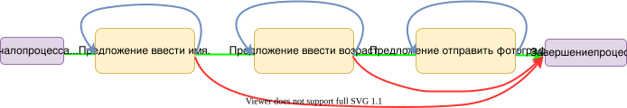
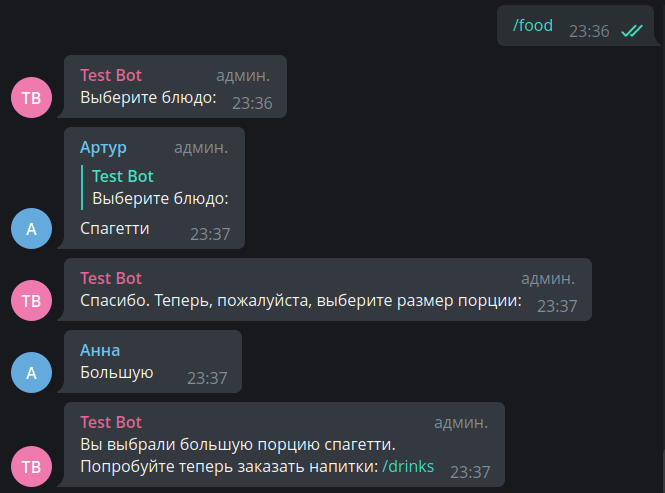

# Кінцеві автомати (FSM) {: id="fsm-start" }

!!! info ""
    Використовувана версія aiogram: 3.7.0

## Теорія {: id="theory" }

У цій главі ми поговоримо про ще одну важливу можливість ботів: про **систему діалогів**. На жаль, далеко не всі 
дії в боті можна виконати за одне повідомлення або команду. Припустимо, є бот для знайомств, де при реєстрації потрібно 
вказати ім'я, вік і надіслати фотографію з обличчям. Можна, звичайно, попросити користувача надіслати фотографію, а в підписі 
до неї вказати всі дані, але це незручно для обробки та запиту повторного введення.  
Тепер уявімо поетапне введення даних, де спочатку бот «включає» режим очікування певної інформації від конкретного 
користувача, далі на кожному етапі перевіряє введені дані, а за командою `/cancel` припиняє очікувати наступний крок і 
повертається в основний режим. Погляньте на схему нижче:



**Зеленою** стрілкою позначено процес переходу по кроках без помилок, **сині** стрілки означають збереження поточного стану і 
очікування повторного введення (наприклад, якщо користувач сказав, що йому 250 років, слід запросити вік заново), а **червоні** 
показують вихід з усього процесу через команду `/cancel` або будь-яку іншу, що означає скасування.

Процес зі схеми вище в теорії алгоритмів називається **кінцевим автоматом** (або FSM — Finite State Machine). Докладніше про це можна 
прочитати [тут](https://tproger.ru/translations/finite-state-machines-theory-and-implementation/).

!!! info "Конструктор діалогів"
    Після того, як попрактикуєтесь з FSM у цій главі, ви напевно почуєте, як багато всього доведеться зробити, щоб 
    отримати складнорозгалужену ланцюг дій. На щастя, існує бібліотека 
    [**aiogram-dialog**](https://github.com/Tishka17/aiogram_dialog) від **Tishka17**, яка спрощує роботу з машиною станів.

## Практика {: id="practice" }

У механізм кінцевих автоматів у aiogram вже вбудована підтримка різних бекендів для зберігання станів 
між етапами діалогу з ботом (до речі, ніхто не заважає написати свій), а крім того, власне, станів 
можна зберігати довільні дані, наприклад, раніше описані ім'я та вік для подальшого використання 
де-небудь. Список наявних сховищ FSM можна знайти 
[у репозиторії aiogram](https://github.com/aiogram/aiogram/tree/dev-3.x/aiogram/fsm/storage), 
а в цій главі ми будемо користуватися найпростішим бекендом 
[MemoryStorage](https://github.com/aiogram/aiogram/blob/dev-3.x/aiogram/fsm/storage/memory.py), який 
зберігає всі дані в оперативній пам'яті. Він ідеально підходить для прикладів, але **не рекомендується** використовувати його в реальних 
проектах, т.к. MemoryStorage зберігає всі дані в оперативній пам'яті без збереження на диск. Також варто відзначити, що кінцеві 
автомати можна використовувати не лише з хендлерами повідомлень (`message_handler`, `edited_message_handler`), а також 
з коллбеками та інлайн-режимом.

Як приклад ми напишемо імітатор замовлення їжі та напитків у кафе. 

### Створення кроків {: id="define-states" }

Перш, ніж приступимо безпосередньо до FSM, опишемо трохи простої функції, яка буде генерувати 
звичайну клавіатуру з кнопками в один рядок, вона стане нам в пригоді пізніше:

```python title="keyboards/simple_row.py"
from aiogram.types import ReplyKeyboardMarkup, KeyboardButton


def make_row_keyboard(items: list[str]) -> ReplyKeyboardMarkup:
    """
    Створює реплай-клавіатуру з кнопками в один рядок
    :param items: список текстів для кнопок
    :return: об'єкт реплай-клавіатури
    """
    row = [KeyboardButton(text=item) for item in items]
    return ReplyKeyboardMarkup(keyboard=[row], resize_keyboard=True)
```

Розглянемо опис кроків для «замовлення» їжі. Створимо файл `handlers/ordering_food.py`, де опишемо списки блюд і їх розмірів 
(у реальному житті ця інформація може динамічно завантажуватися з якої-небудь БД):

```python
# Ці значення далі будуть підставлятися в підсумковий текст, звідси 
# така на перший погляд дивна форма прикметників
available_food_names = ["Суші", "Спагетті", "Хачапурі"]
available_food_sizes = ["Маленькую", "Середню", "Велику"]
```

Тепер опишемо всі можливі «стани» конкретного процесу (вибір їжі). На словах можна описати так: користувач викликає 
команду `/food`, бот відповідає повідомленням з проханням вибрати блюдо і встає в стан \*очікує вибір блюда\* для конкретного 
користувача. Як тільки користувач робить вибір, бот, перебуваючи в цьому стані, перевіряє коректність введення, а потім приймає рішення, 
запросити введення повторно (без змін стану) або перейти до наступного кроку \*очікує вибір розміру порції\*. Коли користувач 
і тут вводить коректні дані, бот відображає підсумковий результат (вміст замовлення) і скидає стан. Пізніше 
у цій главі ми навчимося робити примусовий скид стану на будь-якому етапі командою `/cancel`.

### Обробка кроку 1 {: id="step-1" }

Отже, перейдімо безпосередньо до опису станів. Для зберігання станів необхідно створити клас, що успадковується 
від класу `StatesGroup`, усередині нього потрібно створити змінні, присвоївши їм екземпляри класу `State`:

```python
class OrderFood(StatesGroup):
    choosing_food_name = State()
    choosing_food_size = State()
```

Напишемо хендлер першого кроку, що реагує на команду `/food` у разі, якщо у користувача не встановлено ніякого стану:

```python hl_lines="4 10"
from aiogram.filters import Command, StateFilter
from aiogram.fsm.context import FSMContext

@router.message(StateFilter(None), Command("food"))
async def cmd_food(message: Message, state: FSMContext):
    await message.answer(
        text="Виберіть блюдо:",
        reply_markup=make_row_keyboard(available_food_names)
    )
    # Встановлюємо користувачу стан "вибирає назву"
    await state.set_state(OrderFood.choosing_food_name)
```

Щоб працювати з механізмом FSM, у хендлер необхідно пробросити аргумент з іменем `state`, який матиме 
тип `FSMContext`. А в останньому рядку ми явно говоримо боту встати в стан `choosing_food_name` з групи `OrderFood`. 

!!! warning "Відмінність від aiogram 2.x"
    У aiogram 2.x відсутність фільтра на state означала «тільки при відсутності явно встановленого стану» 
    (іншими словами, `state=None`). У aiogram 3.x відсутність фільтра означає «при будь-якому стані». Нагадаю, що аналогічний 
    підхід у «тройці» використовується з контент-типами повідомлень.

Далі напишемо хендлер, який ловить один із варіантів блюд з нашого списку:

```python linenums="1"
@router.message(
    OrderFood.choosing_food_name, 
    F.text.in_(available_food_names)
)
async def food_chosen(message: Message, state: FSMContext):
    await state.update_data(chosen_food=message.text.lower())
    await message.answer(
        text="Дякую. Тепер, будь ласка, виберіть розмір порції:",
        reply_markup=make_row_keyboard(available_food_sizes)
    )
    await state.set_state(OrderFood.choosing_food_size)
```

Розглянемо детальніше деякі елементи хендлера. Фільтри (рядки 2-3) повідомляють, що нижче розташована функція спрацює 
тоді і тільки тоді, коли користувач буде в стані `OrderFood.choosing_food_name` і текст повідомлення буде 
збігатися з одним із елементів списку `available_food_names`. У рядку 6 ми записуємо дані (текст повідомлення) 
у сховище FSM, і ці дані унікальні для пари `(chat_id, user_id)` (є нюанс, про нього пізніше). Нарешті, 
у рядку 11 ми переводимо користувача в стан `OrderFood.choosing_food_size`.

А що якщо користувач вирішить введити щось самостійно, без клавіатури? У цьому випадку треба повідомити користувачу 
про помилку і дати йому ще одну спробу. Дуже часто новачки розробники ботів на цьому моменті задають питання: 
«а як залишити користувача в тому ж стані?». Відповідь проста: щоб залишити користувача в поточному стані, достатньо 
його \[стан\] не змінювати, тобто буквально _нічого не робити_. 

Напишемо додатковий хендлер, у якого буде фільтр тільки на стан `OrderFood.choosing_food_name`, а фільтра 
на текст не буде. Якщо розташувати його під функцією `food_chosen()`, 
то вийде «реагуй в стані choosing_food_name, на всі тексти, крім тих, що ловить попередній хендлер» 
(іншими словами, «лови всі неправильні варіанти»).

```python
@router.message(OrderFood.choosing_food_name)
async def food_chosen_incorrectly(message: Message):
    await message.answer(
        text="Я не знаю такого блюда.\n\n"
             "Будь ласка, виберіть одну з назв зі списку нижче:",
        reply_markup=make_row_keyboard(available_food_names)
    )
```

### Обробка кроку 2 {: id="step-2" }

Другий і останній етап — обробити введення розміру порції користувачем. Аналогічно попередньому етапу зробимо два хендлери 
(на вірну і невірну відповіді), але в першому з них додамо вибір зведеної інформації про замовлення:

```python hl_lines="3 9"
@router.message(OrderFood.choosing_food_size, F.text.in_(available_food_sizes))
async def food_size_chosen(message: Message, state: FSMContext):
    user_data = await state.get_data()
    await message.answer(
        text=f"Ви вибрали {message.text.lower()} порцію {user_data['chosen_food']}.\n"
             f"Спробуйте тепер замовити напитки: /drinks",
        reply_markup=ReplyKeyboardRemove()
    )
    await state.clear()


@router.message(OrderFood.choosing_food_size)
async def food_size_chosen_incorrectly(message: Message):
    await message.answer(
        text="Я не знаю такого розміру порції.\n\n"
             "Будь ласка, виберіть один із варіантів зі списку нижче:",
        reply_markup=make_row_keyboard(available_food_sizes)
    )
```

Виклик `get_data()` у рядку №3 повертає об'єкт сховища для конкретного користувача в конкретному чаті. З нього 
\[сховища\] ми достаємо збережене значення назви блюда і підставляємо його у повідомлення. Метод `clear()` у стані 
повертає користувача в «пусту» стан і видаляє всі збережені дані. Що робити, якщо потрібно тільки очистити 
стан або тільки затерти дані? Для цього зануримося в визначення функції `clear()` у вихідних кодах aiogram 3.x:

```python
class FSMContext:
    # Частина коду пропущена

    async def clear(self) -> None:
        await self.set_state(state=None)
        await self.set_data({})
```

Тепер ви знаєте, як очистити щось одне :)

Кроки для вибору напитків роблять зовсім аналогічно. Спробуйте зробити самостійно або поглядіть у вихідні тексти 
до цієї глави.

Повний текст файлу з хендлерами для замовлення їжі:

```python title="handlers/ordering_food.py"
from aiogram import Router, F
from aiogram.filters import Command, StateFilter
from aiogram.fsm.context import FSMContext
from aiogram.fsm.state import StatesGroup, State
from aiogram.types import Message, ReplyKeyboardRemove

from keyboards.simple_row import make_row_keyboard

router = Router()

# Ці значення далі будуть підставлятися в підсумковий текст, звідси
# така на перший погляд дивна форма прикметників
available_food_names = ["Суші", "Спагетті", "Хачапурі"]
available_food_sizes = ["Маленькую", "Середню", "Велику"]


class OrderFood(StatesGroup):
    choosing_food_name = State()
    choosing_food_size = State()


@router.message(Command("food"))
async def cmd_food(message: Message, state: FSMContext):
    await message.answer(
        text="Виберіть блюдо:",
        reply_markup=make_row_keyboard(available_food_names)
    )
    # Встановлюємо користувачу стан "вибирає назву"
    await state.set_state(OrderFood.choosing_food_name)

# Етап вибору блюда #


@router.message(OrderFood.choosing_food_name, F.text.in_(available_food_names))
async def food_chosen(message: Message, state: FSMContext):
    await state.update_data(chosen_food=message.text.lower())
    await message.answer(
        text="Дякую. Тепер, будь ласка, виберіть розмір порції:",
        reply_markup=make_row_keyboard(available_food_sizes)
    )
    await state.set_state(OrderFood.choosing_food_size)


# Загалом, ніхто не заважає вказувати стани повністю рядками
# Це може стати в пригоді, якщо з якої-то причини 
# ваші назви станів генеруються в рантаймі (але навіщо?)
@router.message(StateFilter("OrderFood:choosing_food_name"))
async def food_chosen_incorrectly(message: Message):
    await message.answer(
        text="Я не знаю такого блюда.\n\n"
             "Будь ласка, виберіть одну з назв зі списку нижче:",
        reply_markup=make_row_keyboard(available_food_names)
    )

# Етап вибору розміру порції та відображення зведеної інформації #


@router.message(OrderFood.choosing_food_size, F.text.in_(available_food_sizes))
async def food_size_chosen(message: Message, state: FSMContext):
    user_data = await state.get_data()
    await message.answer(
        text=f"Ви вибрали {message.text.lower()} порцію {user_data['chosen_food']}.\n"
             f"Спробуйте тепер замовити напитки: /drinks",
        reply_markup=ReplyKeyboardRemove()
    )
    # Скид стану та збережених даних у користувача
    await state.clear()


@router.message(OrderFood.choosing_food_size)
async def food_size_chosen_incorrectly(message: Message):
    await message.answer(
        text="Я не знаю такого розміру порції.\n\n"
             "Будь ласка, виберіть один із варіантів зі списку нижче:",
        reply_markup=make_row_keyboard(available_food_sizes)
    )
```

### Загальні команди {: id="common-commands" }

Раз уж заговорили про скид станів, давайте у файлі `handlers/common.py` реалізуємо обробники команди `/start` і 
дії «скасування». У першому випадку має показуватися певен приветственний/довідковий текст, а для скасування напишемо 
два хендлери: коли користувач не перебуває у жодному стані, і коли перебуває в якомусь.

Усі функції гарантують відсутність стану та даних, видаляють звичайну клавіатуру, якщо раптом вона є:

```python title="handlers/common.py"
from aiogram import F, Router
from aiogram.filters import Command
from aiogram.filters import StateFilter
from aiogram.fsm.context import FSMContext
from aiogram.fsm.state import default_state
from aiogram.types import Message, ReplyKeyboardRemove

router = Router()


@router.message(Command(commands=["start"]))
async def cmd_start(message: Message, state: FSMContext):
    await state.clear()
    await message.answer(
        text="Виберіть, що хочете замовити: "
             "блюда (/food) або напитки (/drinks).",
        reply_markup=ReplyKeyboardRemove()
    )


# Неважко здогадатися, що наступні два хендлери можна 
# спокійно об'єднати в один, але для повноти картини залишимо так

# default_state - це те ж саме, що й StateFilter(None)
@router.message(StateFilter(None), Command(commands=["cancel"]))
@router.message(default_state, F.text.lower() == "скасування")
async def cmd_cancel_no_state(message: Message, state: FSMContext):
    # Стан скидати не потрібно, видалимо тільки дані
    await state.set_data({})
    await message.answer(
        text="Нічого скасовувати",
        reply_markup=ReplyKeyboardRemove()
    )


@router.message(Command(commands=["cancel"]))
@router.message(F.text.lower() == "скасування")
async def cmd_cancel(message: Message, state: FSMContext):
    await state.clear()
    await message.answer(
        text="Дія скасована",
        reply_markup=ReplyKeyboardRemove()
    )

```

### Файл bot.py {: id="entrypoint" }

Напоследок розглянемо точку входу — файл `bot.py` з усіма імпортами та підключеними маршрутизаторами:

```python title="bot.py"
import asyncio
import logging

from aiogram import Bot, Dispatcher
from aiogram.fsm.storage.memory import MemoryStorage

# файл config_reader.py можна взяти з репозиторію
# приклад — у першій главі
from config_reader import config
from handlers import common, ordering_food


async def main():
    logging.basicConfig(
        level=logging.INFO,
        format="%(asctime)s - %(levelname)s - %(name)s - %(message)s",
    )

    # Якщо не вказати storage, то за замовчуванням все одно буде MemoryStorage
    # Але явне краще неявного =]
    dp = Dispatcher(storage=MemoryStorage())
    bot = Bot(config.bot_token.get_secret_value())

    dp.include_router(common.router)
    dp.include_router(ordering_food.router)
    # сюди імпортуйте ваш власний маршрутизатор для напитків

    await dp.start_polling(bot)


if __name__ == '__main__':
    asyncio.run(main())
```

### Різні стратегії FSM {: id="strategies" }

Aiogram 3.x привніс необичное, але цікаве нововведення в механізм кінцевих автоматів — стратегії FSM. Вони дозволяють 
перевизначити логіку формування пар для станів та даних. Всього стратегій п'ять, ось вони:

* **USER_IN_CHAT** — стратегія за замовчуванням. Стан та дані різні у кожного користувача в кожному чаті. Тобто, у користувача будуть 
різні стани та дані в різних групах, а також у ЛС з ботом.
* **CHAT** — стан та дані спільні для всього чату цілком. У ЛС різниця непомітна, але у групі у всіх учасників буде 
один стан та спільні дані.
* **GLOBAL_USER** — у всіх чатах у одного й того ж користувача буде один і той же стан та дані.
* **USER_IN_TOPIC** — у користувача можуть бути різні стани залежно від топіка 
у [супергрупі-форумі](https://telegram.org/blog/topics-in-groups-collectible-usernames#topics-in-groups).
* **CHAT_TOPIC** — у кожного топіка свій стан без розділення на користувачів у цьому топіку.

Чесно кажучи, я не можу придумати гарний use-case для **GLOBAL_USER**, однак **CHAT** може стати в пригоді для ботів, 
які реалізують різні ігри в групах. Якщо ви знаєте цікаві застосування, будь ласка, розповідайте про них 
у нашому чатику!

Як приклад розглянемо ситуацію, коли бот для замовлення їжі чомусь опинився в групі й має стратегію **CHAT**. 
А щоб це сталося, необхідно внести невеликі правки у файл `bot.py`:

```python
# новий імпорт
from aiogram.fsm.strategy import FSMStrategy

async def main():
    # тут код
    dp = Dispatcher(storage=MemoryStorage(), fsm_strategy=FSMStrategy.CHAT)
    # тут тоже код
```

Після запуску бота попросимо людей у групі повзаємодіяти з ним:



Виглядає дивно, не правда ж?

Тепер, озброївшись знаннями про кінцеві автомати, ви можете без страху писати ботів із системою діалогів.
