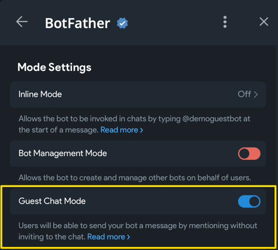

# Гостьовий режим  {: id="guest-mode-start" }

!!! info ""
    Використовується версія aiogram: 3.28.0.  
    Це чорновий варіант розділу, написаний відразу після виходу оновлення 
    Bot API v10.0

## Вступ {: id="intro" }

Гостьовий режим дозволяє ботам відправляти повідомлення в чатах, де вони не є учасниками. Алгоритм їх роботи такий:

* Користувач викликає бота повідомленням вигляду `@bot ТЕКСТ_ЗАПИТУ`.
* Бот отримує безпосередньо повідомлення, з яким його викликали, та, якщо повідомлення користувача 
є відповіддю (reply) на якесь інше повідомлення, то ще й те саме інше повідомлення (тобто у `message` буде ще `.reply_to_message`).
* Бот може відповісти рівно один раз і лише протягом невеликого періоду часу.


Візуально й архітектурно гостьовий режим та інлайн-режим є родичами. Архітектурно Guest Mode 
виглядає як інлайн-режим з одним варіантом вибору, а повідомлення відправляється від імені самого бота.

Може виникнути запитання: коли використовувати той чи інший режим. Офіційна документація дає 
[кілька прикладів](https://core.telegram.org/bots/features#use-cases-guest-mode-vs-inline-mode), спробую перерахувати їх своїми словами. 
Інлайн-режим зручний, коли людина хоче підготувати якесь повідомлення за допомогою бота, 
наприклад, знайти картинку, відео, посилання, не залишаючи контекст чату в Telegram. Приклад: викликати бота `@pic`, 
щоб швидко знайти зображення й відправити його від свого імені.

Гостьовий режим підходить у випадку, коли потрібно дати завдання боту з будь-якого місця, не додаючи його в групу чи прямо в ЛС з іншим ботом. 
Приклад: відомий "@grok is this true?" з X/Twitter. Різниця в тому, який рівень участі 
людини в процесі та наскільки синхронний цей процес. Інлайн-режим припускає, 
що людина вводить усі дані, розглядає варіанти й відправляє потрібний у чат. 
Гостьовий режим – це "fire and forget", тобто штовхнув бота й спілкуєшся далі де угодно, 
доки бот виконує завдання. Подивіться на скриншот вище, щоб побачити схожість та відмінність.

Важливо розуміти: гостьовий режим не дає викликаному боту доступу до повідомлень, крім одного-двох (повідомлення, 
з яким бота викликали, та того повідомлення, яким викликали бота). Гостьовий бот також не вступає автоматично в групу, 
однак на відміну від інлайн-бота, бот у гостьовому режимі отримує інформацію про чат, у якому його викликали (айді, назва тощо). 
Також є проблема з видаленням повідомлень: бот не може видалити своє повідомлення, відправлене з guest mode, 
тому що при відправленні повертається `inline_message_id`, який не приймається на вхід `deleteMessage()` в API, 
а людина, яка викликає гостьового бота в групі, може не бути адміністратором. 
Єдиний варіант – відправляти разом із повідомленням кнопку, по натисненню якої редагувати повідомлення 
до «порожнього» (крапка чи пробіл), але саме повідомлення все одно залишиться.


Перейдемо до прикладів, яких сьогодні буде два: один зовсім простий для розуміння процесу, а інший посвідченіший 
з деякими AI-фішками. Але спочатку потрібно боту увімкнути підтримку гостьового режиму: відкрийте веб-додаток у `@BotFather` 
(саме веб-додаток!), потім виберіть зі списку свого бота, відкрийте `Bot Settings` та увімкніть `Guest Chat Mode`:




## Простий приклад {: id="simple-example" }

У простому прикладі реалізуємо найбазовішу логіку: на будь-який виклик бота в гостьовому режимі той буде відповідати 
якоюсь «сумнівною» фразою. Цього більш ніж достатньо для розуміння суті й легкого відтворення.

_У блоці нижче ви можете перемикатися між режимом «тільки хендлер» та «приклад цілком»._


=== "Тільки хендлер"
    ```python
    RESPONSES = [
        "Не знаю.",
        "Не впевнен.",
        "Може бути.",
        "Важко сказати.",
        "Можливо.",
    ]

    @dp.guest_message(F.text)  # [1]
    async def any_message(
            message: Message,
    ):
        await message.answer_guest_query(     # [2]
            result=InlineQueryResultArticle(  # [3]
                id="1",
                title="Будь-який текст, все одно ніхто не побачить",
                input_message_content=InputTextMessageContent(
                    message_text=random.choice(RESPONSES),
                ),
            )
        )
    ```
    

=== "Приклад цілком"
    ```python title="simple_example.py"
    --8<-- "code/10_guest_mode/simple_example.py"
    ```

Цифрами в блоці «тільки хендлер» позначені:

1. Для повідомлень у гостьовому режимі використовується окремий обробник `guest_message`, оскільки 
це окремий апдейт від Telegram. Фільтри при цьому рівно такі ж, як і у `message`.
2. Для відповіді викликайте спеціальний метод `answer_guest_query()`, спроба викликати `answer()` або 
`reply()` призведе до помилки.
3. У якості єдиного аргументу `result` функції `answer_guest_query()` зазначте один 
об'єкт типу [InlineResultQuery](https://core.telegram.org/bots/api#inlinequeryresult) 
(в інлайн-режимі передається список, а тут – єдине значення). Поля `id` та `title` заповнювати потрібно, 
4. але їх значення не грають ніякої ролі, ні користувач, ні ви їх не побачите ніде.

Якщо ви використовуєте `uv`, то процес запуску максимально простий:

```bash
uv add "aiogram>=3.28.0"
BOT_TOKEN=1234567890:AaBbCcDdEeFfGrOoShAHhIiJjKkLlMmNnOo uv run simple_example.py
```

Результат – на скриншоті нижче:


## Продвинутий приклад {: id="advanced-example" }

Наступним на черзі зробимо простого LLM-помічника на мінімум: без пошуку в Інтернеті, 
без виклику різноманітних інструментів, просто за рахунок внутрішніх знань якоїсь моделі з 
[OpenRouter](https://openrouter.ai). Для повторення наступного коду вам потребується власний акаунт 
на OpenRouter та створений там же API-ключ. Якщо у вас нема можливості випустити такий ключ, 
навіть у іншого провайдера, то хоча б подивіться приклад до кінця, щоб у майбутньому 
швидше приступити до роботи з AI.

Усі вихідники до цього розділу розташовані 
на [GitHub](https://github.com/MasterGroosha/aiogram-3-guide/tree/master/code/10_guest_mode), а далі 
в тексті розглянемо лише важливі моменти.

Одна з найважливіших речей – це промт. Задамо моделці контекст, скажемо відповідати лише неформатованим текстом, 
опишемо логіку обробки повідомлення й відповіді на інше повідомлення, та й нехай відповідає стисло, щоб 
постаратися не вилізти за ліміт у 4096 символів. І наприкінці пропишемо поточну дату, щоб AI не 
вважав, що на календарі 2024 або 2025:

??? "Текст промта (натисніть, щоб розгорнути)"

    --8<-- "code/10_guest_mode/bot/system_prompt.txt"

Далі функція для отримання відповіді від провайдера:

```python
async def get_llm_response(
        client: AsyncOpenAI,
        prompt: str,
        model: str,
) -> str | None:
    completion = await client.chat.completions.create(
        model=model,
        messages=[
            {
                "role": "system",
                "content": prompt,
            },
        ],
        stream=False,
        extra_body={"reasoning": {"enabled": True}},
    )
    if not completion.choices:
        return None
    return completion.choices[0].message.content
```

Тут важливо відзначити таке: по-перше, усі повідомлення користувачів у нашому випадку укладаються 
в системний промт, тому список `messages` складатиметься з одного елементу. По-друге, стрімінг 
необхідно вимкнути, у разі з гостьовими ботами він не підтримується. По-третє, «роздуми» 
(reasoning) можна виставити в `False`, тоді відповідь буде сильно швидше, але OpenRouter періодично 
пише помилку, що для певних запитів чи моделей потребується ввімкнутий reasoning, тому просто 
його ввімкнемо. Так, це сповільнить отримання відповіді, але гостьові боти працюють «у фоні», так що не страшно. 
По-четверте, буває, що модель зовсім не повертає ніякого результату, це потрібно обробити (у коді 
вище – перевіркою `completition.choice` на порожність або `None`).

Нарешті, хендлер. Він зрозумілий і лінійний, ось він цілком:

```python
@router.guest_message(F.text)
async def guest_message(
        message: Message,
        llm_client: AsyncOpenAI,
        llm_model: str,
        system_prompt: str,
) -> None:
    # Перевірка, чи є викликаюче повідомлення відповіддю на якесь інше.
    if (replied_message := message.reply_to_message) is None:
        # Це піде в системний промпт
        replied_message = "(none provided)"
    else:
        replied_message = (
            replied_message.text
            or f"(some mediafile, contents unknown, "
               f"but there is a caption: {replied_message.caption})"
            # Вважаємо, що не вміємо «читати» медіафайли
            or "(some mediafile, contents unknown)"
        )
    # Підготовка системного промта
    prompt = (
        system_prompt
        .replace("{{replied_message}}", replied_message)
        .replace("{{current_message}}", message.text)  # noqa
        .replace("{{date_today}}", datetime.now().strftime("%d.%m.%Y"))
    )
    response_text = await get_llm_response(
        client=llm_client,
        prompt=prompt,
        model=llm_model,
    )
    parse_mode = None
    # Буває, що відповіді від моделі немає. У такому разі нехай буде заглушка.
    if response_text is None:
        response_text = "<i>На жаль, не вдалося отримати відповідь від моделі.</i>"
        parse_mode = ParseMode.HTML
    # Відповідаємо на вихідний запит
    await message.answer_guest_query(
        result=InlineQueryResultArticle(
            id="1",
            title=".",
            input_message_content=InputTextMessageContent(
                message_text=response_text,
                parse_mode=parse_mode,
            ),
        )
    )
```

Системний промт читається й кладеться в ОЗУ при кожному запуску бота, там же ініціалізується 
клієнт для роботи з OpenRouter:

```python title="bot/__main__.py"

...

async def main() -> None:
    settings = Settings()

    ...
    
    openrouter_client = AsyncOpenAI(
        base_url=settings.llm.base_url,
        api_key=settings.llm.api_key.get_secret_value(),
    )

    with open("bot/system_prompt.txt", "r", encoding="utf-8") as f:
        system_prompt: str = f.read()

    dp = Dispatcher(
        llm_client=openrouter_client,
        llm_model=settings.llm.model_name,
        system_prompt=system_prompt,
    )

...
```


Додайте відсутні бібліотеки, заповніть файл `settings.toml` за аналогією з `settings.example.toml` 
та запустіть бота:

```bash
uv add structlog pydantic-settings openai
uv run -m bot
```

Тепер можна перевірити пару сценаріїв. Наприклад, бот не вміє читати картинки, але чи може він приблизно 
здогадатися, що там, маючи лиш опис?


Що ж, цілком собі вийшло. А як у нього справи з ланцюжком повідомлень та з «чутливістю» часу?


Теж коректно (цей текст готувався 10 травня 2026 року). Як бачите, навіть без продвинутих штук, типу веб-пошуку та tool calling, можна отримати доволі корисний у побуті інструмент. На цьому знайомство з гостьовим режимом ботів підходить до кінця.
