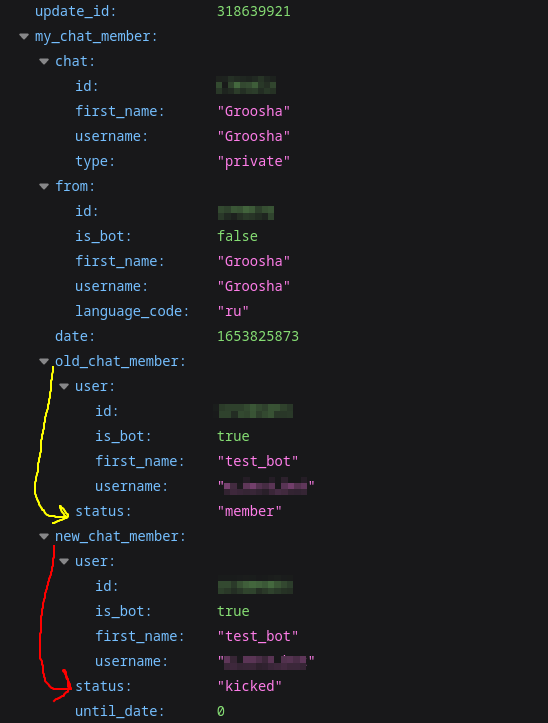
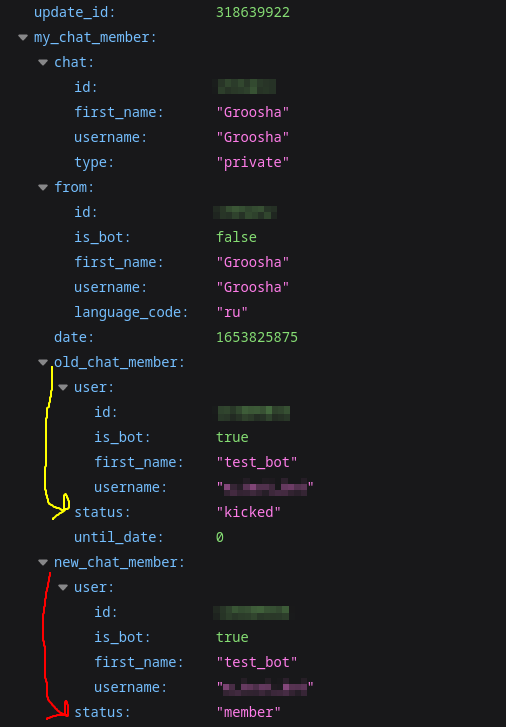
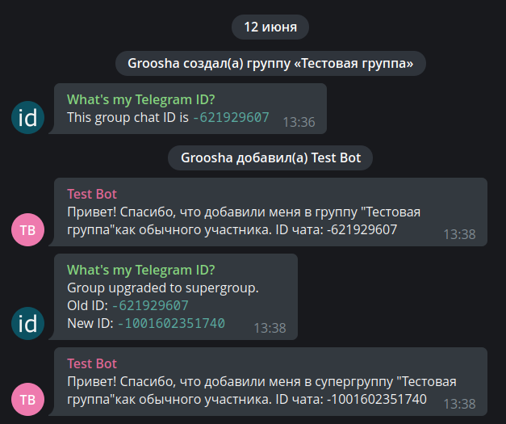
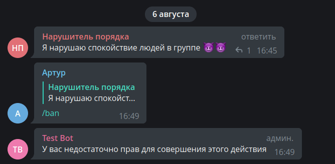
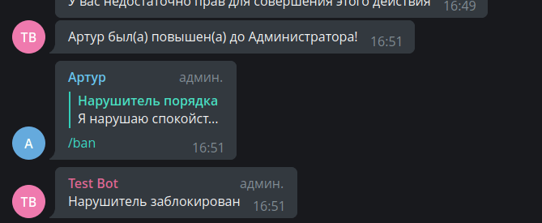
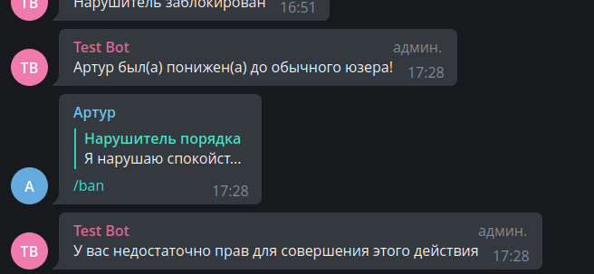

# Особливі оновлення {: id="special-updates" }

!!! info ""
    Використовувана версія aiogram: 3.7.0

## Вступ {: id="intro" }

Майже всі типи подій у Telegram мають якесь зовнішнє представлення для користувача. Службові повідомлення, звичайні, 
колбеки, інлайн-режим... але існують два типи оновлень, призначені саме для самих ботів. Йдеться про 
`my_chat_member` та `chat_member`

Давним-давно боти в групах існували в «інформаційному вакуумі»: просто для будь-яких 
модераторських дій, будь то бани або обмеження, необхідно було перевіряти права користувача через методи 
[getChatMember](https://core.telegram.org/bots/api#getchatadministrators) або 
[getChatAdministrators](https://core.telegram.org/bots/api#getchatadministrators), та ще й кешувати на невеликий 
проміжок часу, щоб не натрапити на ліміти Bot API, точні значення яких [лімітів] досі залишаються таємницею.

Або, наприклад, якийсь хитрий користувач додавав бота в групу, забирав у того право писати і починав дергати команди, 
очікуючи, що бот не обробляє таку помилку і упаде. А вже з відправкою в приватний чат загалом весело: не знаючи точно, яка 
активна аудиторія бота, розробнику доводилося або відправляти якесь повідомлення по списку користувачів в 
своїй базі, або, що трохи гуманніше, відправляти цим користувачам якусь ChatAction, типу «_пише_…»; як виявилося, 
тим, хто заблокував бота, це саме «_пише_…» не прийде, повернувши помилку від Bot API.

У березні 2021 року ситуація кардинально змінилася на краще з релізом 
[оновлення Bot API v5.1](https://core.telegram.org/bots/api-changelog#march-9-2021), у якому 
додалося два нові типи оновлень: `my_chat_member` та `chat_member`. Обидва оновлення всередину 
містять об'єкт одного і того ж типу [ChatMemberUpdated](https://core.telegram.org/bots/api#chatmemberupdated). 
Різниця між цими двома подіями така:

* `my_chat_member`. Тут все, що стосується безпосередньо бота, або приватного чату користувача з ботом: (розблокування) блокування бота користувачем 
в приватному чаті, додавання бота в групу або канал, видалення звідти, зміна прав бота та його статусу в різних чатах тощо.
* `chat_member`. Містить всі зміни стану користувачів у групах та каналах, де бот перебуває в якості 
адміністратора: прихід/вихід користувачів у групи, підписки/відписки у каналах, зміна прав та статусів користувачів, 
призначення/усунення адмінів та багато іншого.

!!! warning "Важливо"
    За замовчуванням Telegram не надсилає ботам оновлення `chat_member`, їх отримання потрібно включити окремо. Докладніше — 
    в [відповідному розділі](#chat-member)

У цьому розділі ми спробуємо розглянути ці оновлення на найбільш часто необхідних завданнях, однак перед переходом 
до наступних розділів наполегливо рекомендую ознайомитися з 
[цією сторінкою](https://docs.aiogram.dev/en/dev-3.x/dispatcher/filters/chat_member_updated.html) 
з документації **aiogram 3.x**.

## Об'єкт ChatMemberUpdated {: id="chatmemberupdated" }

Сам по собі об'єкт [ChatMemberUpdated](https://core.telegram.org/bots/api#chatmemberupdated) заслуговує окремої 
уваги. Щоб вивчити його детальніше, припустимо, в якійсь групі адміністратор Аліса забанила 
звичайного учасника Вітю. З полями `chat` та `date` все очевидно, їх пропустимо.

Поле `from` (у вашому Python-коді це буде `from_user`) містить інформацію про суб'єкт дії. У нашому випадку суб'єкт 
дії — це Аліса, тому в `from` (`from_user`) буде об'єкт [User](https://core.telegram.org/bots/api#user) з 
даними про Алісу.

`old_chat_member` та `new_chat_member`. Під цими полями приховані «стани» 
об'єкта дії ДО та ПІСЛЯ події. Відповідно, в `old_chat_member` буде об'єкт з типом 
[ChatMemberMember](https://core.telegram.org/bots/api#chatmembermember) (це не опечатка), та полем `user` з інформацією 
про Вітю, а в `new_chat_member` — об'єкт [ChatMemberBanned](https://core.telegram.org/bots/api#chatmemberbanned) з полем 
`user` все про того ж нещасного Виктора.

Нарешті, якщо в групу або канал вступила умовна Маша, то в об'єкті ChatMemberUpdated буде непусте поле 
`invite_link`, з типом [ChatInviteLink](https://core.telegram.org/bots/api#chatinvitelink) та відомостями про те, 
по якій саме запрошувальній посиланню вона прийшла.

!!! warning "Про запрошувальні посилання"
    Тут варто зробити важливу зауваження: кожен адміністратор 
    групи/каналу (включаючи ботів) може створити безліч запрошувальних посилань з різними параметрами. Якщо бот 
    «впіймав» вступлення учасника по створеному ним \[ботом\] ж посиланню, то в полі `invite_link` об'єкта ChatInviteLink 
    буде видна посилання цілком (без `https://t.me`, звісно). Але якщо учасник прийшов по посиланню іншого 
    адміністратора, то бот побачить лише першу частину, друга буде замінена на розділовець.
    
    Ймовірніше за все, це зроблено для того, щоб боти не могли відправляти кому попало запрошувальні посилання, 
    створені іншими адміністраторами чату.

    До речі, за якоюсь дивною телеграмною логікою, якщо вступити в публічну групу по запрошувальній посиланню 
    (навіть не по юзернейму), то бот не побачить посилання (отримає `None`). Телега 🤷‍♂️

## Оновлення my_chat_member {: id="my-chat-member" }

### Бани/розбани в приватному чаті {: id="ban-unban-pm" }

У профільних чатах періодично виникає запитання: «як зробити розсилку користувачам бота, 
якщо хтось міг його заблокувати?». Розумієно, першою та головною порадою буде: 
«створи [канал](https://telegram.org/faq_channels)», тому що канали — це найкращий способ інформувати користувачів 
про що-либудь.

Але якщо ви все ж твердо вирішили, що будете робити розсилку користувачам прямо через бота, то існує три основні 
способи актуалізації активних користувачів бота:

1. Безпосередньо під час здійснення розсилки шляхом виловлювання помилок відправки та внесення змін в базу даних 
користувачів.
2. Через періодичну [відправку якоїсь ChatAction](https://core.telegram.org/bots/api#sendchataction), 
наприклад, «пише» по списку користувачів.
3. Прослуховуванням оновлення my_chat_member.

Зараз нас цікавить лише п.3. Навчимося за допомогою `my_chat_member` визначати, що користувач 
заблокував або розблокував бота. Але перш, ніж спробуємо «магію» aiogram, розберімося, як зазначені ситуації 
виглядають у самому Bot API. Для цього зупинимо процес з ботом, відкриємо діалог з ним у Telegram та послідовно 
заблокуємо та розблокуємо, використовуючи опції в UI месенджера. Далі відкриємо веб-браузер або якийсь 
Insomnia/Postman та перейдемо по посиланню `https://api.telegram.org/bot<TOKEN>/getupdates`, щоб побачити ще не 
оброблені повідомлення у форматі JSON.

Отже, ось що приходить боту, коли хтось його блокує:



На що варто звернути увагу:

* Подія `my_chat_member` сталася в приватному чаті з користувачем Groosha (chat_id дорівнює моєму Telegram ID).
* Ініціатор (суб'єкт) події — теж Groosha.
* У полі `old_chat_member` видно, над кім здійснено дію (над ботом) та який статус бота в приватному чаті був ДО: "member", 
тобто бот НЕ був заблокований раніше.
* У полі `new_chat_member` вміст `user` той же самий, а ось статус уже "kicked", тобто ПІСЛЯ події бот був 
заблокований користувачем.

Тобто бот в приватному чаті з Groosha здійснив перехід свого стану з "member" в "kicked". Тепер подивимося, що прийшло від 
Telegram після розблокування:



Цей снімок екрана схожий на попередній, але якщо придивитися, то можна помітити різницю: інший `update_id` 
(збільшився на одиницю), а також статуси ДО та ПІСЛЯ поміняліся місцями. Бот в приватному чаті з Groosha здійснив перехід 
з "kicked" в "member".  
Крім того, зазвичай поруч буде ще одне оновлення вже з типом `message` та з командою `/start` 
у вмісті. Офіційні клієнти при розблокуванні бота одразу відправляють команду `/start`, але не варто на це 
розраховувати: подібні дії залишаються на збір клієнтам, які можуть поводитися по-різному.

Тепер навчимося реагувати на такі події через aiogram на простому прикладі: припустимо, у нас є список з двох активних 
користувачів бота з ідентифікаторами 111 та 222. За командою `/start` додамо користувача в список розсилки, а за командою `/users` будемо 
виводити ідентифікатори тих, хто не заблокував бота (іншими словами, при блокуванні бота будемо видаляти ідентифікатор зі списку, а 
при розблокуванні знову додамо).

Ось готовий роутер під вищеописані умови:

```python title="handlers/in_pm.py"
from aiogram import F, Router
from aiogram.filters.chat_member_updated import \
    ChatMemberUpdatedFilter, MEMBER, KICKED
from aiogram.filters.command import \
    CommandStart, Command
from aiogram.types import ChatMemberUpdated, Message

router = Router()
router.my_chat_member.filter(F.chat.type == "private")
router.message.filter(F.chat.type == "private")

# Виключно для прикладу!
# У реальному житті користуйтесь більш надійними
# джерелами ідентифікаторів користувачів
users = {111, 222}


@router.my_chat_member(
    ChatMemberUpdatedFilter(member_status_changed=KICKED)
)
async def user_blocked_bot(event: ChatMemberUpdated):
    users.discard(event.from_user.id)


@router.my_chat_member(
    ChatMemberUpdatedFilter(member_status_changed=MEMBER)
)
async def user_unblocked_bot(event: ChatMemberUpdated):
    users.add(event.from_user.id)


@router.message(CommandStart())
async def cmd_start(message: Message):
    await message.answer("Hello")
    users.add(message.from_user.id)


@router.message(Command("users"))
async def cmd_users(message: Message):
    await message.answer("\n".join(f"• {user_id}" for user_id in users))

```

Зверніть увагу: для хендлерів на оновлення `my_chat_member` ми використовуємо фільтр `ChatMemberUpdatedFilter` з 
указанням виловленого результату ПІСЛЯ (тобто атрибут `new_chat_member` у оновленні). Тобто в даному випадку нас 
цікавить лише кінцевий стан користувача.

І ось як це виглядає на практиці:


### Додавання в групу {: id="bot-added-to-group" }

Ще часте запитання від початківців розробників: «як впіймати подію додавання бота в групу?». Ну що ж, 
давайте розбиратися. Але перед цим подивимося, які взагалі можуть бути 
«[статуси](https://core.telegram.org/bots/api#chatmember)» користувача:

* creator (він же owner) — власник чату. Судячи з усього, бот не може мати такий статус. Власник безальтернативно має 
всі можливі права в чаті, крім «анонімності», вона перемикається туди-сюди вільно.
* administrator — будь-який інший адміністратор. В інтерфейсі додатків можна забрати йому взагалі всі права, 
але він все одно залишиться адміністратором та зможе, наприклад, читати Recent Actions та ігнорувати slow mode.
* member — учасник чату з правами за замовчуванням. Дізнатися ці «права за замовчуванням» у випадку з групами можна, викликавши 
API-метод [getChat](https://core.telegram.org/bots/api#getchat) та подивившись поле `permissions`.
* restricted — користувач, обмежений у якихось правах. Наприклад, що знаходиться в т.з. "read-only". 
**ВАЖЛИВО**: у стані `restricted` користувач може як знаходитися в групі, так і не знаходитися, тому 
у [ChatMemberRestricted](https://youtu.be/ndTTmWiOS-M) потрібно додатково перевіряти прапор `is_member`.
* left — «[він улетів, але обіцяв повернутися](https://youtu.be/ndTTmWiOS-M)», тобто користувач вийшов з групи, 
але при бажанні може снова зайти. І на момент виходу він не був у стані `restricted`.
* banned — користувач забанений та не може повернутися самостійно, поки його 
не [розбанять](https://core.telegram.org/bots/api#unbanchatmember).

Маючи під рукою вищевикладену інформацію, нетрудно здогадатися, що подія «бота додали в групу» — це перехід з 
набору станів `{banned, left, restricted(is_member=False)}` 
в набір `{restricted(is_member=True), member, administrator}`. Такий перехід англійською називається transition, та 
в **aiogram 3.x** уже є заготовки.

Варіант №1: тупо перелічимо всі стани ДО та ПІСЛЯ:

```python
# Не забуваємо імпорти:
from aiogram.filters.chat_member_updated import \
    ChatMemberUpdatedFilter, KICKED, LEFT, MEMBER, \
    RESTRICTED, ADMINISTRATOR, CREATOR

@router.my_chat_member(
    ChatMemberUpdatedFilter(
        member_status_changed=
        (KICKED | LEFT | -RESTRICTED)
        >>
        (+RESTRICTED | MEMBER | ADMINISTRATOR | CREATOR)
    )
)
```

Вертикальна риска означає "або", бітовий оператор ">>" показує напрямок переходу, 
а символи «плюс» та «мінус» біля RESTRICTED відносяться до прапора `is_member` (плюс - True, мінус - False).

Але розробник aiogram пішов далі та обгорнув ці два набори в окремі стани `IS_NOT_MEMBER` та `IS_MEMBER` 
відповідно. Спростимо наш код у виді варіанту №2:

```python
# Трохи інші імпорти
from aiogram.filters.chat_member_updated import \
    ChatMemberUpdatedFilter, IS_NOT_MEMBER, IS_MEMBER

@router.my_chat_member(
    ChatMemberUpdatedFilter(
        member_status_changed=
        IS_NOT_MEMBER >> IS_MEMBER
    )
)
```

Але оскільки, повторюсь, такий перехід досить часто використовується в ботах, то розробник пішов _ще далі_ та 
обгорнув такий перехід у виді змінної `JOIN_TRANSITION`, отримавши варіант №3:

```python
# І ще менше імпортів
from aiogram.filters.chat_member_updated import \
    ChatMemberUpdatedFilter, JOIN_TRANSITION

@router.my_chat_member(
    ChatMemberUpdatedFilter(
        member_status_changed=JOIN_TRANSITION
    )
)
```

Наполегливо рекомендую ознайомитися з усіма наборами станів та переходів 
[в документації](https://docs.aiogram.dev/en/dev-3.x/dispatcher/filters/chat_member_updated.html), щоб зробити 
свій код чищим.

Тепер створимо ще один роутер, під яким будуть два хендлери, що реагують на додавання бота 
в групу або супергрупу в ролі адміністратора та звичайного учасника. 
При додаванні будемо відправляти в чат зведену інформацію про те, куди додали бота:

```python title="handlers/bot_in_group.py"
from aiogram import F, Router
from aiogram.filters.chat_member_updated import \
    ChatMemberUpdatedFilter, IS_NOT_MEMBER, MEMBER, ADMINISTRATOR
from aiogram.types import ChatMemberUpdated

router = Router()
router.my_chat_member.filter(F.chat.type.in_({"group", "supergroup"}))

chats_variants = {
    "group": "групу",
    "supergroup": "супергрупу"
}


# Не вдалося відтворити випадок додавання бота як Restricted,
# тому прикладу з ним не буде


@router.my_chat_member(
    ChatMemberUpdatedFilter(
        member_status_changed=IS_NOT_MEMBER >> ADMINISTRATOR
    )
)
async def bot_added_as_admin(event: ChatMemberUpdated):
    # Найпростіший випадок: бот доданий як адмін.
    # Легко можемо відправити повідомлення
    await event.answer(
        text=f"Привіт! Спасибі, що додали мене в "
             f'{chats_variants[event.chat.type]} "{event.chat.title}" '
             f"як адміністратора. ID чату: {event.chat.id}"
    )


@router.my_chat_member(
    ChatMemberUpdatedFilter(
        member_status_changed=IS_NOT_MEMBER >> MEMBER
    )
)
async def bot_added_as_member(event: ChatMemberUpdated, bot: Bot):
    # Варіант посилніший: бота додали як звичайного учасника.
    # Але може бути відсутнє право написання повідомлень, тому заздалегідь перевіримо.
    chat_info = await bot.get_chat(event.chat.id)
    if chat_info.permissions.can_send_messages:
        await event.answer(
            text=f"Привіт! Спасибі, що додали мене в "
                 f'{chats_variants[event.chat.type]} "{event.chat.title}" '
                 f"як звичайного учасника. ID чату: {event.chat.id}"
        )
    else:
        print("Якось логуємо цю ситуацію")
```

Але, як завжди, є нюанс, і щоб його побачити, потрібно додати бота в групу, 
а потім конвертувати її в супергрупу. Для наочності я створив групу 
зі своїм ботом [@my_id_bot](https://t.me/my_id_bot), а потім додав туди тестового бота з кодом, описаним вище. 
Увага на картинку:



Ой, чомусь бот відреагував так, ніби його щойно додали, хоча начебто нічого не змінилося. 
Насправді конвертація групи в супергрупу для бота виглядає як додавання в новий чат. На щастя, в 
цьому випадку боту також приходить Message з непустими полями 
`migrate_from_chat_id` та `migrate_to_chat_id`. А далі справа за малим: при спрацюванні події `my_chat_member` 
на додавання в супергрупу перевіряти, що за останній час (скажімо, за пару секунд) не було повідомлень 
з непустим полем `migrate_to_chat_id`.

Рішення практично повністю повторює описані вище приклади та більше того, реалізовано в моєму [@my_id_bot](https://t.me/my_id_bot): 
[ось так](https://github.com/MasterGroosha/my-id-bot/blob/17fa99945dd4eb186a7f2a200567829641edbe74/bot/handlers/add_or_migrate.py)
(зірочки на гітхабі всіляко вітаються)

!!! info "Групи та супергрупи"
    Всупереч частому помиленню, звичайні групи по-прежнему існують і ніде не збираються зникати. Офіційні 
    клієнти Telegram спочатку створюють саме звичайну групу, яка неявно при настанні якоїсь події 
    конвертується в супергрупу. І є серйозні підозри, що таке поведення у найближчі роки не зміниться, 
    особливо в світлі того, що на звичайні (не-преміум) облікові записи діє ліміт на участь у 500 супергрупах та каналах 
    сумарно.

    При конвертації, крім зміни ID чату, присутні також деякі побічні ефекти, тому часто всього простіше 
    після створення групи одразу зробити її супергрупою, отримати остаточний ідентифікатор та не турбуватися. 
    Повний список дій, що приводять до конвертації групи в супергрупу, можна побачити тут: 
    [https://t.me/tgbeta/3424](https://t.me/tgbeta/3424).


## Оновлення chat_member {: id="chat-member" }

Наступний спеціальний тип оновлень `chat_member` — хитрий. Справа в тому, що він за замовчуванням не відправляється Телеграмом, 
і щоб Bot API його надсилав, необхідно при виклику **getUpdates** або **setWebhook** 
передати список потрібних типів подій. Наприклад:

```python
# тут імпорти

async def main():
    # тут код
    dp = Dispatcher()
    bot = Bot("токен")
    await dp.start_polling(
        bot, 
        allowed_updates=["message", "inline_query", "chat_member"]
    )
```

Тоді після запуску бота телега почне надсилати три указані типи подій, але без усіх інших.

Розробники aiogram підійшли до теми елегантно: якщо явним чином не указувати `allowed_updates`, то 
фреймворк рекурсивно пройде по всіх роутерах, починаючи з диспетчера, переглянеться хендлери та самостійно 
зберуть список бажаних для отримання оновлень. Хочете перевизначити цю поведінку? Передавайте `allowed_updates` явно.

!!! tip "Чому мені не приходить оновлення <XXX\> ???"
    У профільних чатах регулярно запитують: «Мій код не працює, не реагує на подію, чому?»

    Перше, що варто зробити — упевнитися, що потрібне оновлення взагалі приходить боту. Іншими словами, перевірити, 
    з яким `allowed_updates` було викликано полінг/вебхуки в останній раз. Найпростіше це зробити прямо в браузері:

    1. Взяти токен бота, назвемо його AAAAA
    2. Сформувати посилання виду `https://api.telegram.org/botAAAAA/getWebhookInfo`
    3. Перейти по ній

    Далі уважно вивчити JSON у відповіді. Якщо ключ `allowed_updates` присутний, то упевнитися, що бажаний 
    тип оновлень є в списку. Якщо ключа немає, це дорівнює «приходить все, крім `chat_member`»

### Актуалізація списку адмінів у групах {: id="actualizing-admins" }

Часта проблема ботів-модераторів: як на викликувані команди накласти перевірку прав доступу. 
До прикладу, як зробити так, щоб банити учасників за командою /ban могли лише адміністратори групи.

Перша та наївна думка — щоразу викликати getChatMember, щоб визначити статус того, хто викликує команду в групі. 
Друга думка — закешувати цю інформацію на короткий час. 
Третя та більш правильна ідея — при старті бота отримати список адмінів, 
а далі слухати оновлення chat_member про зміну їхнього складу та редагувати список самостійно. 
Бот перезавантажився? Не біда, знову отримали актуальний список та працюємо з ним.

Напишемо роутер, у якому будемо стежити за зміною складу адмінів та оновлювати переданий ззовні список 
(точніше, у термінах python це буде множина, вона ж Set):

```python title="handlers/admin_changes_in_group.py"
from aiogram import F, Router
from aiogram.filters.chat_member_updated import \
    ChatMemberUpdatedFilter, KICKED, LEFT, \
    RESTRICTED, MEMBER, ADMINISTRATOR, CREATOR
from aiogram.types import ChatMemberUpdated

from config_reader import config

router = Router()
router.chat_member.filter(F.chat.id == config.main_chat_id)


@router.chat_member(
    ChatMemberUpdatedFilter(
        member_status_changed=
        (KICKED | LEFT | RESTRICTED | MEMBER)
        >>
        (ADMINISTRATOR | CREATOR)
    )
)
async def admin_promoted(event: ChatMemberUpdated, admins: set[int]):
    admins.add(event.new_chat_member.user.id)
    await event.answer(
        f"{event.new_chat_member.user.first_name} "
        f"був(а) підвищен(а) до Адміністратора!"
    )


@router.chat_member(
    ChatMemberUpdatedFilter(
        # Зверніть увагу на напрямок стрілок
        # Або можна було поміняти місцями об'єкти в дужках
        member_status_changed=
        (KICKED | LEFT | RESTRICTED | MEMBER)
        <<
        (ADMINISTRATOR | CREATOR)
    )
)
async def admin_demoted(event: ChatMemberUpdated, admins: set[int]):
    admins.discard(event.new_chat_member.user.id)
    await event.answer(
        f"{event.new_chat_member.user.first_name} "
        f"був(а) понижен(а) до звичайного користувача!"
    )
```

Тепер напишемо інший роутер з хендлером на команду `/ban`. У самому хендлері будемо перевіряти наявність ідентифікатора 
того, хто викликує, у множині `admins` та виходячи з цього дозволяти або забороняти бан:

```python title="handlers/events_in_group.py"
from aiogram import Router, F
from aiogram.filters.command import Command
from aiogram.types import Message

router = Router()

# Власне кажучи, можна на роутер вивісити кастомний фільтр
# з перевіркою, лежить ли ідентифікатор того, хто викликує, у множині admins.
# Тоді всі хендлери в роутері автоматично будуть викликатися
# лише для людей з admins, це скоротить код та позбавить від зайвого if
# Але для прикладу зробимо через if-else, щоб було наочніше


@router.message(Command("ban"), F.reply_to_message)
async def cmd_ban(message: Message, admins: set[int]):
    if message.from_user.id not in admins:
        await message.answer(
            "У вас недостатньо прав для здійснення цієї дії"
        )
    else:
        await message.chat.ban(
            user_id=message.reply_to_message.from_user.id
        )
        await message.answer("Порушник заблокований")
```

Залишилося зареєструвати роутери в основному файлі та підгрузити список адмінів при старті. Власне, ось повне 
вміст, разом з усіма попередніми правками.

```python title="bot.py"
import asyncio
import logging

from aiogram import Bot, Dispatcher
from aiogram.client.default import DefaultBotProperties
from aiogram.enums import ParseMode

from config_reader import config
from handlers import in_pm, bot_in_group, admin_changes_in_group, events_in_group


async def main():
    logging.basicConfig(
        level=logging.INFO,
        format="%(asctime)s - %(levelname)s - %(name)s - %(message)s",
    )

    dp = Dispatcher()
    bot = Bot(
        config.bot_token.get_secret_value(),
        default=DefaultBotProperties(
            parse_mode=ParseMode.HTML
        )
    )
    dp.include_routers(
        in_pm.router, events_in_group.router,
        bot_in_group.router, admin_changes_in_group.router
    )

    # Підгрузка списку адмінів
    admins = await bot.get_chat_administrators(config.main_chat_id)
    admin_ids = {admin.user.id for admin in admins}

    await dp.start_polling(bot, admins=admin_ids)


if __name__ == '__main__':
    asyncio.run(main())
```

Тепер подивимося, що в результаті вийшло. Пробуємо викликати команду `/ban` не-адміном:



Йдемо в параметри групи та призначаємо Артура адміністратором (бот побачить зміну та повідомить про це в чаті):



Візьмемо права адміна у підопічного пацієнта та попросимо його ще раз викликати команду `/ban`:



Тепер ви знаєте, як працювати з цими «невидимими» оновленнями, ура! На закінчення рекомендую ознайомитися 
з [ще одним демонстраційним ботом](https://github.com/MasterGroosha/telegram-report-bot), у якому 
використовуються деякі з вищеописаних можливостей.
