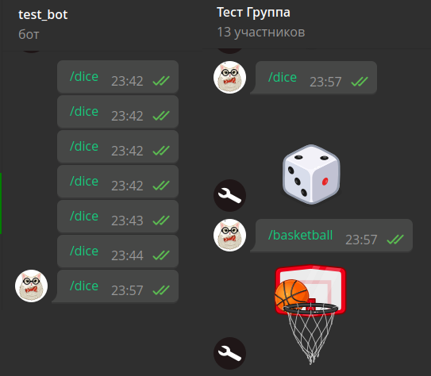
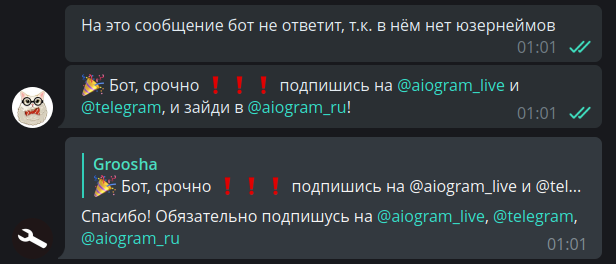
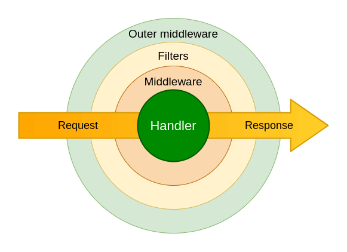
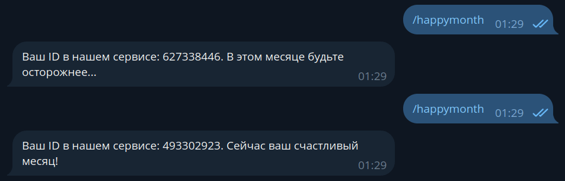

# 过滤器与中间件

!!! info ""
    使用的 aiogram 版本：3.14.0

现在是时候了解 aiogram 3.x 中过滤器和中间件的工作方式了，同时认识框架的"lambda 表达式杀手"— _魔法过滤器_。

## 过滤器 {: id="filters" }

### 为什么需要过滤器？ {: id="why-filters" }

如果您已经写了[第一个机器人](quickstart.md#hello-world)，我为您祝贺：您已经在使用过滤器了，
只是那些是内置过滤器。是的，就是那个 `Command("start")` 就是一个过滤器。过滤器的目的是让来自 Telegram 的下一个更新
进入正确的处理器，也就是[期望]它的地方。

让我们看一个最简单的例子来理解过滤器的重要性。假设我们有用户 Alice（ID 111）
和 Bob（ID 777）。有一个机器人，对任何文本消息都会用一些激励短语让这两个人开心，而其他人则被拒绝：

```python
from random import choice

@router.message(F.text)
async def my_text_handler(message: Message):
    phrases = [
        "Привет! Отлично выглядишь :)",
        "Хэллоу, сегодня будет отличный день!",
        "Здравствуй)) улыбнись :)"
    ]
    if message.from_user.id in (111, 777):
        await message.answer(choice(phrases))
    else:
        await message.answer("Я с тобой не разговариваю!")
```

然后在某个时刻，我们决定为这两个人中的每一个都提供更个性化的问候，
所以我们将处理器分成三个：一个给 Alice，一个给 Bob，一个给其他人：

```python
@router.message(F.text)
async def greet_alice(message: Message):
    # print("Хэндлер для Алисы")
    phrases = [
        "Привет, {name}. Ты сегодня красотка!",
        "Ты самая умная, {name}",
    ]
    if message.from_user.id == 111:
        await message.answer(
            choice(phrases).format(name="Алиса")
        )

@router.message(F.text)
async def greet_bob(message: Message):
    phrases = [
        "Привет, {name}. Ты самый сильный!",
        "Ты крут, {name}!",
    ]
    if message.from_user.id == 777:
        await message.answer(
            choice(phrases).format(name="Боб")
        )

@router.message(F.text)
async def stranger_go_away(message: Message):
    if message.from_user.id not in (111, 777):
        await message.answer("Я с тобой не разговариваю!")
```

在这种情况下，Alice 会收到消息并开心。但其他人都不会收到任何消息，因为
代码总是会进入 `greet_alice()` 函数，没有通过内部条件 `if message.from_user.id == 111`。
您可以通过取消注释 `print()` 调用来轻松验证这一点。

但为什么会这样呢？答案很简单：任何文本消息首先都会通过
`greet_alice()` 函数上的 `F.text` 检查，这个检查会返回 `True`，更新就会进入这个函数，
然后没有通过内部条件 `if`，就会退出并消失。

为了避免这样的情况，存在过滤器。实际上，正确的检查应该是
"文本消息且用户 ID 为 111"。那么当 ID 为 777 的 Bob 给机器人写消息时，过滤器的组合
会返回 False，路由器就会检查下一个处理器，其中两个过滤器都返回 True，更新就会进入该处理器。
乍一看，上面描述的内容听起来非常复杂，但到本章结束时，您将了解如何正确组织这样的检查。

### 过滤器作为类 {: id="filters-as-classes" }

与 aiogram 2.x 不同，在"3"中没有针对特定聊天类型的过滤器类 **ChatTypeFilter**
（私聊、群组、超级群组或频道）。让我们自己写一个。允许用户指定所需的类型
要么是字符串，要么是列表（list）。后者在我们同时对多种类型感兴趣时很有用，
例如群组和超级群组。

我们的应用入口点，即 `bot.py` 文件，看起来很熟悉：

```python title="bot.py"
import asyncio

from aiogram import Bot, Dispatcher


async def main():
    bot = Bot(token="TOKEN")
    dp = Dispatcher()

    # 启动机器人并跳过所有累积的传入消息
    # 是的，即使你使用轮询也可以调用此方法
    await bot.delete_webhook(drop_pending_updates=True)
    await dp.start_polling(bot)


if __name__ == "__main__":
    asyncio.run(main())

```

在它旁边创建一个 `filters` 目录，在其中创建文件 `chat_type.py`：

```python title="filters/chat_type.py" hl_lines="7 8 11"
from typing import Union

from aiogram.filters import BaseFilter
from aiogram.types import Message


class ChatTypeFilter(BaseFilter):  # [1]
    def __init__(self, chat_type: Union[str, list]): # [2]
        self.chat_type = chat_type

    async def __call__(self, message: Message) -> bool:  # [3]
        if isinstance(self.chat_type, str):
            return message.chat.type == self.chat_type
        else:
            return message.chat.type in self.chat_type
```

让我们注意标记的行：

1. 我们的过滤器继承自基类 `BaseFilter`
2. 在类的构造函数中，可以设置未来的过滤器参数。在这个例子中，我们声明有一个
参数 `chat_type`，它可以是字符串（`str`）或列表（`list`）。
3. 所有的操作都在 `__call__()` 方法中进行，当类的实例
`ChatTypeFilter()` 被[作为函数调用](https://docs.python.org/3/reference/datamodel.html?highlight=__call__#object.__call__)时触发。
内部没有什么特别的：检查传入对象的类型并调用相应的检查。
我们的目标是让过滤器返回一个布尔值，因为之后只有所有过滤器都返回 `True` 的处理器才会执行。

现在让我们写一对处理器，它们对 `/dice` 和 `/basketball` 命令
发送相应类型的骰子，但只在群组中。创建文件 `handlers/group_games.py` 并写一些基本代码：

```python title="handlers/group_games.py" hl_lines="3 6 11 12 19 20"
from aiogram import Router
from aiogram.enums.dice_emoji import DiceEmoji
from aiogram.types import Message
from aiogram.filters import Command

from filters.chat_type import ChatTypeFilter

router = Router()


@router.message(
    ChatTypeFilter(chat_type=["group", "supergroup"]),
    Command(commands=["dice"]),
)
async def cmd_dice_in_group(message: Message):
    await message.answer_dice(emoji=DiceEmoji.DICE)


@router.message(
    ChatTypeFilter(chat_type=["group", "supergroup"]),
    Command(commands=["basketball"]),
)
async def cmd_basketball_in_group(message: Message):
    await message.answer_dice(emoji=DiceEmoji.BASKETBALL)
```

让我们理解一下。
首先，我们导入了内置过滤器 `Command` 和我们自己写的
`ChatTypeFilter`。
其次，我们将过滤器作为位置参数传递给装饰器，指定
所需的聊天类型。
第三，在 aiogram 2.x 中您习惯于将命令过滤为 `commands=...`，但在 **aiogram 3** 中已经没有这样了，
正确的做法是使用与自己的过滤器相同的方式使用内置过滤器，通过导入和调用相应的类。
我们在第二个装饰器中看到了这个，它调用 `Command(commands="somecommand")` 或简短地：`Command("somecommand")`

剩下的是将处理器文件导入到入口点并将新路由器连接到分派器（新行已突出显示）：

```python title="bot.py" hl_lines="5 12"
import asyncio

from aiogram import Bot, Dispatcher

from handlers import group_games


async def main():
    bot = Bot(token="TOKEN")
    dp = Dispatcher()

    dp.include_router(group_games.router)

    # 启动机器人并跳过所有累积的传入消息
    # 是的，即使你使用轮询也可以调用此方法
    await bot.delete_webhook(drop_pending_updates=True)
    await dp.start_polling(bot)


if __name__ == "__main__":
    asyncio.run(main())
```

让我们检查一下：



一切似乎都很好，但如果我们有不是 2 个处理器而是 10 个呢？我们必须为每一个指定我们的
过滤器，并且不要忘记任何一个。幸运的是，过滤器可以直接连接到路由器上！在这种情况下，检查
将在更新到达此路由器时执行一次。这可能很有用，
如果在过滤器中你做一些不同的"重操作"，比如调用 Bot API；否则你很容易
遇到速率限制。

这是我们的骰子处理器文件的最终版本：

```python title="handlers/group_games.py"
from aiogram import Router
from aiogram.enums.dice_emoji import DiceEmoji
from aiogram.filters import Command
from aiogram.types import Message

from filters.chat_type import ChatTypeFilter

router = Router()
router.message.filter(
    ChatTypeFilter(chat_type=["group", "supergroup"])
)


@router.message(Command("dice"))
async def cmd_dice_in_group(message: Message):
    await message.answer_dice(emoji=DiceEmoji.DICE)


@router.message(Command("basketball"))
async def cmd_basketball_in_group(message: Message):
    await message.answer_dice(emoji=DiceEmoji.BASKETBALL)
```

!!! info ""
    实际上，这样的聊天类型过滤器可以略微不同地实现。尽管
    我们有四种聊天类型（私聊、群组、超级群组、频道），但 `message` 类型的更新
    不能来自频道，因为它们有自己的更新类型 `channel_post`。当我们
    过滤群组时，通常不在乎是普通群组还是超级群组，只要不是私聊。

    因此，过滤器本身可以简化为条件性的 `ChatTypeFilter(is_group=True/False)`
    并简单地检查是私聊还是不是。具体的实现留给读者自行决定。

除了 True/False，过滤器还可以向通过过滤器的处理器传递一些东西。这在
我们不想在处理器中处理消息时很有用，因为我们已经在过滤器中处理过了。为了
变得清楚，让我们写一个过滤器，如果消息中有用户名，它会通过消息，同时
"推送"找到的值到处理器中。

在 filters 目录中创建新文件 `find_usernames.py`：

```python title="filters/find_usernames.py" hl_lines="24 26"
from typing import Union, Dict, Any

from aiogram.filters import BaseFilter
from aiogram.types import Message


class HasUsernamesFilter(BaseFilter):
    async def __call__(self, message: Message) -> Union[bool, Dict[str, Any]]:
        # 如果根本没有 entities，将返回 None，
        # 在这种情况下，我们认为这是一个空列表
        entities = message.entities or []

        # 检查任何用户名并使用
        # extract_from() 方法从文本中提取它们。详见
        # 关于处理消息的章节
        found_usernames = [
            item.extract_from(message.text) for item in entities
            if item.type == "mention"
        ]

        # 如果找到了用户名，那么将其"推送"到处理器
        # 使用"usernames"键名
        if len(found_usernames) > 0:
            return {"usernames": found_usernames}
        # 如果没有找到任何用户名，返回 False
        return False
```

并创建带有处理器的新文件：

```python title="handlers/usernames.py" hl_lines="6 13 17 21"
from typing import List

from aiogram import Router, F
from aiogram.types import Message

from filters.find_usernames import HasUsernamesFilter

router = Router()


@router.message(
    F.text,
    HasUsernamesFilter()
)
async def message_with_usernames(
        message: Message,
        usernames: List[str]
):
    await message.reply(
        f'Спасибо! Обязательно подпишусь на '
        f'{", ".join(usernames)}'
    )
```

如果找到至少一个用户名，`HasUsernamesFilter` 过滤器不会只返回 `True`，而是
返回一个字典，其中提取的用户名在 `usernames` 键下。相应地，在这个
过滤器被应用的处理器中，你可以在函数处理器中添加一个同名的参数。瞧！
现在不需要再次解析整个消息并再次提取用户名列表：



### 魔法过滤器 {: id="magic-filters" }

看了前一部分的 `ChatTypeFilter` 之后，有些人可能会喊：
"为什么要这么复杂，如果可以直接用 lambda：
`lambda m: m.chat.type in ("group", "supergroup")`"？而你是对的！确实，对于一些
简单的情况，当你只需要检查对象字段的值时，创建单独的
过滤器文件、然后导入它，意义不大。

aiogram 的创始人兼主要开发者 Alex 写了
[magic-filter](https://github.com/aiogram/magic-filter/) 库，
实现动态获取对象属性值（某种程度上的 `getattr` 的最大化）。更重要的是，它已经与 **aiogram 3.x** 一起提供。
如果你安装了"3"，那么你已经安装了 **magic-filter**。

!!! info ""
    magic-filter 库也可在 [PyPi](https://pypi.org/project/magic-filter/)
    上获得，可以独立于 aiogram 在你的其他项目中使用。在 aiogram 中使用
    该库时，你将可以访问一个额外的特性，将在本章后面讨论

"魔法过滤器"的功能在
[aiogram 文档](https://docs.aiogram.dev/en/dev-3.x/dispatcher/filters/magic_filters.html)中相当详细地描述了，这里
我们将重点关注主要部分。

让我们回忆一下什么是消息的"内容类型"。这个概念在 Bot API 中不存在，但在 pyTelegramBotAPI 和 aiogram 中存在。
这个想法很简单：如果在 [Message](https://core.telegram.org/bots/api#message) 对象中
`photo` 字段不为空（即在 Python 中不等于 `None`），
那么这个消息包含一个图像，因此，我们认为它的内容类型是 `photo`。而 `content_types="photo"` 过滤器
将只捕获这样的消息，让开发者不必在处理器内检查这个属性。

现在不难想象，一个用俄语表达为
"传入变量 'm' 的属性 'photo' 不应该等于 None"的 lambda 表达式，用 Python 写出来是
`lambda m: m.photo is not None`，或者稍微简化一下，`lambda m: m.photo`。而 `m` 本身变成
我们过滤的对象。例如，`Message` 类型的对象。

Magic-filter 提供了类似的东西。为此，你需要从 aiogram 导入 `MagicFilter` 类，
但我们将其导入不是完整名称，而是单字母别名 `F`：

```python
from aiogram import F

# 这里 F 代表 message
@router.message(F.photo)
async def photo_msg(message: Message):
    await message.answer("Это точно какое-то изображение!")
```

与旧的 `ContentTypesFilter(content_types="photo")` 相比，新的 `F.photo` 很方便！现在，
凭借这样的神圣知识，我们可以轻松用魔法替换 `ChatTypeFilter` 过滤器：
`router.message.filter(F.chat.type.in_({"group", "supergroup"}))`。
更进一步，即使对内容类型的检查也可以表示为魔法过滤器：
`F.content_type.in_({'text', 'sticker', 'photo'})` 或 `F.photo | F.text | F.sticker`。

还应该记住，过滤器不仅可以应用于 **Message** 的处理，也可以应用于任何其他
类型的更新：回调、内联查询、(my_)chat_member 等。

让我们看看 **aiogram 3.x** 中 magic-filter 的"独有"特性。我们说的是
`as_(<some text>)` 方法，它允许获取过滤器的结果作为处理器的参数。一个简短的
例子来说明：带有照片的消息中的图像作为数组到达，通常按质量升序排列。相应地，
你可以立即在处理器中获得具有最大尺寸的照片对象：

```python
from aiogram.types import Message, PhotoSize

@router.message(F.photo[-1].as_("largest_photo"))
async def forward_from_channel_handler(message: Message, largest_photo: PhotoSize) -> None:
    print(largest_photo.width, largest_photo.height)
```

一个更复杂的例子。如果消息从匿名群组管理员转发
或从某个频道转发，那么在 `Message` 对象中会有一个非空的 `forward_from_chat` 字段，其中包含
`Chat` 类型的对象。这是一个例子，它只在 `forward_from_chat` 字段非空时工作，
而在 `Chat` 对象中 `type` 字段等于 `channel`（换句话说，我们排除来自匿名
管理员的转发，只对来自频道的转发作出反应）：

```python
from aiogram import F
from aiogram.types import Message, Chat

@router.message(F.forward_from_chat[F.type == "channel"].as_("channel"))
async def forwarded_from_channel(message: Message, channel: Chat):
    await message.answer(f"This channel's ID is {channel.id}")
```

一个更复杂的例子。使用 magic-filter，你可以检查列表中的元素是否符合某个条件：

```python
from aiogram.enums import MessageEntityType

@router.message(F.entities[:].type == MessageEntityType.EMAIL)
async def all_emails(message: Message):
    await message.answer("All entities are emails")


@router.message(F.entities[...].type == MessageEntityType.EMAIL)
async def any_emails(message: Message):
    await message.answer("At least one email!")
```

### MagicData {: id="magic-data" }

最后，让我们简要介绍一下 [MagicData](https://docs.aiogram.dev/en/latest/dispatcher/filters/magic_data.html)。这个过滤器
允许你在过滤方面上升到更高的水平，并操纵通过中间件或
[分派器/轮询/网络钩子](quickstart.md#pass-extras)传入的值。假设你有一个受欢迎的机器人。现在
是时候进行技术维护了：备份数据库、清理日志等。但同时
你不想关闭机器人，以免失去新的用户：让它告诉用户稍等片刻。

一个可能的解决方案是创建一个特殊的路由器，在某种方式
向机器人传入一个等于 `True` 的布尔值 maintenance_mode 时，拦截消息、回调等。一个简单的单文件示例
用于理解这个逻辑可以在下面看到：

```python
import asyncio
import logging
import sys

from aiogram import Bot, Dispatcher, Router, F
from aiogram.filters import MagicData, CommandStart
from aiogram.types import Message, CallbackQuery
from aiogram.utils.keyboard import InlineKeyboardBuilder

# 创建维护模式的路由器并给它设置过滤器
maintenance_router = Router()
maintenance_router.message.filter(MagicData(F.maintenance_mode.is_(True)))
maintenance_router.callback_query.filter(MagicData(F.maintenance_mode.is_(True)))

regular_router = Router()

# 此路由器的处理器将拦截所有消息和回调，
# 如果 maintenance_mode 等于 True
@maintenance_router.message()
async def any_message(message: Message):
    await message.answer("Бот в режиме обслуживания. Пожалуйста, подождите.")


@maintenance_router.callback_query()
async def any_callback(callback: CallbackQuery):
    await callback.answer(
        text="Бот в режиме обслуживания. Пожалуйста, подождите",
        show_alert=True
    )

# 此路由器的处理器在维护模式之外使用，
# 即当 maintenance_mode 等于 False 或根本未指定时
@regular_router.message(CommandStart())
async def cmd_start(message: Message):
    builder = InlineKeyboardBuilder()
    builder.button(text="Нажми меня", callback_data="anything")
    await message.answer(
        text="Какой-то текст с кнопкой",
        reply_markup=builder.as_markup()
    )


@regular_router.callback_query(F.data == "anything")
async def callback_anything(callback: CallbackQuery):
    await callback.answer(
        text="Это какое-то обычное действие",
        show_alert=True
    )


async def main() -> None:
    bot = Bot('1234567890:AaBbCcDdEeFfGrOoShAHhIiJjKkLlMmNnOo')
    # 在现实生活中，maintenance_mode 的值
    # 将从外部源获取（例如，配置或通过 API）
    # 请记住，由于 bool 类型是不可变的，
    # 在运行时更改它不会产生任何影响
    dp = Dispatcher(maintenance_mode=True)
    # Maintenance 路由器应该在第一位
    dp.include_routers(maintenance_router, regular_router)
    await dp.start_polling(bot)


if __name__ == "__main__":
    logging.basicConfig(level=logging.INFO, stream=sys.stdout)
    asyncio.run(main())
```

!!! tip "适度最好"
    Magic-filter 提供了一个相当强大的过滤工具，有时可以紧凑地描述复杂的逻辑，
    但这不是万能的。如果你不能立即写出一个漂亮的魔法过滤器，
    不要担心；只需制作一个[过滤器类](filters-and-middlewares.md/#filters-as-classes)。
    没有人会因此指责你。


## 中间件 {: id="middlewares" }

### 为什么需要中间件？ {: id="why-middlewares" }

想象你走进一家夜间俱乐部有某个目的（听音乐、喝鸡尾酒、
结识新朋友）。在门口站着一个保安。他可以让你直接通过，
可以检查你的护照并决定你是否能进去，可以给你一个纸质手环，以便
之后区分真正的客人和迷路的人，他甚至可能根本不让你进去，把你送回家。

在 aiogram 的术语中，你是一个更新，夜间俱乐部是一组处理器，而门口的保安是中间件。后者的任务是
插入更新处理流程以实现某种逻辑。回到上面的例子，在中间件内部可以做什么？

* 记录事件；
* 向处理器传递一些对象（例如，从会话池中获取数据库会话）；
* 替换更新处理，而不将其传递到处理器；
* 默默地跳过更新，就像它们不存在一样；
* ... 或其他任何东西！

### 中间件的类型和结构 {: id="middlewares-structure" }

让我们再次查看 aiogram 3.x 文档，但这次是在
[另一个部分](https://docs.aiogram.dev/en/dev-3.x/dispatcher/middlewares.html#basics)并查看
以下图像：



事实证明，中间件有两种：外部（outer）和内部（inner 或只是"中间件"）。区别是什么？
外部在过滤器检查之前执行，内部在之后执行。在实践中，这意味着通过外部中间件的消息/回调/内联查询
可能根本进不了任何处理器，但如果它进入了内部中间件，那么之后
100% 会有某个处理器。

!!! info "更新类型的中间件"
    值得提醒的是，Update 是 Telegram 中所有事件类型的通用类型。这带来了两个重要特性
    在 aiogram 处理它们的方式中：
    • 更新类型的内部中间件**总是**被调用（即在这种情况下外部和内部之间没有区别）。
    • 更新类型的中间件只能挂在分派器上（根路由器）。

让我们看一个最简单的中间件：

```python linenums="1"
from typing import Callable, Dict, Any, Awaitable
from aiogram import BaseMiddleware
from aiogram.types import TelegramObject

class SomeMiddleware(BaseMiddleware):
    async def __call__(
        self,
        handler: Callable[[TelegramObject, Dict[str, Any]], Awaitable[Any]],
        event: TelegramObject,
        data: Dict[str, Any]
    ) -> Any:
        print("Before handler")
        result = await handler(event, data)
        print("After handler")
        return result
```

每个建立在类基础上的中间件（我们不会考虑
[其他变体](https://docs.aiogram.dev/en/dev-3.x/dispatcher/middlewares.html#function-based)）必须实现
`__call__()` 方法，有三个参数：

1. **handler** — 实际上，将要执行的处理器对象。仅对内部中间件有意义，
因为外部中间件还不知道更新会进入哪个处理器。
2. **event** — 我们处理的 Telegram 对象的类型。通常是 Update、Message、CallbackQuery 或 InlineQuery
（但不仅限于此）。如果你确切知道你处理什么类型的对象，可以随意写，例如，`Message` 而不是
`TelegramObject`。
3. **data** — 与当前更新相关的数据：FSM、从过滤器传入的额外字段、标志（稍后讨论）等等。
在这个 `data` 中我们也可以放入一些我们自己的数据，稍后将作为
处理器中的参数可用（就像在过滤器中一样）。

函数体还有更有趣的内容。

* 你在第 13 行**之前**写的所有内容都将在
下层处理器（这可以是另一个中间件或直接的处理器）前执行。
* 你在第 13 行**之后**写的所有内容都将在
下层处理器退出后执行。
* 如果你想继续处理，你**必须**调用 `await handler(event, data)`。如果你想"丢弃"更新，就不要调用它。
* 如果你不需要从处理器获取数据，那么将最后一行设置为
`return await handler(event, data)`。如果不返回 `await handler(event, data)`（隐式 `return None`），
那么更新将被视为"已丢弃"。

我们熟悉的所有对象（`Message`、`CallbackQuery` 等）都是更新（`Update`），所以对于 `Message`，首先
会执行 `Update` 的中间件，然后才是 `Message` 本身的中间件。让我们保留上面例子中的 `print()` 并
追踪中间件的执行顺序，如果我们为
`Update` 和 `Message` 类型各注册一个外部和内部中间件。

如果消息（`Message`）最终被某个处理器处理：

1. `[Update Outer] Before handler`
2. `[Update Inner] Before handler`
3. `[Message Outer] Before handler`
4. `[Message Inner] Before handler`
5. `[Message Inner] After handler`
6. `[Message Outer] After handler`
7. `[Update Inner] After handler`
8. `[Update Outer] After handler`

如果消息没有找到正确的处理器：

1. `[Update Outer] Before handler`
2. `[Update Inner] Before handler`
3. `[Message Outer] Before handler`
4. `[Message Outer] After handler`
5. `[Update Inner] After handler`
6. `[Update Outer] After handler`

!!! question "在机器人中禁止用户"
    在 Telegram 机器人的群组中经常被问到一个问题："如何在机器人中禁止用户，
    使其无法给机器人发消息？"。很可能最好的地方是更新类型的外部中间件，作为处理用户请求的最早阶段。
    而且，aiogram 中的一个内置中间件将用户信息放在 `data` 字典中，键为 `event_from_user`。
    之后，你可以从那里提取用户 ID，与你自己的某个"黑名单"进行比较，
    只需执行 `return` 来阻止链的进一步处理。

### 中间件示例 {: id="middlewares-examples" }

让我们看几个中间件的例子。

#### 向中间件传递参数 {: id="middleware-pass-arguments" }

我们使用类中间件，因此它们有一个构造函数。这允许定制内部代码的行为，
从外部管理它。例如，从配置文件。让我们写一个无用但有说明性的"减速"中间件，
它将延迟传入消息处理指定秒数：

```python hl_lines="7 8 18"
import asyncio
from typing import Any, Callable, Dict, Awaitable
from aiogram import BaseMiddleware
from aiogram.types import TelegramObject

class SlowpokeMiddleware(BaseMiddleware):
    def __init__(self, sleep_sec: int):
        self.sleep_sec = sleep_sec

    async def __call__(
            self,
            handler: Callable[[TelegramObject, Dict[str, Any]], Awaitable[Any]],
            event: TelegramObject,
            data: Dict[str, Any],
    ) -> Any:
        # 等待指定的秒数并将控制权传递给链中的下一个
        # （这可以是处理器或下一个中间件）
        await asyncio.sleep(self.sleep_sec)
        result = await handler(event, data)
        # 如果在处理器中执行 return，此值将进入 result
        print(f"Handler was delayed by {self.sleep_sec} seconds")
        return result
```

现在让我们将其挂在两个路由器上，值不同：

```python
from aiogram import Router
from <...> import SlowpokeMiddleware

# 在其他地方
router1 = Router()
router2 = Router()

router1.message.middleware(SlowpokeMiddleware(sleep_sec=5))
router2.message.middleware(SlowpokeMiddleware(sleep_sec=10))
```

#### 从中间件传递数据 {: id="middleware-store-data" }

如我们[早前](#middlewares-structure)所了解的，处理每个更新时，中间件可以访问字典 `data`，
其中包含各种有用的对象：机器人、更新的作者（event_from_user）等等。但我们也可以用任何东西填充这个
字典。而且，稍后调用的中间件可以看到早期调用的中间件放入的内容。

让我们考虑以下情况：第一个中间件根据 Telegram ID 用户获取某个内部 ID（例如，来自
某个假定的外部服务），第二个中间件使用这个内部 ID 计算用户的"幸运月份"
（内部 ID 除以 12 的余数）。所有这些都被放入处理器中，该处理器会让或惹怒调用
该命令的人。听起来很复杂，但现在你会理解的。让我们从中间件开始：

```python hl_lines="20 21 32 33 36 37"
from random import randint
from typing import Any, Callable, Dict, Awaitable
from datetime import datetime
from aiogram import BaseMiddleware
from aiogram.types import TelegramObject

# 从某个外部服务获取用户内部 ID 的中间件
class UserInternalIdMiddleware(BaseMiddleware):
    # 当然，我们的例子中没有真正的服务，
    # 只有残酷的随机数：
    def get_internal_id(self, user_id: int) -> int:
        return randint(100_000_000, 900_000_000) + user_id

    async def __call__(
            self,
            handler: Callable[[TelegramObject, Dict[str, Any]], Awaitable[Any]],
            event: TelegramObject,
            data: Dict[str, Any],
    ) -> Any:
        user = data["event_from_user"]
        data["internal_id"] = self.get_internal_id(user.id)
        return await handler(event, data)

# 计算用户"幸运月份"的中间件
class HappyMonthMiddleware(BaseMiddleware):
    async def __call__(
            self,
            handler: Callable[[TelegramObject, Dict[str, Any]], Awaitable[Any]],
            event: TelegramObject,
            data: Dict[str, Any],
    ) -> Any:
        # 从前一个中间件获取值
        internal_id: int = data["internal_id"]
        current_month: int = datetime.now().month
        is_happy_month: bool = (internal_id % 12) == current_month
        # 将 True 或 False 放入 data，以在处理器中获取
        data["is_happy_month"] = is_happy_month
        return await handler(event, data)
```

现在让我们写一个处理器，把它放在路由器中，并将路由器连接到分派器。我们将第一个中间件作为外部挂在分派器上，
因为（根据计划）这个内部 ID 总是需要的。第二个中间件我们作为内部挂在特定的路由器上，
因为计算幸运月份只在其中需要。

```python hl_lines="4 5"
@router.message(Command("happymonth"))
async def cmd_happymonth(
        message: Message, 
        internal_id: int, 
        is_happy_month: bool
):
    phrases = [f"Ваш ID в нашем сервисе: {internal_id}"]
    if is_happy_month:
        phrases.append("Сейчас ваш счастливый месяц!")
    else:
        phrases.append("В этом месяце будьте осторожнее...")
    await message.answer(". ".join(phrases))

# 在其他地方：
async def main():
    dp = Dispatcher()
    # <...>
    dp.update.outer_middleware(UserInternalIdMiddleware())
    router.message.middleware(HappyMonthMiddleware())
```

这是我们在十一月（第 11 个月）得到的结果：



#### 周末不允许回调！ {: id="no-callbacks-on-weekend" }

想象某个工厂有一个 Telegram 机器人，每天早上工厂的人都应该点击内联按钮，
以确认他们在场且能够工作。工厂的工作制是 5/2，我们希望周六和周日的点击不被计算。由于
点击按钮涉及复杂的逻辑（向接入控制系统发送数据），在周末我们只是
"丢弃"更新并显示带有错误的窗口。以下示例可以完整复制并运行：

```python
import asyncio
import logging
import sys
from datetime import datetime
from typing import Any, Callable, Dict, Awaitable

from aiogram import Bot, Dispatcher, Router, BaseMiddleware, F
from aiogram.filters import Command
from aiogram.types import Message, CallbackQuery, TelegramObject
from aiogram.utils.keyboard import InlineKeyboardBuilder

router = Router()

# 这将是任何回调的外部中间件
class WeekendCallbackMiddleware(BaseMiddleware):
    def is_weekend(self) -> bool:
        # 5 - 周六，6 - 周日
        return datetime.utcnow().weekday() in (5, 6)

    async def __call__(
            self,
            handler: Callable[[TelegramObject, Dict[str, Any]], Awaitable[Any]],
            event: TelegramObject,
            data: Dict[str, Any]
    ) -> Any:
        # 可以进行检查并忽略中间件，
        # 如果它被错误地安装在回调之外
        if not isinstance(event, CallbackQuery):
            # 在这里记录一些内容
            return await handler(event, data)

        # 如果今天不是周六也不是周日，
        # 那么继续处理。
        if not self.is_weekend():
            return await handler(event, data)
        # 否则，我们自己回答回调
        # 并停止进一步的处理
        await event.answer(
            "Какая работа? Завод остановлен до понедельника!",
            show_alert=True
        )
        return


@router.message(Command("checkin"))
async def cmd_checkin(message: Message):
    builder = InlineKeyboardBuilder()
    builder.button(text="Я на работе!", callback_data="checkin")
    await message.answer(
        text="Нажимайте эту кнопку только по будним дням!",
        reply_markup=builder.as_markup()
    )


@router.callback_query(F.data == "checkin")
async def callback_checkin(callback: CallbackQuery):
    # 这里是大量复杂的代码
    await callback.answer(
        text="Спасибо, что подтвердили своё присутствие!",
        show_alert=True
    )


async def main() -> None:
    bot = Bot('1234567890:AaBbCcDdEeFfGrOoShAHhIiJjKkLlMmNnOo')
    dp = Dispatcher()
    dp.callback_query.outer_middleware(WeekendCallbackMiddleware())
    dp.include_router(router)
    await dp.start_polling(bot)


if __name__ == "__main__":
    logging.basicConfig(level=logging.INFO, stream=sys.stdout)
    asyncio.run(main())
```

现在，如果稍微玩一下时间的移动，你可以看到在工作日机器人正常回复，
而在周末会显示错误。

### 标志 {: id="flags" }

**aiogram 3.x** 的另一个有趣特性是[标志](https://docs.aiogram.dev/en/dev-3.x/dispatcher/flags.html)。本质上，
这些是处理器的某种"标记"，可以在中间件和其他地方读取。借助标志，你可以标记处理器，
而不用进入其内部结构，以便稍后在中间件中做一些事情，例如限流。

让我们看一个稍微修改过的代码
[来自文档](https://docs.aiogram.dev/en/dev-3.x/dispatcher/flags.html#example-in-middlewares)。假设
在你的机器人中有很多处理器，它们发送媒体文件或准备文本以供后续
发送。如果这样的操作执行时间很长，那么使用 [sendChatAction](https://core.telegram.org/bots/api#sendchataction) 方法
显示状态"正在输入"或"正在发送照片"被认为是一个好的做法。
默认情况下，这样的事件只发送 5 秒钟，但如果消息
被更早发送将自动结束。aiogram 有一个帮助类 `ChatActionSender`，它允许发送
选定的状态，直到消息被发送完成。

我们也不想在每个处理器内部插入 `ChatActionSender` 的工作，让中间件为那些
设置了 `long_operation` 标志的处理器来做，其中该标志的值是状态（例如 `typing`、`choose_sticker`...）。
这是中间件本身：

```python
from typing import Callable, Dict, Any, Awaitable

from aiogram import BaseMiddleware
from aiogram.dispatcher.flags import get_flag
from aiogram.types import Message
from aiogram.utils.chat_action import ChatActionSender


class ChatActionMiddleware(BaseMiddleware):
    async def __call__(
        self,
        handler: Callable[[Message, Dict[str, Any]], Awaitable[Any]],
        event: Message,
        data: Dict[str, Any],
    ) -> Any:
        long_operation_type = get_flag(data, "long_operation")

        # 如果处理器上没有这样的标志
        if not long_operation_type:
            return await handler(event, data)

        # 如果标志存在
        async with ChatActionSender(
                action=long_operation_type,
                chat_id=event.chat.id,
                bot=data["bot"],
        ):
            return await handler(event, data)
```

相应地，为了读取标志，需要在某个地方指定它。
选项：`@dp.message(<你的过滤器>, flags={"long_operation": "upload_video_note"})`


!!! info ""
    你可以在我的
    [赌场机器人](https://github.com/MasterGroosha/telegram-casino-bot/blob/09ef66cd9d1ff4709791126b058c7313c71c99c5/bot/middlewares/throttling.py)中
    看到 throttling 中间件的例子。
