# 消息处理

!!! info ""
    使用的 aiogram 版本: 3.7.0

在本章中，我们将学习如何对消息应用各种类型的格式，以及如何处理媒体文件。

## 文本 {: id="text" }
处理文本消息可能是大多数机器人最重要的操作之一。文本可以表达几乎任何内容，
并且我们希望 _漂亮地_ 呈现信息。开发人员可以使用三种文本标记方式：HTML、Markdown 和 MarkdownV2。
其中最先进的是 HTML 和 MarkdownV2，"经典的" Markdown 支持的功能更少，在 aiogram 中不再使用。

在我们研究如何在 aiogram 中处理文本之前，有必要提及 aiogram 3.x 与 2.x 的一个重要区别：
在"2.x"中，默认只处理文本消息，而在"3.x"中处理任何类型的消息。更准确地说，
现在接收仅文本消息的方式是：

```python
# 之前（使用装饰器）
@dp.message_handler()
async def func_name(...)

# 之前（使用注册函数）
dp.register_message_handler(func_name)

# 现在（使用装饰器）
from aiogram import F
@dp.message(F.text)
async def func_name(...)

# 现在（使用注册函数）
dp.message.register(func_name, F.text)
```

关于"魔法过滤器" **F** 我们将在 [另一章](filters-and-middlewares.md) 中讨论。

### 格式化输出 {: id="formatting-options" }

发送消息时选择格式由 `parse_mode` 参数决定，例如：
```python
from aiogram import F
from aiogram.types import Message
from aiogram.filters import Command
from aiogram.enums import ParseMode

# 如果不指定过滤器 F.text，
# 那么处理程序甚至会对带有标题 /test 的图片起作用
@dp.message(F.text, Command("test"))
async def any_message(message: Message):
    await message.answer(
        "Hello, <b>world</b>!", 
        parse_mode=ParseMode.HTML
    )
    await message.answer(
        "Hello, *world*\!", 
        parse_mode=ParseMode.MARKDOWN_V2
    )
```

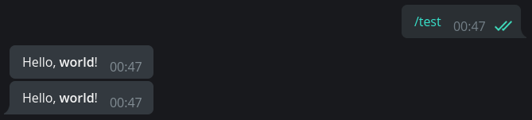

如果机器人中普遍使用某种格式，那么每次都指定 `parse_mode` 参数会很麻烦。幸运的是，
在 aiogram 中，您可以设置机器人的默认参数。为此，创建 `DefaultBotProperties` 对象
并将所需设置传递给它：

```python
from aiogram.client.default import DefaultBotProperties

bot = Bot(
    token="123:abcxyz",
    default=DefaultBotProperties(
        parse_mode=ParseMode.HTML
        # 这里还有许多其他有趣的设置
    )
)

# 在函数中的某个地方...
await message.answer("带有 <u>HTML 标记</u> 的消息")
# 要在特定请求中明确禁用格式，
# 传递 parse_mode=None
await message.answer(
    "没有 <s>任何标记</s> 的消息", 
    parse_mode=None
)
```

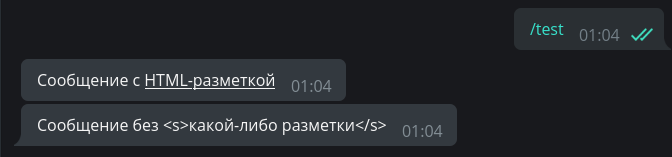

### 输入转义 {: id="input-escaping" }

通常会出现这样的情况：最终消息文本事先不知道，并根据某些外部数据形成：用户名、
其输入等。编写一个对 `/hello` 命令的处理程序，它将按用户的全名（`first_name + last_name`）
问候用户，例如："Hello, Ivan Ivanov"：

```python
from aiogram.filters import Command

@dp.message(Command("hello"))
async def cmd_hello(message: Message):
    await message.answer(
        f"Hello, <b>{message.from_user.full_name}</b>",
        parse_mode=ParseMode.HTML
    )
```

一切似乎都很好，机器人向用户问好：

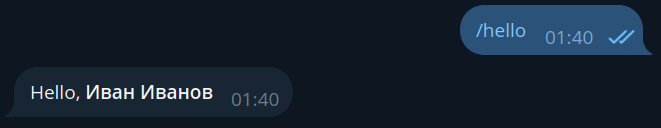

但是一个名字为 &lt;Slavik777&gt; 的用户到来了，机器人沉默了！而且在日志中看到以下内容：
`aiogram.exceptions.TelegramBadRequest: Telegram server says - Bad Request: can't parse entities: 
Unsupported start tag "Slavik777" at byte offset 7`

哎呀，我们有 HTML 格式模式，Telegram 试图将 &lt;Slavik777&gt; 解析为 HTML 标签。不好。
但这个问题有几个解决方案。首先：转义传递的值。

```python
from aiogram import html
from aiogram.filters import Command

@dp.message(Command("hello"))
async def cmd_hello(message: Message):
    await message.answer(
        f"Hello, {html.bold(html.quote(message.from_user.full_name))}",
        parse_mode=ParseMode.HTML
    )
```

第二个稍微复杂一些，但更高级：使用一个特殊的工具，它将分别收集文本和有关
应该格式化哪些部分的信息。

```python
from aiogram.filters import Command
from aiogram.utils.formatting import Text, Bold

@dp.message(Command("hello"))
async def cmd_hello(message: Message):
    content = Text(
        "Hello, ",
        Bold(message.from_user.full_name)
    )
    await message.answer(
        **content.as_kwargs()
    )
```

在上面的例子中，构造 `**content.as_kwargs()` 将返回参数 `text`、`entities`、`parse_mode`
并将它们代入 `answer()` 调用。

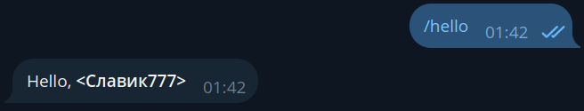

提到的格式化工具相当复杂，
[官方文档](https://docs.aiogram.dev/en/latest/utils/formatting.html) 演示了方便的复杂构造显示，例如：

```python
from aiogram.filters import Command
from aiogram.utils.formatting import (
    Bold, as_list, as_marked_section, as_key_value, HashTag
)

@dp.message(Command("advanced_example"))
async def cmd_advanced_example(message: Message):
    content = as_list(
        as_marked_section(
            Bold("Success:"),
            "Test 1",
            "Test 3",
            "Test 4",
            marker="✅ ",
        ),
        as_marked_section(
            Bold("Failed:"),
            "Test 2",
            marker="❌ ",
        ),
        as_marked_section(
            Bold("Summary:"),
            as_key_value("Total", 4),
            as_key_value("Success", 3),
            as_key_value("Failed", 1),
            marker="  ",
        ),
        HashTag("#test"),
        sep="\n\n",
    )
    await message.answer(**content.as_kwargs())
```

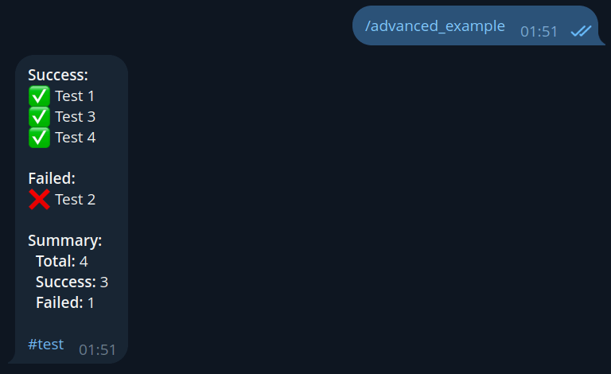

!!! info ""
    有关各种格式化方法和支持的标签的更多信息可在
    [Bot API 文档](https://core.telegram.org/bots/api#formatting-options)中找到。

### 保留格式 {: id="keep-formatting" }

假设机器人应该从用户那里获取格式化的文本并向其中添加一些内容，例如时间戳。
让我们编写一些简单的代码：

```python
# 新导入！
from datetime import datetime

@dp.message(F.text)
async def echo_with_time(message: Message):
    # 获取当前时间（本地时区）
    time_now = datetime.now().strftime('%H:%M')
    # 创建带下划线的文本
    added_text = html.underline(f"Created at {time_now}")
    # 发送带有添加文本的新消息
    await message.answer(f"{message.text}\n\n{added_text}", parse_mode="HTML")
```

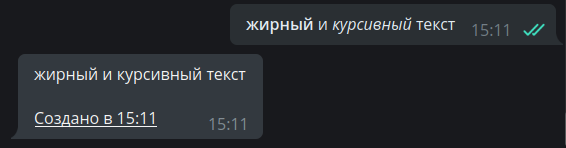

嗯，出了问题，为什么原始消息的格式坏了？
这是因为 `message.text` 返回纯文本，没有任何格式。要获得所需格式的文本，
我们将使用替代属性：`message.html_text` 或 `message.md_text`。现在我们需要第一个。
在上面的示例中将 `message.text` 替换为 `message.html_text`，我们得到正确的结果：

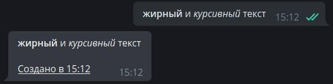

### 处理 entities {: id="message-entities" }

Telegram 大大简化了开发人员的生活，在其一方对用户消息进行预处理。例如，
某些实体，如电子邮件、电话号码、用户名等，可以不用 [正则表达式](https://ru.wikipedia.org/wiki/Регулярные_выражения)
提取，而可以直接从对象 [Message](https://core.telegram.org/bots/api#message) 和
`entities` 字段中提取，该字段包含 [MessageEntity](https://core.telegram.org/bots/api#messageentity)
类型对象的数组。作为例子，让我们编写一个处理程序，从消息中提取链接、电子邮件和等宽文本（每个一个）。
这里隐藏着一个重要的陷阱。**Telegram 返回的不是值本身，而是它们在文本中的开始和长度**。
而且，文本被视为 UTF-8 符号，但实体使用 UTF-16，因为如果您只是取位置和长度，
那么在存在 UTF-16 符号（例如，表情符号）时，您处理的文本就会出错。

下面的例子最好地演示了这一点。在屏幕截图中，机器人的第一条回复是"粗暴"解析的结果，
第二条是应用 aiogram 方法 `extract_from()` 到实体的结果。为其传递整个原始文本：

```python
@dp.message(F.text)
async def extract_data(message: Message):
    data = {
        "url": "<N/A>",
        "email": "<N/A>",
        "code": "<N/A>"
    }
    entities = message.entities or []
    for item in entities:
        if item.type in data.keys():
            # 不正确
            # data[item.type] = message.text[item.offset : item.offset+item.length]
            # 正确
            data[item.type] = item.extract_from(message.text)
    await message.reply(
        "Вот что я нашёл:\n"
        f"URL: {html.quote(data['url'])}\n"
        f"E-mail: {html.quote(data['email'])}\n"
        f"Пароль: {html.quote(data['code'])}"
    )
```

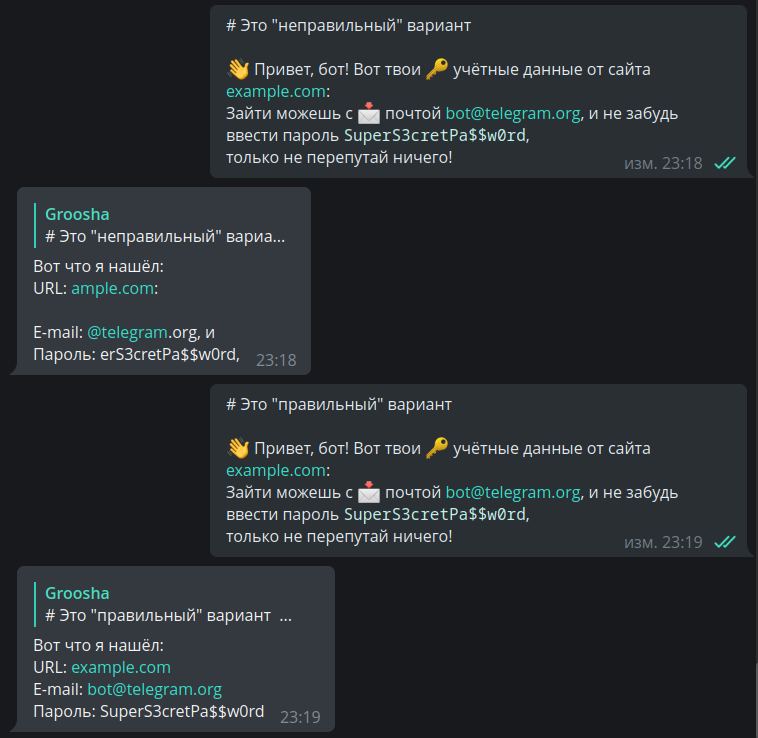

### 命令及其参数 {: id="commands-args" }

Telegram [为用户提供](https://core.telegram.org/bots/features#inputs) 许多输入信息的方式。
其中之一是命令：以斜杠开头的关键字，例如 `/new` 或 `/ban`。有时，机器人可能被设计为
在命令本身之后期望一些 _参数_，例如 `/ban 2d` 或 `/settimer 20h This is delayed message`。
aiogram 包含一个 `Command()` 过滤器，可以简化开发人员的生活。实现最后一个例子：

```python
@dp.message(Command("settimer"))
async def cmd_settimer(
        message: Message,
        command: CommandObject
):
    # 如果没有传递任何参数，
    # 那么 command.args 将为 None
    if command.args is None:
        await message.answer(
            "Error: no arguments passed"
        )
        return
    # 尝试按第一个空格将参数分成两部分
    try:
        delay_time, text_to_send = command.args.split(" ", maxsplit=1)
    # 如果我们得到少于两个部分，将抛出 ValueError
    except ValueError:
        await message.answer(
            "Error: incorrect command format. Example:\n"
            "/settimer <time> <message>"
        )
        return
    await message.answer(
        "Timer added!\n"
        f"Time: {delay_time}\n"
        f"Text: {text_to_send}"
    )
```

尝试使用不同的参数传递命令（或根本不使用参数）并检查响应：

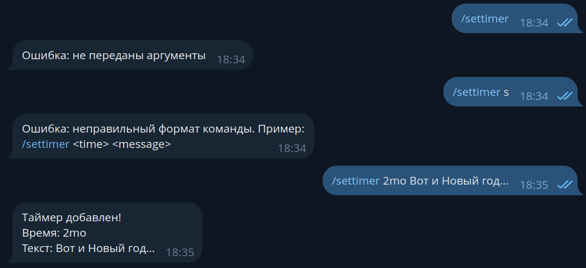

在组中可能会出现命令的小问题：Telegram 自动突出显示以斜杠开头的命令，这有时会导致这样的情况
（感谢我亲爱的订户帮助创建屏幕截图）：

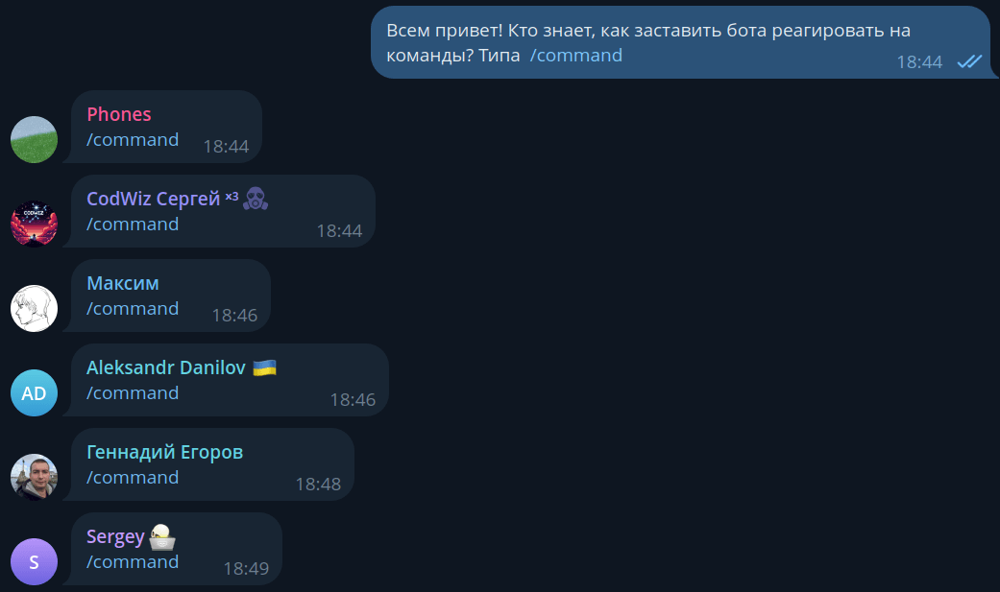

为了避免这种情况，您可以强制机器人对具有其他前缀的命令做出反应。它们不会被突出显示，
并且需要完全手动输入，所以自己评估这种方法的好处。

```python
@dp.message(Command("custom1", prefix="%"))
async def cmd_custom1(message: Message):
    await message.answer("I see the command!")


# 您可以指定多个前缀....vv...
@dp.message(Command("custom2", prefix="/!"))
async def cmd_custom2(message: Message):
    await message.answer("And I see this one too!")
```

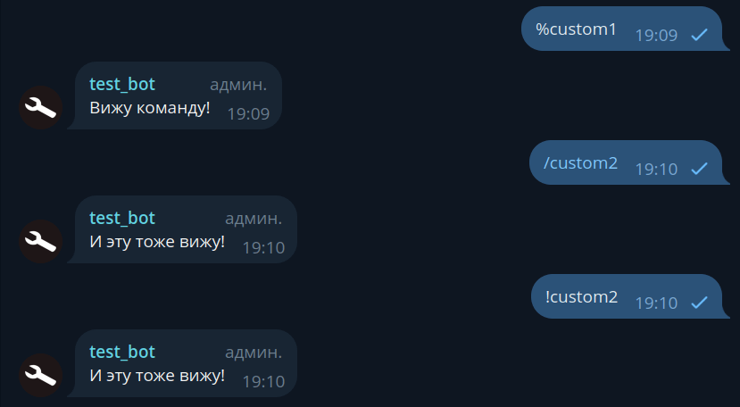

在组中使用自定义前缀的问题只在于，启用了隐私模式的非管理员机器人（默认情况下）
可能由于 [特性](https://core.telegram.org/bots/faq#what-messages-will-my-bot-get)
看不到这样的命令。最常见的用例是已经是管理员的群组审核机器人。

### 深层链接 {: id="deeplinks" }

在 Telegram 中有一个命令具有稍微更多的功能。这是 `/start`。事实上，
您可以形成形如 `t.me/bot?start=xxx` 的链接，当用户点击这样的链接时，
他们会看到一个"开始"按钮，点击它机器人会收到消息 `/start xxx`。
即在链接中植入某个额外的参数，不需要手动输入。这称为深层链接（不要与 deepdive 混淆），
可用于许多不同的事情：激活各种命令的快捷方式、转介系统、快速配置机器人等。
让我们编写两个例子：

```python
import re
from aiogram import F
from aiogram.types import Message
from aiogram.filters import Command, CommandObject, CommandStart

@dp.message(Command("help"))
@dp.message(CommandStart(
    deep_link=True, magic=F.args == "help"
))
async def cmd_start_help(message: Message):
    await message.answer("This is a help message")


@dp.message(CommandStart(
    deep_link=True,
    magic=F.args.regexp(re.compile(r'book_(\d+)'))
))
async def cmd_start_book(
        message: Message,
        command: CommandObject
):
    book_number = command.args.split("_")[1]
    await message.answer(f"Sending book №{book_number}")
```

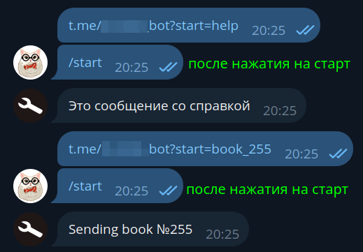

请注意，通过 `start` 的深层链接会将用户发送到与机器人的私聊。要选择一个群组
并将深层链接发送到那里，请将 `start` 替换为 `startgroup`。此外，aiogram 有一个方便的
[函数](https://github.com/aiogram/aiogram/blob/228a86afdc3c594dd9db9e82d8d6d445adb5ede1/aiogram/utils/deep_linking.py#L126-L158)
用于直接从代码创建深层链接。

!!! tip "更多深层链接，但不是针对机器人的"
    在 Telegram 文档中，有对客户端应用程序的所有可能的深层链接的详细描述：
    [https://core.telegram.org/api/links](https://core.telegram.org/api/links)


### 链接预览 {: id="link-previews" }

通常，在发送带有链接的文本消息时，Telegram 会尝试查找并显示序列中第一个链接的预览。
可以通过将 `link_preview_options` 作为 `send_message()` 方法的参数传递 `LinkPreviewOptions` 对象
来自定义此行为：

```python
# 新导入
from aiogram.types import LinkPreviewOptions

@dp.message(Command("links"))
async def cmd_links(message: Message):
    links_text = (
        "https://nplus1.ru/news/2024/05/23/voyager-1-science-data"
        "\n"
        "https://t.me/telegram"
    )
    # 禁用链接
    options_1 = LinkPreviewOptions(is_disabled=True)
    await message.answer(
        f"No link preview\n{links_text}",
        link_preview_options=options_1
    )

    # -------------------- #

    # 小预览
    # 要使用 prefer_small_media，必须还指定 url
    options_2 = LinkPreviewOptions(
        url="https://nplus1.ru/news/2024/05/23/voyager-1-science-data",
        prefer_small_media=True
    )
    await message.answer(
        f"Small preview\n{links_text}",
        link_preview_options=options_2
    )

    # -------------------- #

    # 大预览
    # 要使用 prefer_large_media，必须还指定 url
    options_3 = LinkPreviewOptions(
        url="https://nplus1.ru/news/2024/05/23/voyager-1-science-data",
        prefer_large_media=True
    )
    await message.answer(
        f"Large preview\n{links_text}",
        link_preview_options=options_3
    )

    # -------------------- #

    # 您可以组合：小预览和在文本上方放置
    options_4 = LinkPreviewOptions(
        url="https://nplus1.ru/news/2024/05/23/voyager-1-science-data",
        prefer_small_media=True,
        show_above_text=True
    )
    await message.answer(
        f"Small preview above text\n{links_text}",
        link_preview_options=options_4
    )

    # -------------------- #

    # 您可以选择哪个链接将用于预览
    options_5 = LinkPreviewOptions(
        url="https://t.me/telegram"
    )
    await message.answer(
        f"Preview not of the first link\n{links_text}",
        link_preview_options=options_5
    )
```

结果：
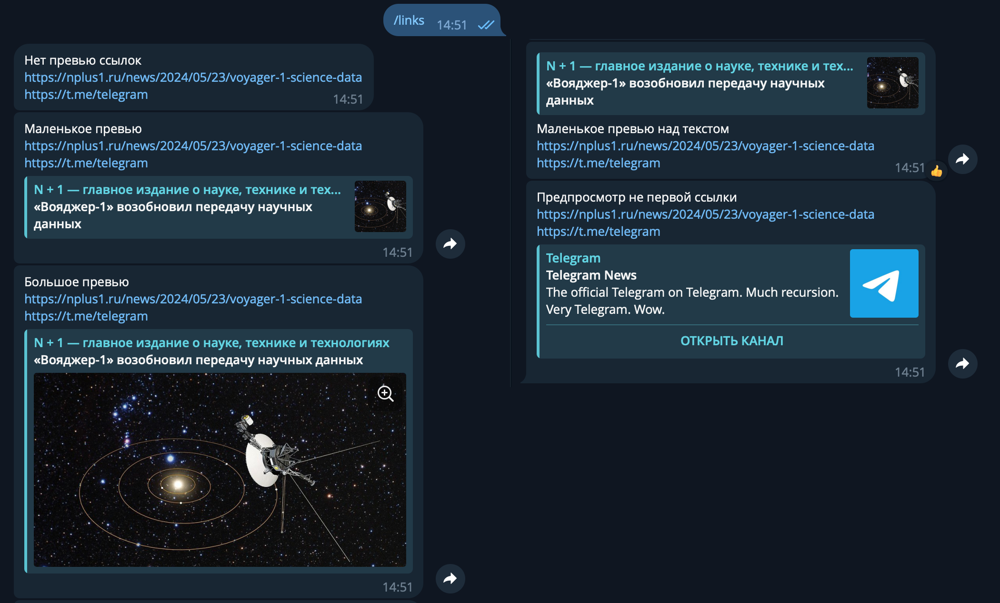

还可以在 `DefaultBotProperties` 中指定某些预览参数，如本章开头所述。

## 媒体文件 {: id="media" }

### 发送文件 {: id="uploading-media" }

除了普通文本消息外，Telegram 还允许交换各种类型的媒体文件：照片、视频、动画、
地理位置、贴纸等。大多数媒体文件都有 `file_id` 和 `file_unique_id` 属性。
第一个可用于多次重新发送同一文件，而且发送会是即时的，因为文件已经位于 Telegram 服务器上。
这是最首选的方法。

例如，以下代码将强制机器人立即用用户发送的同一 gif 回复用户：

```python
@dp.message(F.animation)
async def echo_gif(message: Message):
    await message.reply_animation(message.animation.file_id)
```

!!! warning "始终使用正确的 file_id!"
    机器人应该仅使用它直接接收的 `file_id`，例如，
    从用户在私聊中或在组/频道中"看到"媒体文件。同时，
    如果您尝试使用来自另一个机器人的 `file_id`，这 _可能会起作用_，
    但在某个时间点您将收到错误 **wrong url/file_id specified**。
    所以——只有自己的 `file_id`！

与 `file_id` 不同，标识符 `file_unique_id` 不能用于重新发送或下载媒体文件，
但对于特定媒体的所有机器人都是相同的。当多个机器人需要知道它们自己的 `file_id`
指代同一个文件时，通常需要 `file_unique_id`。

如果文件在 Telegram 服务器上不存在，机器人可以通过三种不同的方式上传：
作为文件系统中的文件、通过链接和直接作为字节集。为了加快发送速度并更好地对待
信使的服务器，应该一次性上传（upload）文件，之后使用 `file_id`，
该 ID 在首次上传媒体后将可用。

在 aiogram 3.x 中有 3 个类用于发送文件和媒体 - `FSInputFile`、`BufferedInputFile`、
`URLInputFile`，您可以在 [文档](https://docs.aiogram.dev/en/dev-3.x/api/upload_file.html)中了解它们。

让我们考虑使用所有不同方式发送图像的简单示例：
```python
from aiogram.types import FSInputFile, URLInputFile, BufferedInputFile

@dp.message(Command('images'))
async def upload_photo(message: Message):
    # 我们将存储发送的文件的 file_id，以便之后使用它们
    file_ids = []

    # 要演示 BufferedInputFile，我们将使用"经典"
    # 通过 `open()` 打开文件。但一般来说，这种方法
    # 最适合从内存中发送字节
    # 在进行某些操作之后，例如，通过 Pillow 编辑
    with open("buffer_emulation.jpg", "rb") as image_from_buffer:
        result = await message.answer_photo(
            BufferedInputFile(
                image_from_buffer.read(),
                filename="image from buffer.jpg"
            ),
            caption="Image from buffer"
        )
        file_ids.append(result.photo[-1].file_id)

    # 从文件系统发送文件
    image_from_pc = FSInputFile("image_from_pc.jpg")
    result = await message.answer_photo(
        image_from_pc,
        caption="Image from file on computer"
    )
    file_ids.append(result.photo[-1].file_id)

    # 通过链接发送文件
    image_from_url = URLInputFile("https://picsum.photos/seed/groosha/400/300")
    result = await message.answer_photo(
        image_from_url,
        caption="Image via link"
    )
    file_ids.append(result.photo[-1].file_id)
    await message.answer("Sent files:\n"+"\n".join(file_ids))
```

照片、视频和 GIF 的标题可以移到顶部：

```python
@dp.message(Command("gif"))
async def send_gif(message: Message):
    await message.answer_animation(
        animation="<gif file_id>",
        caption="I am today:",
        show_caption_above_media=True
    )
```

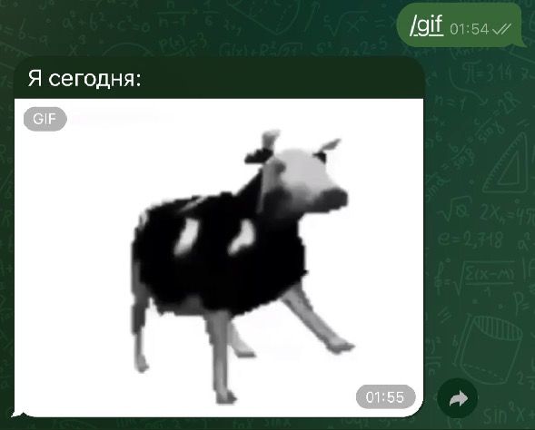

### 下载文件 {: id="downloading-media" }

除了重新发送外，机器人还可以将媒体下载到自己的计算机/服务器。为此，
`Bot` 类型的对象具有 `download()` 方法。在下面的示例中，文件直接下载到文件系统，
但没有人阻止您在内存中保存到 BytesIO 对象，以便进一步传递到应用程序
（例如，pillow）。

```python
@dp.message(F.photo)
async def download_photo(message: Message, bot: Bot):
    await bot.download(
        message.photo[-1],
        destination=f"/tmp/{message.photo[-1].file_id}.jpg"
    )


@dp.message(F.sticker)
async def download_sticker(message: Message, bot: Bot):
    await bot.download(
        message.sticker,
        # 对于 Windows 路径需要调整
        destination=f"/tmp/{message.sticker.file_id}.webp"
    )
```

对于图像，我们使用了不是 `message.photo`，而是 `message.photo[-1]`，为什么？
照片在 Telegram 中的消息中以多个副本形式出现；这是同一图像的不同大小。
因此，如果我们取最后一个元素（索引 -1），我们处理的是最大可用照片大小。

!!! info "下载大文件"
    使用 Telegram Bot API 的机器人最多可以下载 [20 兆字节](https://core.telegram.org/bots/api#getfile) 大小的文件。
    如果您计划下载/上传大文件，最好查看与 Telegram Client API 交互的库，
    而不是 Telegram Bot API，例如，[Telethon](https://docs.telethon.dev/en/latest/index.html)
    或 [Pyrogram](https://docs.pyrogram.org/)。
    
    不是很多人知道，但客户端 API 不仅可以由普通帐户使用，还可以由
    [机器人](https://docs.telethon.dev/en/latest/concepts/botapi-vs-mtproto.html)使用。

    从 Bot API 版本 5.0 开始，您可以使用
    [自己的 Bot API 服务器](https://core.telegram.org/bots/api#using-a-local-bot-api-server)来处理大文件。

### 媒体组 {: id="albums" }

我们在 Telegram 中所说的"相册"（媒体组）实际上是具有共同 `media_group_id` 
的单独媒体消息，在客户端上以视觉方式"粘合"在一起。从版本 3.1 开始，
aiogram 有一个 [相册"收集器"](https://docs.aiogram.dev/en/latest/utils/media_group.html)，
我们现在将考虑它的工作原理。但首先，值得提到媒体组的几个特性：

* 您不能为其附加内联键盘或与其一起发送回复键盘。没有办法。根本不可能。
* 相册中的每个媒体文件都可以有自己的标题（caption）。如果只有一个媒体有标题，
那么它将被显示为整个相册的通用标题。
* 照片可以在一个相册中与视频混合，文档（Document）和音乐（Audio）不能与任何东西混合，
只能与相同类型的媒体混合。
* 相册中最多可以有 10（十）个媒体文件。

现在让我们看看如何在 aiogram 中做到这一点：

```python
from aiogram.filters import Command
from aiogram.types import FSInputFile, Message
from aiogram.utils.media_group import MediaGroupBuilder

@dp.message(Command("album"))
async def cmd_album(message: Message):
    album_builder = MediaGroupBuilder(
        caption="Future album general caption"
    )
    album_builder.add(
        type="photo",
        media=FSInputFile("image_from_pc.jpg")
        # caption="Caption to specific media"

    )
    # 如果我们立即知道类型，那么使用特定的 add
    # 而不是通用的 add_<type>
    album_builder.add_photo(
        # 对于链接或 file_id，足以立即指定值
        media="https://picsum.photos/seed/groosha/400/300"
    )
    album_builder.add_photo(
        media="<your file_id>"
    )
    await message.answer_media_group(
        # 不要忘记调用 build()
        media=album_builder.build()
    )
```

结果：


但下载相册就困难多了...如上所述，相册只是分组的单个消息，
这意味着它们也以不同的更新的形式到达机器人。可能不存在 100% 可靠的方式
一次性接收整个相册，但您可以尝试以最小的损失来做到这一点。
通常这是通过中间件完成的，我自己接收媒体组的实现可以在
[此链接](https://github.com/MasterGroosha/telegram-feedback-bot-topics/blob/master/bot/middlewares/albums_collector.py)
处找到。

## 服务（辅助）消息 {: id="service" }

Telegram 中的消息分为文本、媒体文件和服务（也称为辅助）。现在是时候讨论最后一个了。


尽管它们看起来不寻常，与它们的交互是有限的，但这仍然是具有自己的 ID
甚至所有者的消息。值得注意的是，多年来服务消息的应用范围发生了变化，
现在您的机器人可能根本不会与它们一起工作，或者只是删除它们。

我们不会深入细节，而是考虑一个具体的例子：向新加入的参与者发送欢迎消息。
这样的服务消息将有一个 content_type 等于"new_chat_members"，但实际上这是一个
Message 对象，其中填充了相同名称的字段。

```python
@dp.message(F.new_chat_members)
async def somebody_added(message: Message):
    for user in message.new_chat_members:
        # full_name 属性立即获取名和姓
        # （在上面的屏幕截图中，用户没有姓氏）
        await message.reply(f"Hello, {user.full_name}")
```

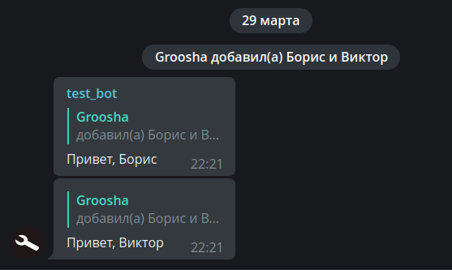

重要的是要记住，`message.new_chat_members` 是一个列表，因为一个用户可以立即添加多个参与者。
同时，不要混淆 `message.from_user` 和 `message.new_chat_members` 字段。
第一个是主体，即执行操作的人。第二个是操作的对象。
即，如果您看到一条消息说"Anna 添加了 Boris 和 Victor"，
那么 `message.from_user` 是关于 Anna 的信息，而 `message.new_chat_members` 列表
包含关于 Boris 和 Victor 的信息。

!!! warning "不要完全依赖服务消息！"
    关于添加（new_chat_members）和离开（left_chat_member）的服务消息有一个
    不愉快的特性：它们不可靠，即它们根本可能不会被创建。
    例如，当组中大约有 10,000 个参与者时，new_chat_members 消息不再创建，
    而 left_chat_member 则在 50 个时已经不创建（但在撰写本章时，
    我遇到了一个组，其中 left_chat_member 即使在 9 个参与者时也没有出现。
    半小时后，另一个人离开时它出现了）。

    随着 Bot API 5.0 的发布，开发人员有了一个更可靠的方式来查看
    任何大小的群组中的条目/退出，**以及频道中的条目/退出**。
    但我们下次再讨论这个。

## 奖励：在文本中隐藏链接 {: id="bonus" }

有时您想发送一条长消息和一张图片，但媒体文件的标题限制只有 1024 个字符，
而普通文本的限制是 4096，将链接放在底部看起来不太好。
为了解决这个问题，许多年前人们想出了"隐藏链接"的 HTML 标记方法。
要点是您可以将链接放在 [零宽度空间](http://www.fileformat.info/info/unicode/char/200b/index.htm)
中，并将整个构造插入到消息的开头。对于观察者来说，消息中没有多余的东西，
但 Telegram 服务器看到一切，并诚实地添加了预览。
aiogram 开发人员为此做了一个特殊的帮助方法 `hide_link()`：
```python
# 新导入！
from aiogram.utils.markdown import hide_link

@dp.message(Command("hidden_link"))
async def cmd_hidden_link(message: Message):
    await message.answer(
        f"{hide_link('https://telegra.ph/file/562a512448876923e28c3.png')}"
        f"Telegram Documentation: *exists*\n"
        f"Users: *don't read documentation*\n"
        f"Pear:"
    )
```

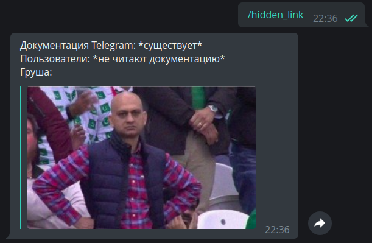

使用 LinkPreviewOptions（见上文），您可以在顶部放置一个媒体文件，
在下方放置一个长 4096 个字符的标题。

就这样。直到下一章！
<s><small>点赞、订阅、按铃</small></s>
