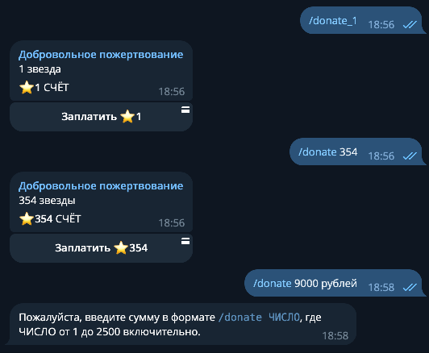
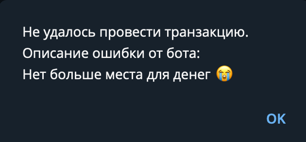
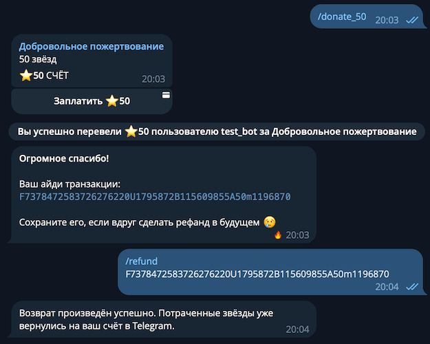

    
# Telegram 中的支付 {: id="payments" }

!!! info ""
    使用的 aiogram 版本: 3.7.0

从本章中，您将了解如何使用 Telegram 内部货币 [Telegram Stars](https://telegram.org/blog/telegram-stars) 在您的 Telegram 机器人中实现购买功能。

## 通过 Stars 进行支付 {: id="pay-with-stars" }

从 2024 年 6 月开始，所有在 Telegram 中的**数字产品和服务**支付必须使用新的数字货币 Telegram Stars 进行。我们不会详细介绍"Stars"的描述，更何况细节可能随着时间而变化。这项创新相当有争议，但看起来机器人开发者必须接受这一点，所以值得深入了解这项技术。

### 工作计划 {: id="plan" }

为了清晰起见，我们将开发一个接收自愿捐赠（捐款）的机器人。应该支持预设 (<code>/&#8288;donate_1</code>, <code>/&#8288;donate_25</code>, <code>/&#8288;donate_50</code>)，以及输入任意数量的 Stars (<code>/&#8288;donate 777</code>，其中数字作为命令参数传递)。我们还将创建一个 <code>/&#8288;refund</code> 命令，以便用户可以将花费的 Stars 返回到他们的 Telegram 账户。根据 [Telegram 的要求](https://telegram.org/tos/bot-developers#6-2-1-payment-disputes-for-digital-goods-and-services)，所有接收数字产品和服务付款的机器人**必须**支持 <code>/&#8288;paysupport</code> 命令，但由于没有关于此的进一步说明，我们将只通知用户关于 <code>/&#8288;refund</code> 命令。

### 技术 {: id="technologies" }

首先是 aiogram，版本不低于 3.7.0。尽管 [sendInvoice](https://core.telegram.org/bots/api#sendinvoice) 方法已经存在很长时间，但 [refundStarPayment](https://core.telegram.org/bots/api#refundstarpayment) 方法仅在 Bot API 7.4 中添加，对应于 aiogram 的版本 3.7。

日志显示使用 [structlog](https://www.structlog.org/en/stable/) 库。您在本文的代码片段中看不到它，但在 [本章的源代码中](https://github.com/MasterGroosha/aiogram-3-guide/tree/master/code/09_payments) 有。

机器人发送的信息文本使用 Mozilla 的 [Project Fluent](https://projectfluent.org/)。除了 Python 代码片段外，您还会看到相应的本地化字符串。为了简化任务并帮助您专注于新材料，我们约定用户的语言无关紧要；机器人将始终从一个文件返回俄语字符串。

!!! info ""
    如果您想了解更多关于将 Telegram 机器人本地化为不同语言而不受上述自我限制，欢迎您参加我们在 Stepik 平台上的 [付费课程](https://stepik.org/a/153850?utm_source=aiogram3guide&utm_medium=web&utm_campaign=payments_chapter)。

### 编写代码。/start 命令 {: id="command-start" }

对于 <code>/&#8288;start</code> 命令，机器人应该返回这样的漂亮文本

```fluent
cmd-start =
    你好！感谢您使用这个机器人。
    可用的命令如下：

    • /donate_1：捐赠 1 个星星。
    • /donate_25：捐赠 25 个星星。
    • /donate_50：捐赠 50 个星星。
    • /donate <数字>：捐赠 <数字> 个星星。
    • /paysupport：购买帮助。
    • /refund：退款。
```

代码：

```python
@router.message(CommandStart())
async def cmd_start(
    message: Message,
    l10n: FluentLocalization,
):
    await message.answer(
        l10n.format_value("cmd-start"),
        parse_mode=None,
    )
```

这个机器人默认启用 HTML 标记模式，但启动消息不能以这种模式发送，因为它使用子字符串 <code><&#8288;数字&#8288;></code>。所以 `parse_mode` 设置为 `None`。参数 `l10n` 是一个本地化中间件，向处理程序提供 `FluentLocalization` 对象。如有任何不明白的地方，请查看 [本章源代码](https://github.com/MasterGroosha/aiogram-3-guide/tree/master/code/09_payments)。

### /donate 命令 {: id="commands-donate" }

接下来，我们需要实现 <code>/&#8288;donate</code> 命令，允许任意选择金额，以及几个预设。截至 2024 年 6 月，购买的最大星星数量为 2500，当创建超过此金额的发票时，Telegram 客户端开始"崩溃"，不允许在购买前获得新的星星。所以我们将限制在 [1;2500] 范围内（包括边界）。

预设命令和常规命令之间的区别很小；您可以将所有内容合并到一个处理程序中。让我们开始编写它：获取命令并解析其内容。对于预设，我们需要按下划线拆分命令本身的文本并提取右半部分作为数字，对于常规命令，我们仔细检查在其后传递的内容：

```python
@router.message(Command("donate_1"))
@router.message(Command("donate_25"))
@router.message(Command("donate_50"))
@router.message(Command("donate"))
async def cmd_donate(
    message: Message,
    command: CommandObject,
    l10n: FluentLocalization,
):
    # 如果这是 /donate 数字 命令，
    # 那么从命令文本中提取数字
    if command.command != "donate":
        amount = int(command.command.split("_")[1])
    # 否则尝试解析用户输入
    else:
        # 检查数字及其范围
        if (
            command.args is None
            or not command.args.isdigit()
            or not 1 <= int(command.args) <= 2500
        ):
            await message.answer(
                l10n.format_value("custom-donate-input-error")
            )
            # 完成处理
            return
        amount = int(command.args)
```

现在，当星星数量被获得并验证后，我们向用户发送发票，即支付单据。对于 Telegram Stars，它如下所示：

```python
    ### 这是来自前一个代码片段的处理程序的延续！ ###

    # 对于 Telegram Stars 支付，价格列表
    # 必须恰好包含 1 个元素
    prices = [LabeledPrice(label="XTR", amount=amount)]
    await message.answer_invoice(
        title=l10n.format_value("invoice-title"),
        description=l10n.format_value(
            "invoice-description",
            {"starsCount": amount}
        ),
        prices=prices,
        # provider_token 必须为空
        provider_token="",
        # 在 payload 中可以传递任何内容，
        # 例如，正在购买的内容的 ID
        payload=f"{amount}_stars",
        # XTR 是 Telegram Stars 货币代码
        currency="XTR"
    )
```



"支付"按钮及其金额由 Telegram 自动生成，您无需手动生成。但如果需要，您可以创建自己的内联键盘并将其附加到发票。主要要求是：第一个按钮必须具有 `pay=True` 参数。如果在按钮文本中使用星形表情符号 ⭐ 或子字符串 XTR，此文本将自动替换为 Telegram Star 图标：

```python
    builder = InlineKeyboardBuilder()
    builder.button(
        text=f"支付 {amount} XTR",
        pay=True
    )
    builder.button(
        text="取消购买",
        callback_data="cancel"
    )
    builder.adjust(1)

    prices = [LabeledPrice(label="XTR", amount=amount)]
    await message.answer_invoice(
        title=l10n.format_value("invoice-title"),
        description=l10n.format_value(
            "invoice-description",
            {"starsCount": amount}
        ),
        prices=prices,
        provider_token="",
        payload=f"{amount}_stars",
        currency="XTR",
        # 覆盖键盘
        reply_markup=builder.as_markup()
    )
```


顺便说一下，发票也可以作为消息文本中的可点击链接发送：

```python
@router.message(Command("donate_link"))
async def cmd_link(
    message: Message,
    bot: Bot,
    l10n: FluentLocalization,
):
    # 1 个星星发票链接的示例
    # 作为对此 API 调用的响应，Telegram 返回
    # 链接。
    invoice_link = await bot.create_invoice_link(
        title=l10n.format_value("invoice-title"),
        description=l10n.format_value(
            "invoice-description",
            {"starsCount": 1}
        ),
        prices=[LabeledPrice(label="XTR", amount=1)],
        provider_token="",
        payload="demo",
        currency="XTR"
    )
    await message.answer(
        l10n.format_value(
            "invoice-link-text",
            {"link": invoice_link}
        )
    )
```

本地化中的新字符串：

```fluent
invoice-title = 自愿捐赠
invoice-description =
    {$starsCount ->
        [one] {$starsCount} 个星星
        [few] {$starsCount} 个星星
       *[other] {$starsCount} 个星星
}

custom-donate-input-error = 
    请输入格式为 <code>/donate 数字</code> 的金额，
    其中 数字 从 1 到 2500（包括）。

invoice-link-text =
    使用 <a href="{$link}">此链接</a> 进行 1 个星星的捐赠。
```

### 支付前检查 {: id="pre-checkout" }

如果用户的账户上有足够的 Stars，Bot API 会向机器人发送类型为 [PreCheckoutQuery](https://core.telegram.org/bots/api#precheckoutquery) 的更新。机器人有恰好 10 秒钟的时间再次检查一切，要么确认购买，要么取消它。为什么要取消？例如，用户尝试购买同一个唯一元素两次。或者他在机器人中被禁止，不应该能够购买任何东西。任何东西。如果需要取消购买，机器人应该用 `ok=False` 和清晰的错误文本响应 PreCheckoutQuery。例如：

```python
# FTL 文件中的错误文本：
pre-checkout-failed-reason = 没有更多空间放钱了 😭

# Python 处理程序：
@router.pre_checkout_query()
async def on_pre_checkout_query(
    pre_checkout_query: PreCheckoutQuery,
    l10n: FluentLocalization,
):
    await pre_checkout_query.answer(
        ok=False,
        error_message=l10n.format_value("pre-checkout-failed-reason")
    )
```

在这种情况下，机器人会看到类似的内容：



但大多数时候一切都会很好，您可以允许付款：

```python
@router.pre_checkout_query()
async def on_pre_checkout_query(
    pre_checkout_query: PreCheckoutQuery,
):
    await pre_checkout_query.answer(ok=True)
```

### 支付后 {: id="after-payment" }

完成购买后，机器人将收到一条 Message 类型的更新，其中包含非空属性 `successful_payment`，在其内容中，您可以找到交易 ID、payload（开发者在创建发票时自己传递的技术数据）和其他内容。例如，您可以祝贺用户购买成功，向消息添加火焰效果，发送 ID 以供将来退款使用（如果适用），或在演示机器人的情况下立即返回 Star。

```python
@router.message(F.successful_payment)
async def on_successful_payment(
    message: Message,
    l10n: FluentLocalization,
):
    await message.answer(
        l10n.format_value(
            "payment-successful",
            {"id": message.successful_payment.telegram_payment_charge_id}
        ),
        # 这是标准反应中的"火焰"效果
        message_effect_id="5104841245755180586",
    )
```

更新本地化：

```fluent
payment-successful =
    <b>非常感谢！</b>

    您的交易 ID：
    <code>{$id}</code>

    如果您将来想退款，请保存它 😢
```

{: style='height: 50%; width: 50%'}

### 购买退款 {: id="refunds" }

!!! warning "退款系统限制"
    2025 年，作者发生了一件有趣的事情：我开始收到各种人的私信请求返回花费的星星。问题是，在我的机器人 [@GrooshaDonateBot](https://t.me/GrooshaDonateBot) 中没有这样的交易。在又一次这样的问题后，我发现人们在其他机器人中花费了他们的星星，可能没有获得付费商品/服务，并在互联网上搜索如何返回资金。Google 中的 AI Overview 对查询"哪个 tg 机器人可以帮助退回花费的星星"显示以下文本："要返回用于支付的星星，您可以使用测试机器人 @GrooshaDonateBot 或 @DurgerKingBot，它们在购买后返回花费的星星..."

    重点是这样的。Google（和其他 LLM）- 退款只能__尝试__在用户花费这些星星的同一机器人中进行。在 @BotOne 中花费的星星**不能**由 @BotTwo 机器人返回！

    成就解锁：_被神经网络嘲笑了_

严格来说，在开始使用机器人之前，用户应该能够查看条款和条件（Terms of Service）。特别是，应该清楚地说明可以为什么返回资金，为什么不能。例如，您可以立即通知，某些数字商品不提供退款，或者在使用服务一定次数或一定天数后，退款变得不可用。这完全由您决定，在我们的演示机器人中，我们将给用户能够为任何购买返回资金的机会。为此，我们实现 <code>/&#8288;refund</code> 命令，我们请求将交易 ID 作为参数传递。[refundStarPayment](https://core.telegram.org/bots/api#refundstarpayment) 方法可能返回不同的错误，特别是交易 ID 不正确或用于特定交易的购买资金已经返回。让我们处理这些情况并实现退款：

```python
@router.message(Command("refund"))
async def cmd_refund(
    message: Message,
    bot: Bot,
    command: CommandObject,
    l10n: FluentLocalization,
):
    transaction_id = command.args
    if transaction_id is None:
        await message.answer(
            l10n.format_value("refund-no-code-provided")
        )
        return
    try:
        await bot.refund_star_payment(
            user_id=message.from_user.id,
            telegram_payment_charge_id=transaction_id
        )
        await message.answer(
            l10n.format_value("refund-successful")
        )
    except TelegramBadRequest as error:
        if "CHARGE_NOT_FOUND" in error.message:
            text = l10n.format_value("refund-code-not-found")
        elif "CHARGE_ALREADY_REFUNDED" in error.message:
            text = l10n.format_value("refund-already-refunded")
        else:
            # 对于所有其他错误 - 与第一种情况相同的文本
            text = l10n.format_value("refund-code-not-found")
        await message.answer(text)
        return
```

接下来，让我们编写 <code>/&#8288;paysupport</code> 命令的处理程序，它只是重定向到 <code>/&#8288;refund</code>：

```python
@router.message(Command("paysupport"))
async def cmd_paysupport(
    message: Message,
    l10n: FluentLocalization
):
    await message.answer(l10n.format_value("cmd-paysupport"))
```

这次我们需要添加更多文本：

```fluent
refund-successful =
    退款已成功处理。花费的星星已经返回到您的 Telegram 账户。

refund-no-code-provided =
    请输入命令 <code>/refund 代码</code>，其中 代码 是交易 ID。
    它可以在完成付款后看到，也可以在 Telegram 应用程序的"Stars"部分看到。

refund-code-not-found =
    找不到这样的购买代码。请检查您输入的数据并重试。

refund-already-refunded =
    已经为此购买进行了退款。

cmd-paysupport =
    如果您想返回购买资金，请使用 /refund 命令
```

结果：



!!! info "在行动中尝试机器人"
    您可以在 [@GrooshaDonateBot](https://t.me/GrooshaDonateBot) 机器人中尝试使用 Telegram Stars 进行支付。您需要 Stars 来进行任何交易，但如果您使用 <code>/&#8288;demo</code> 命令，固定金额为 1 个星星的付款将在购买后立即返回到您的账户。

现在您已准备好使用 Telegram Stars 在您的机器人中为数字商品和服务实现支付，太好了！
